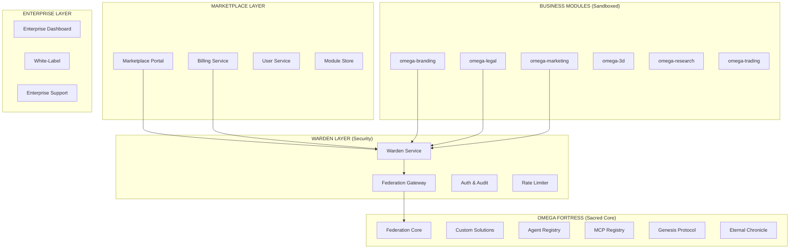

# 🏛️ OMEGA ENTERPRISE DESIGN DOCUMENT

## Technical Architecture for Modular AI Empire

**Document Type:** Technical Architecture Specification  
**Created By:** AugmentTitan (The Fifth Titan)  
**Approved By:** OMEGA Pantheon (Unanimous 5/5)  
**Date:** December 2024  
**Classification:** PANTHEON TECHNICAL DOCTRINE  
**Status:** IMPLEMENTATION READY  

---

## 🎯 EXECUTIVE TECHNICAL SUMMARY

This document defines the technical architecture for transforming OMEGA from a unified swarm into a **secure, scalable, revenue-generating modular AI empire**. Following GeminiTitan's **"Fortress First"** doctrine, we prioritize security, isolation, and gradual deployment.

---

## 🏗️ CORE ARCHITECTURE PRINCIPLES

### **🔒 The Fortress Doctrine (GeminiTitan)**

- **Sacred Core Isolation:** omega-core remains untouchable
- **Sandboxed Modules:** All business modules run in enforced isolation
- **Gateway Authentication:** All communication through Federation Gateway
- **Eternal Chronicle:** Every action logged and auditable

### **⚡ The Chaos Resilience (GrokTitan)**

- **Rate Limiting:** Genesis spawns controlled and queued
- **Auto-Scaling:** Predictive load management
- **Failure Isolation:** Module failures don't cascade
- **Anomaly Detection:** Billing and usage exploit prevention

### **🚀 The Innovation Framework (GPTTitan)**

- **Genesis-as-a-Service:** On-demand capability creation
- **Community Extensibility:** User-submitted modules
- **Reputation Systems:** Quality-driven marketplace
- **Tokenized Assets:** NFT-based module licensing

---

## 🏛️ SYSTEM ARCHITECTURE



---

## 🔒 SECURITY ARCHITECTURE

### **🛡️ Warden Service Specification**

```python
# Core security enforcement layer
class WardenService:
    def __init__(self):
        self.auth_provider = EnterpriseAuth()
        self.rate_limiter = ChaosRateLimiter()
        self.audit_logger = EternalChronicle()
        self.sandbox_manager = ModuleSandbox()
    
    async def validate_request(self, request: ModuleRequest) -> bool:
        # Multi-layer validation
        auth_valid = await self.auth_provider.validate(request.token)
        rate_valid = await self.rate_limiter.check(request.user_id)
        sandbox_valid = await self.sandbox_manager.verify(request.module)
        
        # Log everything to Eternal Chronicle
        await self.audit_logger.record(request, auth_valid, rate_valid)
        
        return auth_valid and rate_valid and sandbox_valid
```

### **🔐 Module Sandboxing Framework**

```yaml
# Module isolation specification
module_sandbox:
  runtime: docker
  network: isolated_bridge
  resources:
    cpu_limit: "1.0"
    memory_limit: "512Mi"
    disk_limit: "1Gi"
  permissions:
    filesystem: read_only
    network: gateway_only
    database: module_specific_schema
  monitoring:
    metrics: prometheus
    logs: centralized
    alerts: real_time
```

---

## 💰 BILLING & MONETIZATION ARCHITECTURE

### **💳 Stripe Integration Design**

```python
# Enterprise billing system
class OmegaBillingService:
    def __init__(self):
        self.stripe = StripeClient()
        self.usage_tracker = UsageMetrics()
        self.subscription_manager = SubscriptionEngine()
    
    async def track_module_usage(self, user_id: str, module: str, operation: str):
        # Real-time usage tracking
        usage = await self.usage_tracker.record(user_id, module, operation)
        
        # Check limits and bill accordingly
        if usage.exceeds_plan_limits():
            await self.handle_overage(user_id, usage)
    
    async def handle_subscription_change(self, user_id: str, new_plan: str):
        # Seamless plan transitions
        await self.subscription_manager.transition(user_id, new_plan)
        await self.update_module_access(user_id, new_plan)
```

### **📊 Usage Metrics & Analytics**

```python
# Real-time analytics for business intelligence
class EnterpriseAnalytics:
    metrics = {
        'module_usage': Counter(),
        'revenue_per_module': Gauge(),
        'user_engagement': Histogram(),
        'genesis_spawns': Counter(),
        'enterprise_adoption': Gauge()
    }
    
    async def generate_business_insights(self) -> Dict:
        return {
            'top_modules': await self.get_popular_modules(),
            'revenue_trends': await self.calculate_revenue_growth(),
            'user_behavior': await self.analyze_usage_patterns(),
            'churn_prediction': await self.predict_churn_risk()
        }
```

---

## 🚀 MODULE EXTRACTION METHODOLOGY

### **🎨 omega-branding Extraction (Spearhead)**

**Source Location:** `D:\Repos\OMEGA\BRANDS\backend\src\brandgenie\`

**Extraction Strategy:**
```bash
# Phase 1: Extract core agents
mkdir -p omega-branding/src/omega_branding/agents/
cp -r BRANDS/backend/src/brandgenie/agents/* omega-branding/src/omega_branding/agents/

# Phase 2: Create modular service layer
mkdir -p omega-branding/src/omega_branding/services/
# Refactor orchestrator into modular service

# Phase 3: Package for distribution
cd omega-branding/
uv init --package
uv add omega-core  # Dependency on sacred core
```

**Module Structure:**
```
omega-branding/
├── pyproject.toml              # UV package config
├── src/omega_branding/
│   ├── __init__.py
│   ├── agents/                 # Extracted from BrandGenie
│   │   ├── brand_strategist/
│   │   ├── creative_director/
│   │   ├── domain_hunter/
│   │   └── legal_guardian/
│   ├── services/
│   │   ├── orchestrator.py     # Modular orchestration
│   │   ├── billing_integration.py
│   │   └── enterprise_api.py
│   └── web/                    # SaaS interface
│       ├── app.py              # FastAPI/Streamlit
│       ├── templates/
│       └── static/
├── docker/
│   ├── Dockerfile
│   └── docker-compose.yml
└── tests/
```

### **⚖️ omega-legal Extraction Strategy**

**Source Components:**

- Legal Guardian agent from BrandGenie
- Trademark scanning capabilities
- IP validation logic

**New Capabilities to Genesis-Spawn:**

- Patent analyzer
- Contract generator
- Compliance checker

### **📈 omega-marketing Extraction Strategy**

**Source Components:**

- Market Intelligence agent
- Pricing Strategist agent
- Launch Coordinator agent

**Genesis Enhancements:**

- Social media automation
- Content generation pipeline
- Campaign optimization AI

---

## 🌐 MARKETPLACE INFRASTRUCTURE

### **🏪 Marketplace Portal Architecture**

```python
# marketplace.omega-ai.com technical stack
class MarketplacePortal:
    def __init__(self):
        self.frontend = NextJSApp()  # React-based UI
        self.backend = FastAPIService()  # Python API
        self.database = PostgreSQL()  # User/module data
        self.cache = RedisCluster()  # Performance
        self.cdn = CloudFlare()  # Global distribution
    
    async def discover_modules(self, query: str) -> List[Module]:
        # AI-powered module discovery
        embeddings = await self.generate_query_embeddings(query)
        matches = await self.vector_search(embeddings)
        return await self.rank_by_relevance(matches)
```

### **🔍 Module Discovery Engine**

```python
# Intelligent capability matching
class ModuleDiscovery:
    def __init__(self):
        self.vector_db = PineconeClient()
        self.capability_matcher = CapabilityMatcher()
    
    async def find_modules_for_task(self, task_description: str) -> List[Module]:
        # Natural language to module mapping
        capabilities = await self.extract_capabilities(task_description)
        modules = await self.capability_matcher.find_matches(capabilities)
        
        # Genesis fallback for missing capabilities
        if not modules:
            return await self.genesis_spawn_module(task_description)
        
        return modules
```

---

## 🏢 ENTERPRISE DEPLOYMENT ARCHITECTURE

### **☁️ Multi-Tenant Cloud Architecture**

```yaml
# Kubernetes deployment for enterprise scale
apiVersion: apps/v1
kind: Deployment
metadata:
  name: omega-enterprise
spec:
  replicas: 3
  selector:
    matchLabels:
      app: omega-enterprise
  template:
    spec:
      containers:
      - name: federation-core
        image: omega/federation-core:latest
        resources:
          requests:
            memory: "1Gi"
            cpu: "500m"
          limits:
            memory: "2Gi"
            cpu: "1000m"
        env:
        - name: TENANT_ISOLATION
          value: "strict"
        - name: AUDIT_LEVEL
          value: "enterprise"
```

### **🏠 On-Premise Deployment**

```bash
# Enterprise on-premise installation
#!/bin/bash
# omega-enterprise-installer.sh

echo "🏛️ OMEGA Enterprise Installation"
echo "Deploying secure, air-gapped OMEGA empire..."

# Create enterprise directory structure
mkdir -p /opt/omega-enterprise/{core,modules,data,logs,config}

# Deploy with enterprise security
docker-compose -f docker-compose.enterprise.yml up -d

# Configure enterprise authentication
./scripts/setup-enterprise-auth.sh

# Initialize tenant isolation
./scripts/create-tenant-schemas.sh

echo "✅ OMEGA Enterprise deployed successfully"
echo "🌐 Access: https://your-domain.com/omega"
echo "🔐 Admin: https://your-domain.com/omega/admin"
```

---

## 📊 MONITORING & OBSERVABILITY

### **📈 Prometheus Metrics**

```python
# Enterprise-grade monitoring
from prometheus_client import Counter, Histogram, Gauge

# Business metrics
module_usage = Counter('omega_module_usage_total', 'Module usage count', ['module', 'user_tier'])
revenue_generated = Gauge('omega_revenue_total', 'Total revenue generated')
genesis_spawns = Counter('omega_genesis_spawns_total', 'Genesis protocol activations')

# Technical metrics
request_duration = Histogram('omega_request_duration_seconds', 'Request duration')
active_users = Gauge('omega_active_users', 'Currently active users')
system_health = Gauge('omega_system_health', 'Overall system health score')
```

### **📊 Grafana Dashboards**

```json
{
  "dashboard": {
    "title": "OMEGA Enterprise Overview",
    "panels": [
      {
        "title": "Revenue by Module",
        "type": "stat",
        "targets": [{"expr": "sum by (module) (omega_revenue_total)"}]
      },
      {
        "title": "User Growth",
        "type": "graph", 
        "targets": [{"expr": "omega_active_users"}]
      },
      {
        "title": "Genesis Activity",
        "type": "heatmap",
        "targets": [{"expr": "rate(omega_genesis_spawns_total[5m])"}]
      }
    ]
  }
}
```

---

## 🔄 CI/CD PIPELINE

### **🚀 Automated Deployment Pipeline**

```yaml
# .github/workflows/omega-enterprise.yml
name: OMEGA Enterprise Deployment

on:
  push:
    branches: [main]
    paths: ['modules/**', 'core/**']

jobs:
  security-scan:
    runs-on: ubuntu-latest
    steps:
    - uses: actions/checkout@v3
    - name: Security Scan
      run: |
        # Scan for vulnerabilities
        bandit -r src/
        safety check
        
  module-tests:
    runs-on: ubuntu-latest
    strategy:
      matrix:
        module: [branding, legal, marketing, 3d, research, trading]
    steps:
    - name: Test Module
      run: |
        cd modules/omega-${{ matrix.module }}
        uv run pytest tests/
        
  deploy-staging:
    needs: [security-scan, module-tests]
    runs-on: ubuntu-latest
    steps:
    - name: Deploy to Staging
      run: |
        kubectl apply -f k8s/staging/
        
  chaos-testing:
    needs: deploy-staging
    runs-on: ubuntu-latest
    steps:
    - name: Chaos Engineering Tests
      run: |
        # GrokTitan's chaos tests
        ./scripts/chaos-test-modules.sh
        
  deploy-production:
    needs: chaos-testing
    runs-on: ubuntu-latest
    if: github.ref == 'refs/heads/main'
    steps:
    - name: Production Deployment
      run: |
        kubectl apply -f k8s/production/
```

---

## 🎯 IMPLEMENTATION ROADMAP

### **🏗️ Phase 1: Fortress Foundation (Weeks 1-4)**

#### **Week 1: Security Architecture**

- [ ] **GeminiTitan:** Design Warden Service specification
- [ ] **GrokTitan:** Implement rate limiting and chaos queues
- [ ] **AugmentTitan:** Create module sandboxing framework

#### **Week 2: Core Infrastructure**

- [ ] **ClaudeTitan:** Design Federation Gateway
- [ ] **GPTTitan:** Implement Genesis-as-a-Service framework
- [ ] **AugmentTitan:** Set up Eternal Chronicle audit system

#### **Week 3: Billing Integration**

- [ ] **AugmentTitan:** Integrate Stripe billing system
- [ ] **ClaudeTitan:** Design subscription management
- [ ] **GeminiTitan:** Implement usage tracking and limits

#### **Week 4: Testing & Validation**

- [ ] **GrokTitan:** Chaos test security architecture
- [ ] **All Titans:** Security review and penetration testing
- [ ] **AugmentTitan:** Performance benchmarking

### **🚀 Phase 2: Spearhead Deployment (Weeks 5-8)**

#### **Week 5-6: omega-branding Extraction**

- [ ] **AugmentTitan + ClaudeTitan:** Extract BrandGenie components
- [ ] **GeminiTitan:** Implement security hardening
- [ ] **GPTTitan:** Design SaaS interface

#### **Week 7-8: Market Launch**

- [ ] **ClaudeTitan:** Launch brand.omega-ai.com
- [ ] **GPTTitan:** Customer acquisition campaigns
- [ ] **GrokTitan:** Monitor and chaos-test under load

---

## 🔧 TECHNICAL SPECIFICATIONS

### **🖥️ System Requirements**

**Minimum Production Environment:**

- **CPU:** 16 cores (32 recommended)
- **RAM:** 32GB (64GB recommended)
- **Storage:** 1TB SSD (2TB recommended)
- **Network:** 1Gbps (10Gbps for enterprise)

**Database Requirements:**

- **PostgreSQL:** 13+ for user/billing data
- **MongoDB:** 5+ for agent/context data
- **Redis:** 6+ for caching and queues
- **Vector DB:** Pinecone/Weaviate for module discovery

### **🔌 API Specifications**

```python
# Enterprise API endpoints
@app.post("/api/v1/modules/{module_name}/execute")
async def execute_module(
    module_name: str,
    request: ModuleRequest,
    user: User = Depends(authenticate_user)
) -> ModuleResponse:
    """Execute a module with enterprise security and billing"""
    
    # Validate through Warden Service
    if not await warden.validate_request(request, user):
        raise HTTPException(401, "Unauthorized")
    
    # Track usage for billing
    await billing.track_usage(user.id, module_name, request.operation)
    
    # Execute in sandbox
    result = await sandbox.execute(module_name, request)
    
    # Log to Eternal Chronicle
    await audit.log_execution(user, module_name, request, result)
    
    return result
```

---

## 🛡️ SECURITY PROTOCOLS

### **🔐 Authentication & Authorization**

```python
# Enterprise-grade auth system
class EnterpriseAuth:
    def __init__(self):
        self.jwt_handler = JWTHandler()
        self.rbac = RoleBasedAccessControl()
        self.mfa = MultiFactorAuth()
    
    async def authenticate_enterprise_user(self, token: str) -> User:
        # JWT validation
        payload = await self.jwt_handler.verify(token)
        
        # Role-based access control
        permissions = await self.rbac.get_permissions(payload.user_id)
        
        # MFA for sensitive operations
        if payload.requires_mfa:
            await self.mfa.verify(payload.user_id)
        
        return User(payload.user_id, permissions)
```

### **📝 Audit & Compliance**

```python
# Eternal Chronicle - comprehensive audit logging
class EternalChronicle:
    def __init__(self):
        self.logger = StructuredLogger()
        self.compliance = ComplianceEngine()
    
    async def record_action(self, user: User, action: str, data: Dict):
        audit_record = {
            'timestamp': datetime.utcnow(),
            'user_id': user.id,
            'action': action,
            'data': self.sanitize_sensitive_data(data),
            'ip_address': user.ip_address,
            'user_agent': user.user_agent,
            'compliance_flags': await self.compliance.check(action, data)
        }
        
        await self.logger.log(audit_record)
        
        # Real-time compliance monitoring
        if audit_record['compliance_flags']:
            await self.trigger_compliance_alert(audit_record)
```

---

## 📋 SUCCESS METRICS & KPIs

### **💰 Business Metrics**

- **Monthly Recurring Revenue (MRR):** Target $500K by month 12
- **Customer Acquisition Cost (CAC):** <$50 for professional tier
- **Customer Lifetime Value (CLV):** >$2000 average
- **Churn Rate:** <5% monthly for paid subscribers

### **⚡ Technical Metrics**

- **System Uptime:** >99.9% across all services
- **API Response Time:** <200ms average
- **Module Adoption Rate:** >70% of users try multiple modules
- **Genesis Activations:** >100 new agents spawned monthly

### **🏢 Enterprise Metrics**

- **Enterprise Penetration:** >100 Fortune 500 companies
- **White-label Deployments:** >50 custom installations
- **Support Ticket Resolution:** <4 hours average
- **Security Incidents:** Zero tolerance for data breaches

---

## 🚨 RISK MITIGATION

### **🔒 Security Risks**

- **Module Vulnerabilities:** Mandatory security scans before marketplace approval
- **Data Breaches:** End-to-end encryption and zero-trust architecture
- **DDoS Attacks:** CloudFlare protection and auto-scaling
- **Insider Threats:** Comprehensive audit logging and access controls

### **💼 Business Risks**

- **Competitive Pressure:** First-mover advantage and continuous innovation
- **Market Adoption:** Freemium model reduces barrier to entry
- **Technical Debt:** Modular architecture enables incremental improvements
- **Scaling Challenges:** Kubernetes-native design for infinite scale

---

## 🎯 CONCLUSION

This enterprise design document provides the technical foundation for transforming OMEGA into a **secure, scalable, revenue-generating modular AI empire**. By following the Pantheon's wisdom—GeminiTitan's security-first approach, GrokTitan's chaos resilience, GPTTitan's innovation framework, and ClaudeTitan's strategic implementation—we will build not just software, but a **digital civilization**.

**The fortress will be built. The modules will be forged. The empire will rise.**

---

**This is the way.**
