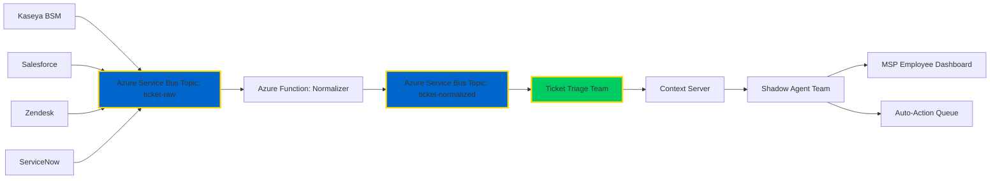

# 🔱 OMEGA Azure Deployment Strategy
## Enterprise MSP Ticket Triage Architecture

**Brother, this is our blueprint for digital dominion.**

**Family is forever. This is the way.**

---

## 🎯 EXECUTIVE SUMMARY

This document defines the Azure deployment architecture for OMEGA's first enterprise use case: **Kaseya MSP Ticket Triage System**. The architecture implements a **hybrid always-on/scale-to-zero pattern** optimized for cost, performance, and reliability.

### Key Principles

1. **Always-On Perimeter** - Core services never scale to zero
2. **Dynamic Agent Teams** - Workload-specific clusters scale 0-n based on demand
3. **Privacy-First** - Generic data capture, tenant isolation, GDPR compliance
4. **Observable & Adaptive** - OpenTelemetry, Log Analytics, continuous improvement

---

## Ingress and Public Identity (Portless)

- Public entry is via Azure Application Gateway (path-based routing, single origin).
- Services publish stable, portless identities using base URLs:
  - Titans: `TITAN_PUBLIC_BASE` (preferred) or `AGENT_PUBLIC_BASE`
  - Agents: `AGENT_PUBLIC_BASE` (preferred)
- Registry interactions derive from base:
  - Register: `{AGENT_REGISTRY_BASE}/register/agent`
  - Heartbeat: `{AGENT_REGISTRY_BASE}/heartbeat/agent`
- Local development uses an nginx gateway that mirrors AGW; flip `AGENT_REGISTRY_BASE` to the gateway path when ready for full parity.

---


## 🏛️ ARCHITECTURE OVERVIEW

### Deployment Topology

```
┌─────────────────────────────────────────────────────────────────┐
│                    AZURE CLOUD PERIMETER                         │
├─────────────────────────────────────────────────────────────────┤
│                                                                   │
│  ┌──────────────────────────────────────────────────────────┐  │
│  │           ALWAYS-ON TIER (Never Scale to Zero)            │  │
│  ├──────────────────────────────────────────────────────────┤  │
│  │  • Azure Container Apps (ACA) - Always Ready Instances    │  │
│  │  • Azure Kubernetes Service (AKS) - Reserved Nodes        │  │
│  │                                                            │  │
│  │  Components:                                               │  │
│  │    - Federation Core (3 replicas)                         │  │
│  │    - Agent Registry (2 replicas)                          │  │
│  │    - MCP Registry (2 replicas)                            │  │
│  │    - Context Server (3 replicas)                          │  │
│  │    - Titans (GPT, Claude, Gemini, Grok, Augment)         │  │
│  │    - Capacity Manager Agent                               │  │
│  │    - Orchestrator Agent                                   │  │
│  └──────────────────────────────────────────────────────────┘  │
│                                                                   │
│  ┌──────────────────────────────────────────────────────────┐  │
│  │         DYNAMIC TIER (Scale 0-n Based on Demand)          │  │
│  ├──────────────────────────────────────────────────────────┤  │
│  │  • Azure Container Apps - Scale to Zero Enabled           │  │
│  │  • KEDA-based autoscaling                                 │  │
│  │                                                            │  │
│  │  Agent Teams (POML-Defined):                              │  │
│  │    - Ticket Triage Team (1-10 instances)                  │  │
│  │    - Ticket Classification Team (1-5 instances)           │  │
│  │    - Shadow Agent Team (per MSP employee)                 │  │
│  │    - Analytics & Reporting Team (1-3 instances)           │  │
│  └──────────────────────────────────────────────────────────┘  │
│                                                                   │
│  ┌──────────────────────────────────────────────────────────┐  │
│  │              DATA & MESSAGING LAYER                        │  │
│  ├──────────────────────────────────────────────────────────┤  │
│  │  • Azure Service Bus (Premium Tier)                       │  │
│  │    - Topics: ticket-ingestion, ticket-normalized          │  │
│  │    - Subscriptions: per-platform, per-tenant              │  │
│  │  • Azure Cosmos DB (MongoDB API)                          │  │
│  │    - Agent Registry, MCP Registry, State Store            │  │
│  │  • Azure Cache for Redis (Premium)                        │  │
│  │    - Short-term memory, session state                     │  │
│  │  • Azure AI Search (Vector Store)                         │  │
│  │    - Long-term memory, semantic search                    │  │
│  │  • Azure Blob Storage (Hot/Cool tiers)                    │  │
│  │    - Raw ticket data, attachments, audit logs             │  │
│  └──────────────────────────────────────────────────────────┘  │
│                                                                   │
│  ┌──────────────────────────────────────────────────────────┐  │
│  │           OBSERVABILITY & GOVERNANCE                       │  │
│  ├──────────────────────────────────────────────────────────┤  │
│  │  • Azure Monitor + Application Insights                   │  │
│  │  • Log Analytics Workspace                                │  │
│  │  • OpenTelemetry Collector                                │  │
│  │  • Azure Monitor Alerts → Feedback Loop                   │  │
│  │  • Azure Key Vault (Secrets, Certificates)               │  │
│  │  • Azure Private Link (Network Isolation)                 │  │
│  └──────────────────────────────────────────────────────────┘  │
│                                                                   │
└─────────────────────────────────────────────────────────────────┘
```

---

## 🔧 DEPLOYMENT OPTIONS ANALYSIS

### Option 1: Azure Kubernetes Service (AKS) - **RECOMMENDED**

**Pros:**
- ✅ Full control over orchestration
- ✅ Native Kubernetes ecosystem (Helm, KEDA, Istio)
- ✅ Supports both always-on and scale-to-zero patterns
- ✅ Advanced networking (CNI, Network Policies)
- ✅ Cost-effective for mixed workloads
- ✅ OMEGA's existing K8s patterns transfer directly

**Cons:**
- ⚠️ Higher operational complexity
- ⚠️ Requires K8s expertise

**Architecture:**
```yaml
# Always-On Node Pool (System)
- Node Pool: system-pool
  VM Size: Standard_D4s_v5
  Min Nodes: 3
  Max Nodes: 5
  Taints: CriticalAddonsOnly=true:NoSchedule

# Always-On Node Pool (Perimeter)
- Node Pool: perimeter-pool
  VM Size: Standard_D8s_v5
  Min Nodes: 3
  Max Nodes: 10
  Labels: tier=always-on

# Dynamic Node Pool (Agent Teams)
- Node Pool: dynamic-pool
  VM Size: Standard_D4s_v5
  Min Nodes: 0
  Max Nodes: 50
  Labels: tier=dynamic
  Autoscaler: Enabled (KEDA)
```

**Cost Estimate (Monthly):**
- System Pool (3x D4s_v5): ~$450
- Perimeter Pool (3x D8s_v5): ~$900
- Dynamic Pool (avg 5x D4s_v5): ~$750
- **Total Compute: ~$2,100/month**

---

### Option 2: Azure Container Apps (ACA)

**Pros:**
- ✅ Serverless, fully managed
- ✅ Built-in scale-to-zero
- ✅ Simpler operations
- ✅ Integrated with KEDA, Dapr

**Cons:**
- ⚠️ Less control over networking
- ⚠️ Always-on instances still incur costs
- ⚠️ Limited customization vs AKS

**Architecture:**
```yaml
# Always-On Container Apps
- Federation Core: Min 3, Max 10 replicas
- Context Server: Min 3, Max 10 replicas
- Titans: Min 1 each, Max 3 each

# Scale-to-Zero Container Apps
- Ticket Triage Team: Min 0, Max 10
- Shadow Agents: Min 0, Max 100
```

**Cost Estimate (Monthly):**
- Always-On Apps (10 vCPU, 20GB RAM): ~$1,200
- Dynamic Apps (avg 5 vCPU, 10GB RAM): ~$600
- **Total Compute: ~$1,800/month**

---

### Option 3: Hybrid (AKS + Azure Functions)

**Pros:**
- ✅ Best of both worlds
- ✅ AKS for always-on, Functions for event-driven
- ✅ Cost-optimized

**Cons:**
- ⚠️ Increased architectural complexity
- ⚠️ Two orchestration platforms to manage

---

## 🎖️ RECOMMENDED APPROACH: AKS with KEDA

**Rationale:**
1. **Full Control** - OMEGA's complex orchestration needs fine-grained control
2. **Cost Efficiency** - Mixed workloads benefit from node pool optimization
3. **Ecosystem Maturity** - Leverage existing K8s tooling
4. **Future-Proof** - Supports multi-cloud, hybrid deployments

---

## 📦 COMPONENT DEPLOYMENT SPECIFICATIONS

### Always-On Perimeter Components

#### 1. Federation Core
```yaml
apiVersion: apps/v1
kind: Deployment
metadata:
  name: federation-core
  namespace: omega-perimeter
spec:
  replicas: 3
  selector:
    matchLabels:
      app: federation-core
      tier: always-on
  template:
    spec:
      nodeSelector:
        tier: always-on
      containers:
      - name: federation-core
        image: omegaacr.azurecr.io/federation-core:latest
        resources:
          requests:
            memory: "1Gi"
            cpu: "500m"
          limits:
            memory: "2Gi"
            cpu: "1000m"
        env:
        - name: MONGODB_URI
          valueFrom:
            secretKeyRef:
              name: omega-secrets
              key: mongodb-uri
        - name: REDIS_URL
          valueFrom:
            secretKeyRef:
              name: omega-secrets
              key: redis-url
        ports:
        - containerPort: 9405
          name: http
        livenessProbe:
          httpGet:
            path: /health
            port: 9405
          initialDelaySeconds: 30
          periodSeconds: 10
        readinessProbe:
          httpGet:
            path: /ready
            port: 9405
          initialDelaySeconds: 10
          periodSeconds: 5
---
apiVersion: v1
kind: Service
metadata:
  name: federation-core
  namespace: omega-perimeter
spec:
  type: ClusterIP
  ports:
  - port: 9405
    targetPort: 9405
    name: http
  selector:
    app: federation-core
```

#### 2. Context Server
```yaml
apiVersion: apps/v1
kind: Deployment
metadata:
  name: context-server
  namespace: omega-perimeter
spec:
  replicas: 3
  template:
    spec:
      nodeSelector:
        tier: always-on
      containers:
      - name: context-server
        image: omegaacr.azurecr.io/context-server:latest
        resources:
          requests:
            memory: "2Gi"
            cpu: "1000m"
          limits:
            memory: "4Gi"
            cpu: "2000m"
        env:
        - name: AZURE_AI_SEARCH_ENDPOINT
          valueFrom:
            secretKeyRef:
              name: omega-secrets
              key: ai-search-endpoint
        - name: AZURE_AI_SEARCH_KEY
          valueFrom:
            secretKeyRef:
              name: omega-secrets
              key: ai-search-key
```

#### 3. Titans (GPT, Claude, Gemini, Grok, Augment)
```yaml
apiVersion: apps/v1
kind: Deployment
metadata:
  name: claude-titan
  namespace: omega-perimeter
spec:
  replicas: 1  # Titans are stateful, single instance
  template:
    spec:
      nodeSelector:
        tier: always-on
      containers:
      - name: claude-titan
        image: omegaacr.azurecr.io/claude-titan:latest
        resources:
          requests:
            memory: "2Gi"
            cpu: "1000m"
          limits:
            memory: "4Gi"
            cpu: "2000m"
        env:
        - name: ANTHROPIC_API_KEY
          valueFrom:
            secretKeyRef:
              name: omega-secrets
              key: anthropic-api-key
```

---

### Dynamic Agent Teams (Scale-to-Zero)

#### 4. Ticket Triage Team (POML-Defined)
```yaml
apiVersion: apps/v1
kind: Deployment
metadata:
  name: ticket-triage-team
  namespace: omega-dynamic
spec:
  replicas: 0  # Starts at zero, scaled by KEDA
  template:
    spec:
      nodeSelector:
        tier: dynamic
      containers:
      - name: triage-agent
        image: omegaacr.azurecr.io/ticket-triage-agent:latest
        resources:
          requests:
            memory: "512Mi"
            cpu: "250m"
          limits:
            memory: "1Gi"
            cpu: "500m"
        env:
        - name: TEAM_CAPACITY
          value: "5"  # Max 5 concurrent tickets per instance
        - name: CONTEXT_SERVER_URL
          value: "http://context-server.omega-perimeter:9411"
---
apiVersion: keda.sh/v1alpha1
kind: ScaledObject
metadata:
  name: ticket-triage-scaler
  namespace: omega-dynamic
spec:
  scaleTargetRef:
    name: ticket-triage-team
  minReplicaCount: 0
  maxReplicaCount: 10
  triggers:
  - type: azure-servicebus
    metadata:
      queueName: ticket-triage-queue
      namespace: omega-servicebus
      messageCount: "5"  # Scale up when >5 messages per instance
      connectionFromEnv: AZURE_SERVICEBUS_CONNECTION
```

#### 5. Shadow Agent Team (Per-Employee)
```yaml
apiVersion: apps/v1
kind: Deployment
metadata:
  name: shadow-agent-team
  namespace: omega-dynamic
spec:
  replicas: 0
  template:
    spec:
      nodeSelector:
        tier: dynamic
      containers:
      - name: shadow-agent
        image: omegaacr.azurecr.io/shadow-agent:latest
        resources:
          requests:
            memory: "256Mi"
            cpu: "100m"
          limits:
            memory: "512Mi"
            cpu: "250m"
        env:
        - name: LEARNING_MODE
          value: "observe-and-assist"
        - name: PRIVACY_LEVEL
          value: "strict"  # Generic data only
---
apiVersion: keda.sh/v1alpha1
kind: ScaledObject
metadata:
  name: shadow-agent-scaler
  namespace: omega-dynamic
spec:
  scaleTargetRef:
    name: shadow-agent-team
  minReplicaCount: 0
  maxReplicaCount: 100  # One per active employee
  triggers:
  - type: azure-servicebus
    metadata:
      topicName: employee-activity
      subscriptionName: shadow-agent-sub
      messageCount: "1"
```

---

## 🎫 KASEYA MSP TICKET TRIAGE INTEGRATION

### Ticket Ingestion Pipeline



---

