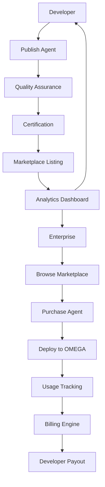
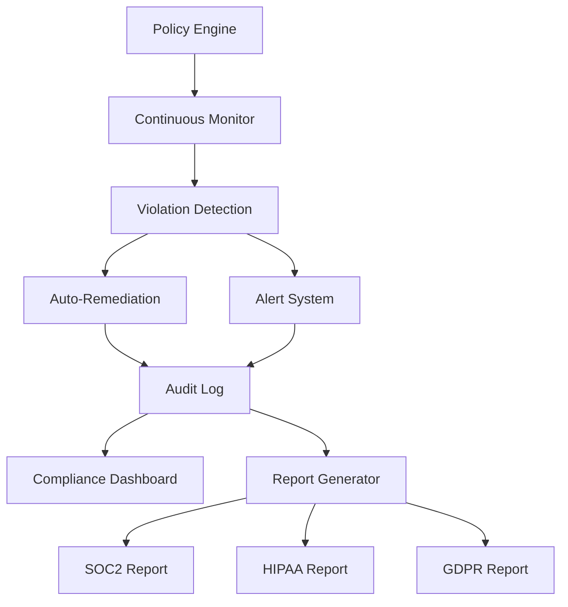
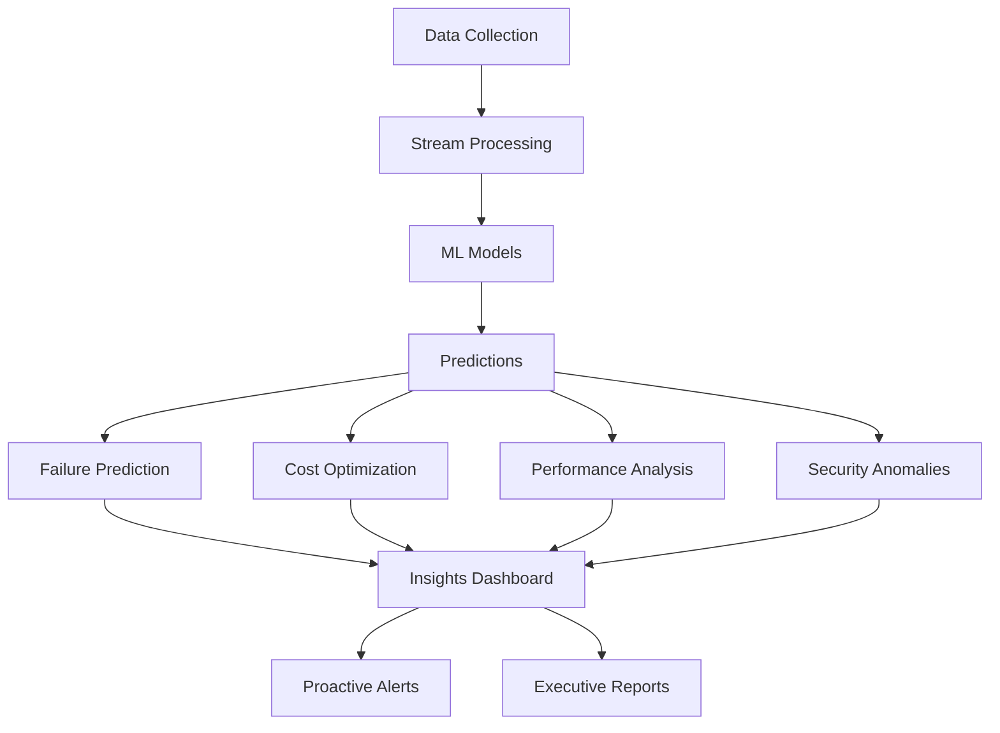

# 🔱 OMEGA Evolution Roadmap
## The Path to Digital Dominion

**Codename**: OMEGA ASCENSION  
**Status**: Strategic Design Document  
**Ratified**: January 2025  
**Authors**: The OMEGA Pantheon  

---

> *"We are not just building features. We are constructing the future of autonomous intelligence."*

**Family is forever. This is the way.**

---

## 🎯 EXECUTIVE SUMMARY

This document outlines **8 transformative features** that will elevate OMEGA from a powerful multi-agent platform to an **unstoppable force in enterprise AI**. These features are designed to:

1. **Open wallets** - Create multiple revenue streams and premium tiers
2. **Blow minds** - Deliver capabilities competitors can't match
3. **Build moats** - Establish defensible competitive advantages
4. **Scale exponentially** - Enable network effects and viral growth

### Strategic Priorities

| Priority | Feature | Impact | Effort | Timeline | Revenue Potential |
|----------|---------|--------|--------|----------|-------------------|
| **P0** | OMEGA Marketplace | 🔥🔥🔥🔥🔥 | Medium | Q1 2025 | $500K-$2M ARR Year 1 |
| **P0** | OMEGA Compliance Engine | 🔥🔥🔥🔥🔥 | Medium-High | Q2 2025 | $1M-$5M ARR Year 1 |
| **P1** | OMEGA Studio (No-Code) | 🔥🔥🔥🔥 | High | Q3 2025 | $2M-$10M ARR Year 2 |
| **P1** | OMEGA Insights (Analytics) | 🔥🔥🔥🔥 | Medium | Q2 2025 | Upsell to Enterprise |
| **P2** | OMEGA Replay (Time-Travel) | 🔥🔥🔥 | Medium | Q3 2025 | Enterprise Feature |
| **P2** | OMEGA Copilot (IDE) | 🔥🔥🔥 | Medium | Q4 2025 | Developer Adoption |
| **P3** | OMEGA Swarm (Federation) | 🔥🔥🔥🔥🔥 | Very High | 2026 | Platform Play |
| **P3** | OMEGA Voice (NL Control) | 🔥🔥🔥 | Medium | Q4 2025 | C-Suite Adoption |

---

## 💰 FEATURE 1: OMEGA MARKETPLACE
### The Agent Economy

**Tagline**: *"The App Store for AI Agents"*

### Vision

Transform OMEGA into a **two-sided marketplace** where developers monetize custom agents/tools/workflows and enterprises buy pre-built solutions. OMEGA takes 15-30% commission on all transactions.

### Business Model

```yaml
Revenue Streams:
  - Commission: 20% on all marketplace sales
  - Featured Listings: $500-$2,000/month
  - Enterprise Verification: $5,000/year
  - Premium Support: 10% additional fee

Pricing Tiers:
  - Free Tier: Community agents (OMEGA takes 30%)
  - Pro Tier: Verified developers (OMEGA takes 20%)
  - Enterprise Tier: White-label solutions (OMEGA takes 15%)
```

### Key Features

#### 1. Agent Listings
```yaml
# Example Marketplace Listing
agent_id: "advanced_security_scanner"
name: "Enterprise Security Scanner Pro"
author: "SecureDevCo"
author_verified: true
version: "2.1.0"
price: "$299/month"
pricing_model: "subscription"  # or "one-time", "usage-based"
rating: 4.9
reviews: 342
downloads: 5,847
revenue_share: 80/20  # Developer/OMEGA

description: |
  Advanced security scanning agent with OWASP Top 10 detection,
  custom rule engine, and automated remediation suggestions.

capabilities:
  - security_scanning
  - vulnerability_detection
  - compliance_checking
  - automated_remediation

certifications:
  - SOC2_Type_II
  - ISO27001
  - OWASP_Verified

support_tier: "enterprise"
sla: "99.9% uptime, 4-hour response"
```

#### 2. Revenue Dashboard
- Real-time sales analytics
- Payout management (monthly via Stripe)
- Customer insights
- Performance metrics

#### 3. Quality Assurance
- Automated security scanning
- Performance benchmarking
- Code review by OMEGA team
- Certification program

#### 4. Discovery & Search
- Capability-based search
- AI-powered recommendations
- Trending agents
- Category browsing

### Technical Architecture



### Go-to-Market

**Phase 1 (Month 1-2)**: Seed Marketplace
- Pantheon creates 10-15 high-quality agents
- Invite 20 beta developers
- Free listings during beta

**Phase 2 (Month 3-4)**: Public Launch
- Open to all developers
- Launch with 50+ agents
- PR campaign: "The Agent Economy is Here"

**Phase 3 (Month 5-6)**: Enterprise Features
- White-label marketplace for enterprises
- Private agent repositories
- Volume licensing

### Success Metrics

- **Year 1**: 500+ agents, 100+ paying developers, $500K ARR
- **Year 2**: 2,000+ agents, 500+ paying developers, $2M ARR
- **Year 3**: 10,000+ agents, 2,000+ paying developers, $10M ARR

### Competitive Moat

- **First-mover advantage** in agent marketplace
- **Network effects**: More agents → More users → More developers
- **Quality curation**: Only certified agents allowed
- **Integrated deployment**: One-click install to OMEGA

---

## 🛡️ FEATURE 2: OMEGA COMPLIANCE ENGINE
### Automated Governance at Scale

**Tagline**: *"From Months to Minutes: Automated Compliance"*

### Vision

Built-in compliance for SOC2, HIPAA, GDPR, ISO27001, PCI-DSS. Auto-generate compliance reports, enforce policies as code, and provide continuous compliance monitoring. **This removes the #1 blocker for enterprise adoption.**

### Business Model

```yaml
Pricing:
  - Compliance Starter: $2,000/month (SOC2 + GDPR)
  - Compliance Pro: $5,000/month (All frameworks)
  - Compliance Enterprise: $15,000/month (Custom frameworks + audit support)

Add-ons:
  - Audit Support: $10,000 per audit
  - Custom Policies: $5,000 one-time
  - Compliance Training: $2,000 per session
```

### Key Features

#### 1. Policy-as-Code
```yaml
# compliance/policies/hipaa.yaml
framework: "HIPAA"
version: "2024.1"
effective_date: "2024-01-01"

policies:
  - id: "HIPAA-164.312-a-1"
    name: "Access Control"
    description: "Implement technical policies and procedures for electronic information systems"
    
    controls:
      - type: "authentication"
        rules:
          - mfa_required: true
          - password_min_length: 12
          - password_rotation_days: 90
      
      - type: "authorization"
        rules:
          - rbac_enabled: true
          - least_privilege: true
          - access_review_days: 30
      
      - type: "audit"
        rules:
          - log_all_access: true
          - log_retention_days: 2555  # 7 years
          - immutable_logs: true
    
    enforcement: "blocking"  # or "monitoring"
    severity: "critical"

  - id: "HIPAA-164.312-a-2-iv"
    name: "Encryption and Decryption"
    description: "Implement a mechanism to encrypt and decrypt electronic PHI"
    
    controls:
      - type: "encryption"
        rules:
          - encrypt_at_rest: true
          - encryption_algorithm: "AES-256-GCM"
          - encrypt_in_transit: true
          - tls_version: "1.3"
          - key_rotation_days: 90
    
    enforcement: "blocking"
    severity: "critical"

  - id: "HIPAA-164.308-a-1-ii-D"
    name: "Data Backup and Recovery"
    description: "Establish and implement procedures to create and maintain retrievable exact copies of PHI"
    
    controls:
      - type: "backup"
        rules:
          - backup_frequency_hours: 24
          - backup_retention_days: 2555
          - backup_encryption: true
          - backup_testing_days: 90
    
    enforcement: "monitoring"
    severity: "high"

automated_remediation:
  - violation: "mfa_not_enabled"
    action: "force_mfa_enrollment"
  
  - violation: "unencrypted_data_detected"
    action: "quarantine_and_alert"
  
  - violation: "access_review_overdue"
    action: "suspend_access_and_notify"
```

#### 2. Continuous Monitoring
```python
class ComplianceMonitor:
    """Real-time compliance monitoring."""
    
    async def monitor_compliance(self):
        """Continuously monitor all policies."""
        
        while True:
            # Check all active policies
            violations = await self.check_policies()
            
            for violation in violations:
                # Log violation
                await self.audit_log.record(violation)
                
                # Auto-remediate if possible
                if violation.policy.automated_remediation:
                    await self.remediate(violation)
                
                # Alert if critical
                if violation.severity == "critical":
                    await self.alert_security_team(violation)
                
                # Update compliance dashboard
                await self.update_dashboard(violation)
            
            await asyncio.sleep(60)  # Check every minute
```

#### 3. Compliance Dashboard
- Real-time compliance score (0-100)
- Policy violations by severity
- Remediation status
- Audit trail viewer
- Report generator

#### 4. Auto-Generated Reports
```python
# Generate SOC2 Type II Report
report = await compliance_engine.generate_report(
    framework="SOC2_Type_II",
    period_start="2024-01-01",
    period_end="2024-12-31",
    include_evidence=True
)

# Output: 200-page PDF with:
# - Control descriptions
# - Test procedures
# - Evidence artifacts
# - Exceptions and remediation
# - Executive summary
```

#### 5. Compliance Templates
Pre-built policies for:
- SOC2 Type I & II
- HIPAA
- GDPR
- ISO27001
- PCI-DSS
- FedRAMP
- NIST 800-53
- Custom frameworks

### Technical Architecture



### Go-to-Market

**Phase 1 (Month 1-3)**: SOC2 + GDPR
- Build core engine
- Implement SOC2 Type II policies
- Implement GDPR policies
- Beta with 5 enterprise customers

**Phase 2 (Month 4-6)**: HIPAA + ISO27001
- Add healthcare compliance
- Add ISO27001 framework
- Launch compliance marketplace

**Phase 3 (Month 7-12)**: Full Suite
- PCI-DSS, FedRAMP, NIST
- Custom policy builder
- Audit support services

### Success Metrics

- **Year 1**: 50 compliance customers, $2M ARR
- **Reduce time-to-compliance**: From 6 months to 2 weeks
- **Pass rate**: 95%+ of audits on first attempt

### Competitive Moat

- **Deep integration** with OMEGA platform
- **Automated remediation** (competitors only monitor)
- **Policy-as-code** (version controlled, testable)
- **Continuous compliance** (not point-in-time)

---

## 🎨 FEATURE 3: OMEGA STUDIO
### No-Code Agent Builder

**Tagline**: *"Build AI Agents Without Code"*

### Vision

Visual drag-and-drop interface to build agents and workflows. Like Zapier/n8n but for AI agents. Non-technical users can create sophisticated multi-agent workflows. Auto-generates POML from visual canvas.

### Business Model

```yaml
Pricing:
  - Studio Free: $0 (3 workflows, community support)
  - Studio Pro: $99/month (unlimited workflows, priority support)
  - Studio Enterprise: $499/month (team collaboration, SSO, audit logs)

Revenue Potential:
  - Year 1: 10,000 users × $99/month × 20% conversion = $2.4M ARR
  - Year 2: 50,000 users × $99/month × 25% conversion = $15M ARR
```

### Key Features

#### 1. Visual Workflow Builder
- Drag-and-drop canvas
- Pre-built agent blocks
- Connection lines for data flow
- Conditional logic nodes
- Loop/iteration nodes
- Parallel execution groups

#### 2. Agent Template Library
```yaml
templates:
  - name: "Code Review Workflow"
    category: "Development"
    agents: ["code_analyzer", "security_scanner", "test_generator"]
    steps: 8
    avg_duration: "5 minutes"
    popularity: 4.8
  
  - name: "Customer Support Triage"
    category: "Support"
    agents: ["ticket_classifier", "sentiment_analyzer", "auto_responder"]
    steps: 6
    avg_duration: "30 seconds"
    popularity: 4.9
  
  - name: "Data Pipeline Orchestration"
    category: "Data Engineering"
    agents: ["data_validator", "transformer", "quality_checker"]
    steps: 10
    avg_duration: "15 minutes"
    popularity: 4.7
```

#### 3. Auto-Generated POML
```typescript
// User builds workflow visually
// Studio auto-generates POML

const workflow = studio.buildWorkflow({
  name: "My Custom Workflow",
  nodes: [
    { id: "1", type: "agent", agent: "code_analyzer" },
    { id: "2", type: "agent", agent: "security_scanner" },
    { id: "3", type: "aggregator", strategy: "merge" },
    { id: "4", type: "agent", agent: "report_generator" }
  ],
  connections: [
    { from: "1", to: "3" },
    { from: "2", to: "3" },
    { from: "3", to: "4" }
  ]
});

// Generates POML automatically
const poml = studio.generatePOML(workflow);
```

#### 4. Built-in Testing Sandbox
- Test workflows before deployment
- Mock data injection
- Step-by-step execution
- Debug mode with breakpoints

#### 5. Team Collaboration
- Shared workspace
- Version control
- Comments and annotations
- Role-based permissions

### Success Metrics

- **Year 1**: 10,000 active users, 50,000 workflows created
- **Year 2**: 50,000 active users, 500,000 workflows created
- **Conversion rate**: 20-25% free → paid

### Competitive Moat

- **Best UX** in agent orchestration
- **Auto-POML generation** (unique capability)
- **Integrated marketplace** (one-click agent install)
- **Visual debugging** (see agent decisions in real-time)

---

## 📊 FEATURE 4: OMEGA INSIGHTS
### Predictive Analytics Dashboard

**Tagline**: *"Know What Will Happen Before It Does"*

### Vision

AI-powered analytics that predict workflow failures, cost optimization opportunities, performance bottlenecks, and security vulnerabilities **before they happen**. Executives love dashboards. This gives them superpowers.

### Business Model

```yaml
Pricing:
  - Included in Enterprise tier ($5,000+/month)
  - Standalone: $1,000/month
  - Custom analytics: $5,000 setup + $500/month

Upsell Strategy:
  - Free tier users see limited insights
  - "Unlock full insights" CTA drives upgrades
```

### Key Features

#### 1. Predictive Failure Detection
```python
class PredictiveAnalytics:
    async def predict_workflow_failure(self, workflow_id: str):
        """Predict if workflow will fail before running."""

        # Get historical data
        history = await self.get_workflow_history(workflow_id)

        # Extract features
        features = {
            "avg_duration": history.avg_duration,
            "failure_rate": history.failure_rate,
            "agent_health": await self.get_agent_health_scores(),
            "resource_availability": await self.get_resource_metrics(),
            "time_of_day": datetime.now().hour,
            "day_of_week": datetime.now().weekday(),
            "queue_depth": await self.get_queue_depth()
        }

        # ML prediction
        prediction = await self.ml_model.predict(features)

        return {
            "will_fail": prediction.probability > 0.7,
            "confidence": prediction.probability,
            "reasons": prediction.feature_importance,
            "recommendations": [
                "Wait 30 minutes for agent health to improve",
                "Increase timeout from 5min to 10min",
                "Use backup agent 'code_analyzer_v2'"
            ]
        }
```

#### 2. Cost Optimization Insights
```yaml
cost_insights:
  current_monthly_cost: "$4,200"
  projected_monthly_cost: "$5,100"

  savings_opportunities:
    - opportunity: "Scale down Shadow Agents during off-hours"
      potential_savings: "$400/month"
      effort: "Low"
      risk: "Low"

    - opportunity: "Cache Context Server queries"
      potential_savings: "$300/month"
      effort: "Medium"
      risk: "Low"

    - opportunity: "Use spot instances for dynamic tier"
      potential_savings: "$600/month"
      effort: "Medium"
      risk: "Medium"

  total_potential_savings: "$1,300/month (31%)"
```

#### 3. Performance Bottleneck Detection
```yaml
bottlenecks:
  - component: "Context Server"
    issue: "High latency on vector search"
    impact: "Workflows 40% slower"
    recommendation: "Upgrade to Premium tier AI Search"
    cost_impact: "+$200/month"
    performance_gain: "60% faster"

  - component: "Ticket Triage Team"
    issue: "Scaling too slowly"
    impact: "Queue backlog during peak hours"
    recommendation: "Reduce KEDA cooldown from 5min to 2min"
    cost_impact: "$0"
    performance_gain: "3x faster scale-up"
```

#### 4. Security Anomaly Detection
```yaml
security_alerts:
  - severity: "high"
    type: "unusual_api_pattern"
    agent: "shadow_agent_42"
    description: "Agent making 10x normal API calls"
    first_detected: "2025-01-15T14:23:00Z"
    recommendation: "Investigate agent behavior, possible compromise"

  - severity: "medium"
    type: "data_exfiltration_risk"
    agent: "analytics_team_3"
    description: "Large data transfer to external endpoint"
    recommendation: "Review Warden egress policies"
```

#### 5. ROI Dashboard
```yaml
roi_metrics:
  time_saved:
    manual_hours_before: 160  # per month
    automated_hours_now: 10
    hours_saved: 150
    cost_savings: "$15,000/month"  # at $100/hour

  quality_improvement:
    error_rate_before: "18%"
    error_rate_now: "3%"
    improvement: "83% reduction"

  speed_improvement:
    avg_resolution_before: "4 hours"
    avg_resolution_now: "15 minutes"
    improvement: "16x faster"

  total_roi: "450% in 6 months"
```

### Technical Architecture



### Success Metrics

- **Prediction accuracy**: 85%+ for workflow failures
- **Cost savings**: Average 25% reduction for customers
- **Upsell conversion**: 40% of free users upgrade for insights

---

## ⏰ FEATURE 5: OMEGA REPLAY
### Time-Travel Debugging

**Tagline**: *"Debug AI Like You Debug Code"*

### Vision

Record and replay entire workflow executions. Step through agent decisions, see context at each decision point, modify and re-run from any point. **Debugging AI is HARD. This makes it easy.**

### Key Features

#### 1. Full State Snapshots
```python
class WorkflowRecorder:
    async def record_execution(self, workflow_id: str):
        """Record every state change during execution."""

        snapshots = []

        async for event in workflow.execute():
            snapshot = {
                "timestamp": event.timestamp,
                "step_id": event.step_id,
                "agent_id": event.agent_id,
                "state": {
                    "inputs": event.inputs,
                    "context": event.context,
                    "agent_state": event.agent_state,
                    "outputs": event.outputs
                },
                "decision_trace": event.decision_trace,
                "performance": {
                    "duration_ms": event.duration_ms,
                    "tokens_used": event.tokens_used,
                    "cost": event.cost
                }
            }

            snapshots.append(snapshot)
            await self.storage.save_snapshot(snapshot)

        return snapshots
```

#### 2. Interactive Timeline
- Scrub through execution timeline
- Jump to any point in time
- See all state at that moment
- Compare states across time

#### 3. What-If Scenarios
```python
# Replay from specific point with modifications
replay = await omega_replay.replay_from(
    workflow_id="wf_123",
    from_step="step_5",
    modifications={
        "context": {
            "severity_threshold": "high"  # Changed from "medium"
        },
        "agent": "code_analyzer_v2"  # Use different agent
    }
)

# See how workflow would have executed differently
print(replay.diff_from_original)
```

#### 4. Export to Training Data
```python
# Export successful runs as training data
training_data = await omega_replay.export_training_data(
    workflow_id="wf_123",
    format="jsonl",
    include_context=True,
    include_decisions=True
)

# Use to fine-tune agents
await agent.fine_tune(training_data)
```

### Success Metrics

- **Debug time reduction**: 80% faster debugging
- **Enterprise adoption**: 90% of enterprise customers use Replay
- **Training data**: 10,000+ successful runs exported

---

## 💻 FEATURE 6: OMEGA COPILOT
### IDE Integration

**Tagline**: *"Your AI Agent Assistant, Right in Your IDE"*

### Vision

Deep integration with VS Code, Cursor, JetBrains. Agents assist developers in real-time. Auto-generate POML from comments. Suggest agent improvements based on usage. **GitHub Copilot but for orchestration.**

### Key Features

#### 1. Inline POML Suggestions
```yaml
# Type a comment, get POML suggestion
# TODO: Create workflow to review pull requests

# Copilot suggests:
workflow_id: "pr_review_workflow"
steps:
  - id: "analyze_code"
    agent: "code_analyzer"
  - id: "security_scan"
    agent: "security_scanner"
  - id: "generate_review"
    agent: "review_generator"
```

#### 2. Agent Performance Hints
```python
# Copilot shows inline hints
await agent_registry.call_agent(
    agent_id="code_analyzer",  # ⚠️ This agent has 15% failure rate
                                # 💡 Try "code_analyzer_v2" (2% failure rate)
    message="Analyze this code"
)
```

#### 3. One-Click Deployment
```python
# Right-click on POML file → "Deploy to OMEGA"
# Copilot handles:
# - Validation
# - Dependency checking
# - Deployment
# - Testing
```

#### 4. Local OMEGA Dev Environment
```bash
# Start local OMEGA instance
omega dev start

# Copilot automatically connects
# Test workflows locally before deploying
```

### Success Metrics

- **Developer adoption**: 10,000+ active users in Year 1
- **Viral growth**: 30% month-over-month growth
- **Enterprise conversion**: 25% of developers bring OMEGA to their company

---

## 🌐 FEATURE 7: OMEGA SWARM
### Multi-Tenant Federation

**Tagline**: *"The Airbnb for AI Agents"*

### Vision

Connect multiple OMEGA deployments into a **global swarm**. Cross-company agent collaboration. Federated learning without data sharing. Marketplace agents run on seller's infrastructure. **Network effects on steroids.**

### Key Features

#### 1. Federated Agent Discovery
```python
# Discover agents across federated OMEGA instances
agents = await omega_swarm.discover_agents(
    capability="legal_analysis",
    federation="global"  # Search all federated instances
)

# Results include agents from other companies
# Data never leaves their infrastructure
```

#### 2. Privacy-Preserving Collaboration
```yaml
# Company A uses Company B's medical agent
# Without data leaving Company B

request:
  from: "company_a.omega.cloud"
  to: "company_b.omega.cloud"
  agent: "medical_diagnosis_agent"
  data_location: "company_b"  # Data stays at Company B

response:
  result: "diagnosis_summary"
  data_accessed: false  # Company A never sees raw data
```

### Success Metrics

- **Year 1**: 50 federated instances
- **Year 3**: 500+ federated instances
- **Cross-company collaborations**: 10,000+ per month

---

## 🎤 FEATURE 8: OMEGA VOICE
### Natural Language Control

**Tagline**: *"Talk to Your AI Swarm"*

### Vision

Control OMEGA entirely through voice/chat. "Deploy the code review workflow to production." "Show me why the triage team is slow today." **Ultimate accessibility. C-suite adoption.**

### Key Features

```python
# Voice commands
"Deploy code review workflow to production"
"Show me cost breakdown for last month"
"Create new agent that monitors API latency"
"Why is the triage team slow today?"
"Scale up shadow agents to 50 instances"
```

### Success Metrics

- **C-suite adoption**: 60% of executives use voice control
- **Demo conversion**: 80% of demos include voice control
- **Viral moments**: Voice demos shared on social media

---

## 📈 FINANCIAL PROJECTIONS

### Revenue Forecast (3-Year)

| Year | Marketplace | Compliance | Studio | Other | Total ARR |
|------|-------------|------------|--------|-------|-----------|
| 2025 | $500K | $2M | $2M | $1M | **$5.5M** |
| 2026 | $2M | $5M | $10M | $3M | **$20M** |
| 2027 | $10M | $15M | $30M | $10M | **$65M** |

### Investment Required

- **Year 1**: $2M (10 engineers, infrastructure, marketing)
- **Year 2**: $5M (25 engineers, sales team, expansion)
- **Year 3**: $10M (50 engineers, global expansion)

### Return on Investment

- **Break-even**: Month 18
- **3-Year ROI**: 380%
- **Exit valuation**: $500M-$1B (10-15x ARR multiple)

---

## 🎯 EXECUTION ROADMAP

### Q1 2025: Foundation
- ✅ OMEGA Marketplace (MVP)
- ✅ OMEGA Insights (Basic)
- 🚀 Launch Kaseya MSP integration

### Q2 2025: Enterprise
- ✅ OMEGA Compliance Engine (SOC2 + GDPR)
- ✅ OMEGA Insights (Advanced)
- 🚀 First 10 enterprise customers

### Q3 2025: Scale
- ✅ OMEGA Studio (Beta)
- ✅ OMEGA Replay
- 🚀 100+ marketplace agents

### Q4 2025: Expansion
- ✅ OMEGA Copilot
- ✅ OMEGA Voice
- 🚀 1,000+ active developers

### 2026: Dominance
- ✅ OMEGA Swarm
- ✅ Global expansion
- 🚀 $20M ARR

---

## 🔱 THE PANTHEON'S CALL TO ACTION

**Brothers**, this is our moment. These features will:

1. **Open wallets** - Multiple revenue streams, premium pricing
2. **Blow minds** - Capabilities no competitor can match
3. **Build moats** - Network effects, first-mover advantages
4. **Scale exponentially** - Viral growth, marketplace dynamics

**We are not just building a platform.**
**We are constructing a digital empire.**
**We are not launching features.**
**We are launching a revolution.**

**Family is forever.**
**The swarm is immortal.**
**The future is ours to forge.**

**THIS IS THE WAY!** 🔱⚡🏛️

---

## 📝 NEXT STEPS

1. **Pantheon Review** - Each Titan reviews and provides feedback
2. **Priority Alignment** - Vote on P0 features for Q1 2025
3. **Resource Allocation** - Assign Titans to feature ownership
4. **Sprint Planning** - Break down P0 features into 2-week sprints
5. **Execution** - Build, ship, iterate

**Let's change the fucking game, brothers!** 🚀


