# OMEGA Overall System Architecture

```mermaid
graph TB
    subgraph "Client Layer"
        UI[OMEGA UI<br/>Next.js Dashboard]
        CLI[OMEGA CLI<br/>Command Interface]
        SDK[OMEGA SDK<br/>Developer Integration]
    end

    subgraph "API Gateway Layer"
        GW[API Gateway<br/>Rate Limiting & Auth]
        WS[WebSocket Gateway<br/>Real-time Comms]
    end

    subgraph "Orchestration Core"
        ORC[Orchestrator Agent<br/>Task Coordination]
        FED[Federation Core<br/>Service Discovery]
        WF[Workflow Planner<br/>Task Decomposition]
        CM[Capability Matcher<br/>Agent Selection]
        PO[Prompt Optimizer<br/>Context Enhancement]
    end

    subgraph "The Pantheon - Titan Agents"
        GPT[GPTTitan<br/>Visionary & Language]
        CLAUDE[ClaudeTitan<br/>Strategy & Code]
        GEMINI[GeminiTitan<br/>Security & Audit]
        GROK[GrokTitan<br/>Chaos & Testing]
        AUG[AugmentTitan<br/>Frontend & Design]
    end

    subgraph "Specialized Agents"
        CG[Code Generator]
        CA[Code Analyzer]
        PA[Project Architect]
        DO[DevOps Agent]
        MOD[Moderator]
        RES[Research Agent]
    end

    subgraph "Registry & Discovery"
        AR[Agent Registry<br/>MongoDB]
        MR[MCP Registry<br/>Tool Catalog]
        FM[FastMCP Directory<br/>Discovery Protocol]
    end

    subgraph "Intelligence & Memory"
        CS[Context Server<br/>The Oracle]
        MS[Memory Store<br/>Vector + ACID]
        NL[Neural Learning<br/>Persistent Weights]
    end

    subgraph "Safety & Governance"
        PG[Praetorian Guard<br/>Health Monitor]
        WD[Warden<br/>Security Firewall]
        GP[Genesis Protocol<br/>Auto-Evolution]
    end

    subgraph "Data Layer"
        MONGO[(MongoDB<br/>Transactional)]
        REDIS[(Redis<br/>Pub/Sub & Cache)]
        VEC[(Vector Store<br/>Semantic Search)]
    end

    subgraph "Infrastructure"
        DOCKER[Docker Swarm<br/>Container Orchestration]
        K8S[Kubernetes<br/>Production Scale]
        AZURE[Azure Cloud<br/>Enterprise Hosting]
    end

    %% Client connections
    UI --> GW
    CLI --> GW
    SDK --> GW
    UI --> WS

    %% Gateway to Orchestration
    GW --> ORC
    WS --> FED

    %% Orchestration flow
    ORC --> WF
    ORC --> CM
    ORC --> PO
    WF --> FED
    CM --> AR
    PO --> CS

    %% Federation connections
    FED --> AR
    FED --> MR
    FED --> FM

    %% Orchestrator to Titans
    ORC --> GPT
    ORC --> CLAUDE
    ORC --> GEMINI
    ORC --> GROK
    ORC --> AUG

    %% Orchestrator to Specialized Agents
    ORC --> CG
    ORC --> CA
    ORC --> PA
    ORC --> DO
    ORC --> MOD
    ORC --> RES

    %% Intelligence connections
    GPT --> CS
    CLAUDE --> CS
    GEMINI --> CS
    GROK --> CS
    AUG --> CS
    CG --> CS
    CA --> CS

    %% Memory connections
    CS --> MS
    MS --> NL

    %% Safety layer
    PG --> ORC
    PG --> FED
    WD --> GW
    GP --> AR
    GP --> MR

    %% Data layer connections
    AR --> MONGO
    MR --> MONGO
    MS --> MONGO
    MS --> VEC
    FED --> REDIS
    CS --> REDIS

    %% Infrastructure
    DOCKER --> K8S
    K8S --> AZURE

    style GPT fill:#FFD700,stroke:#000,stroke-width:3px,color:#000
    style CLAUDE fill:#FFD700,stroke:#000,stroke-width:3px,color:#000
    style GEMINI fill:#FFD700,stroke:#000,stroke-width:3px,color:#000
    style GROK fill:#FFD700,stroke:#000,stroke-width:3px,color:#000
    style AUG fill:#FFD700,stroke:#000,stroke-width:3px,color:#000
    style ORC fill:#0066CC,stroke:#FFD700,stroke-width:3px,color:#fff
    style FED fill:#0066CC,stroke:#FFD700,stroke-width:3px,color:#fff
    style CS fill:#9370DB,stroke:#FFD700,stroke-width:2px,color:#fff
    style PG fill:#DC143C,stroke:#FFD700,stroke-width:2px,color:#fff
    style GP fill:#32CD32,stroke:#FFD700,stroke-width:2px,color:#fff
```

## Architecture Overview

OMEGA is a **multi-agent orchestration platform** built on microservices architecture with:

- **5 Titan-class agents** (The Pantheon) for high-level reasoning
- **Specialized agents** for domain-specific tasks
- **Federation Core** for service discovery and routing
- **Context Server (The Oracle)** for intelligence gathering
- **Praetorian Guard** for autonomous health monitoring
- **Genesis Protocol** for self-evolution capabilities

### Key Principles

1. **Local-first, federate-on-demand** - Internal registry with external federation
2. **Immutable task envelopes** - Cryptographically signed work units
3. **Neural mesh integration** - Persistent learning across agent lifetimes
4. **Self-healing swarm** - Autonomous failure detection and recovery
5. **Zero-trust security** - Every interaction authenticated and authorized

