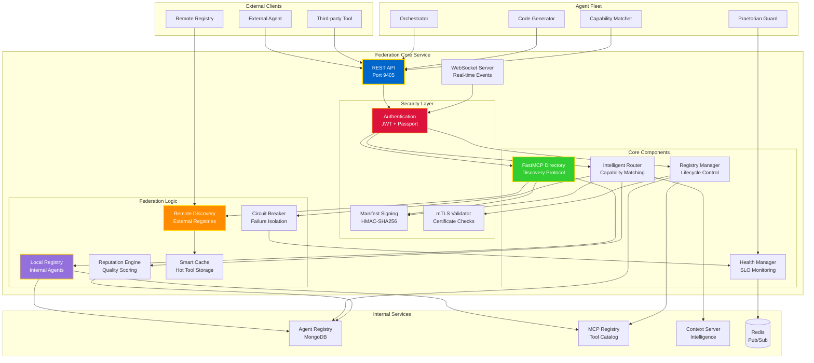

# Federation Core Architecture

## Federation Core Responsibilities

### 1. Service Discovery
- **FastMCP Directory**: Exposes discovery endpoints over HTTP tunnels
- **Registry API**: Member lifecycle management (register/heartbeat/unregister)
- **Capability Matching**: Routes requests to agents with required skills

### 2. Federation Protocol
- **Local-first**: Internal registry is the source of truth
- **Federate-on-demand**: Reaches out to remote registries when needed
- **Reputation Scoring**: Tracks latency, uptime, and result quality
- **Circuit Breaker**: Auto-isolates failing or noisy neighbors
- **Smart Caching**: Keeps high-value remote tools hot and local

### 3. Security Framework
- **Manifest Signing**: HMAC-SHA256 (upgradeable to JWS)
- **Agent Passport**: JWT with KMS-backed private keys
- **mTLS**: Certificate-based mutual authentication
- **Rate Limiting**: Per-tenant quotas and throttling

### 4. Health Monitoring
- **SLO Tracking**: Service-level objective compliance
- **Fleet Health**: Aggregates checks from all agents
- **Auto-remediation**: Triggers Praetorian Guard for failures
- **Telemetry**: Real-time metrics via Redis pub/sub

## Key Endpoints

### Public (No Auth)
- `GET /health` - Service health check
- `GET /fastmcp/manifest` - FastMCP discovery manifest

### Authenticated
- `POST /agents/register` - Register new agent
- `POST /agents/{id}/heartbeat` - Agent heartbeat
- `DELETE /agents/{id}` - Unregister agent
- `GET /agents/discover` - Capability-based discovery
- `POST /route` - Intelligent task routing

### WebSocket
- `ws://federation:9405/ws` - Real-time event stream
- Agent status updates
- Task completion notifications
- Health alerts

