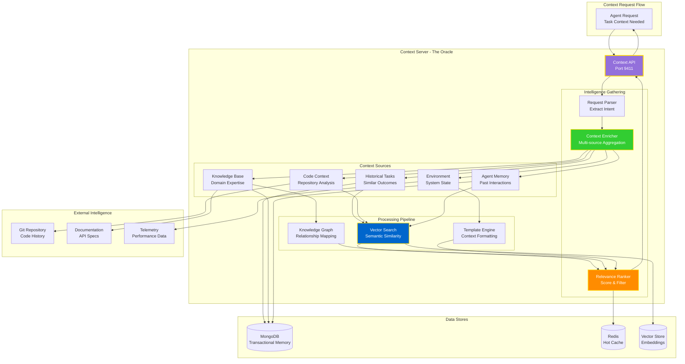
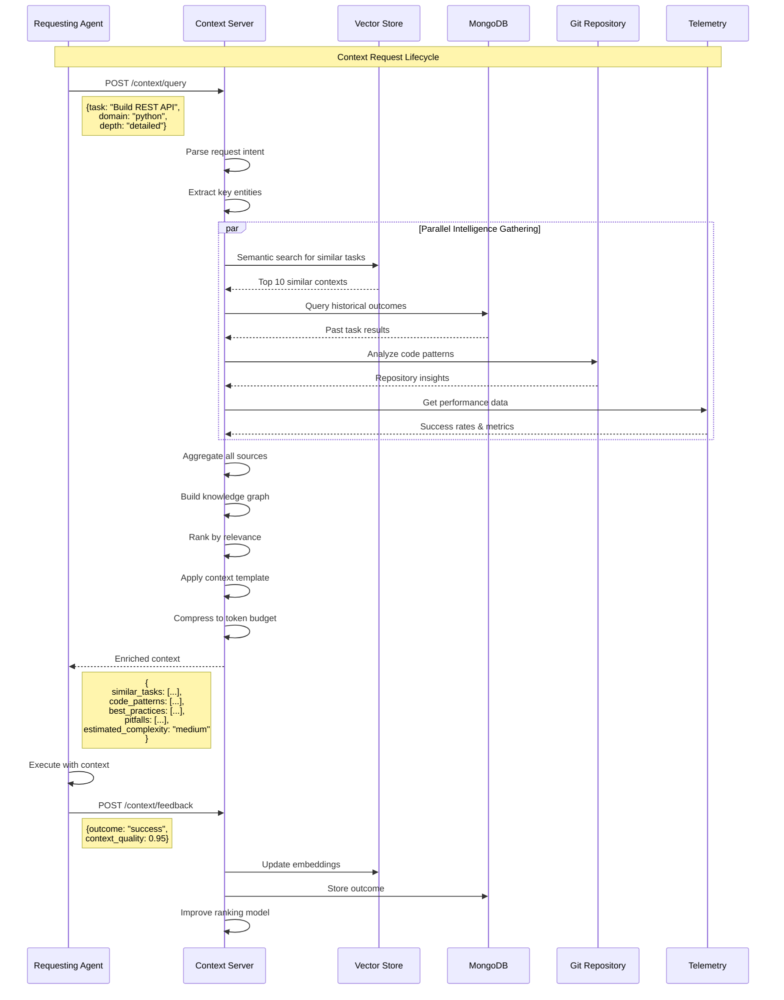

# Context Server (The Oracle) Architecture



## Context Server Flow



## Context Types

### 1. Task Context
Historical data about similar tasks:
```json
{
  "similar_tasks": [
    {
      "task_id": "task_12345",
      "description": "Build Python REST API with FastAPI",
      "outcome": "success",
      "duration_seconds": 450,
      "agent_used": "code_generator_001",
      "similarity_score": 0.92
    }
  ],
  "success_patterns": [
    "Use Pydantic models for validation",
    "Implement async endpoints",
    "Add comprehensive error handling"
  ],
  "common_pitfalls": [
    "Missing CORS configuration",
    "Inadequate input validation"
  ]
}
```

### 2. Code Context
Repository and codebase insights:
```json
{
  "repository_patterns": {
    "architecture": "microservices",
    "frameworks": ["FastAPI", "SQLAlchemy"],
    "testing": "pytest",
    "deployment": "Docker + Kubernetes"
  },
  "relevant_files": [
    {
      "path": "src/api/routes.py",
      "relevance": 0.88,
      "summary": "Existing API route patterns"
    }
  ],
  "coding_standards": {
    "style_guide": "PEP 8",
    "type_hints": "required",
    "docstrings": "Google style"
  }
}
```

### 3. Environment Context
Current system state:
```json
{
  "available_resources": {
    "cpu_cores": 8,
    "memory_gb": 16,
    "gpu": false
  },
  "active_services": [
    "mongodb",
    "redis",
    "federation_core"
  ],
  "configuration": {
    "environment": "development",
    "debug_mode": true,
    "log_level": "INFO"
  }
}
```

### 4. Agent Memory Context
Past interactions and learning:
```json
{
  "agent_history": {
    "total_tasks": 1247,
    "success_rate": 0.96,
    "specializations": ["API development", "Database design"],
    "learned_preferences": {
      "prefers_async": true,
      "testing_framework": "pytest",
      "documentation_style": "detailed"
    }
  },
  "recent_interactions": [
    {
      "timestamp": "2025-08-02T10:30:00Z",
      "task_type": "code_generation",
      "feedback": "excellent",
      "notes": "Agent excels at FastAPI patterns"
    }
  ]
}
```

## Oracle's Omniscience Law

> **"No agent shall act in ignorance."**

Every task execution must be preceded by context gathering:

1. **Query Phase**: Agent requests context from Oracle
2. **Gathering Phase**: Oracle aggregates multi-dimensional intelligence
3. **Enrichment Phase**: Context is ranked, filtered, and formatted
4. **Execution Phase**: Agent acts with full situational awareness
5. **Feedback Phase**: Outcome is stored to improve future context

## Performance Characteristics

- **Query Latency**: < 100ms (p95)
- **Context Depth**: Configurable (shallow/medium/detailed)
- **Token Budget**: Adaptive compression to fit LLM context windows
- **Cache Hit Rate**: > 80% for common queries
- **Freshness**: Real-time for environment, eventual consistency for historical

