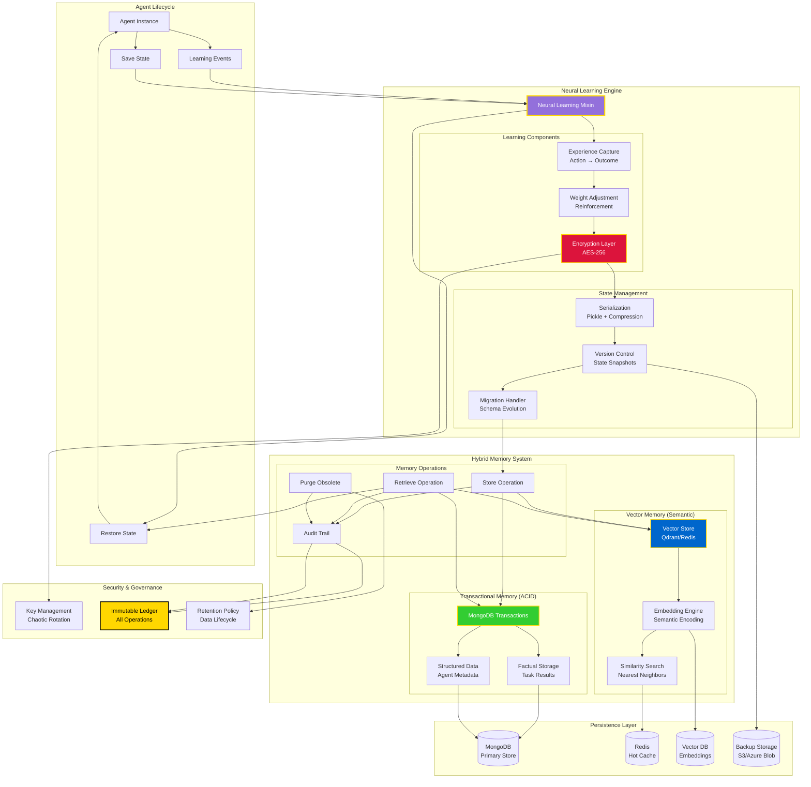
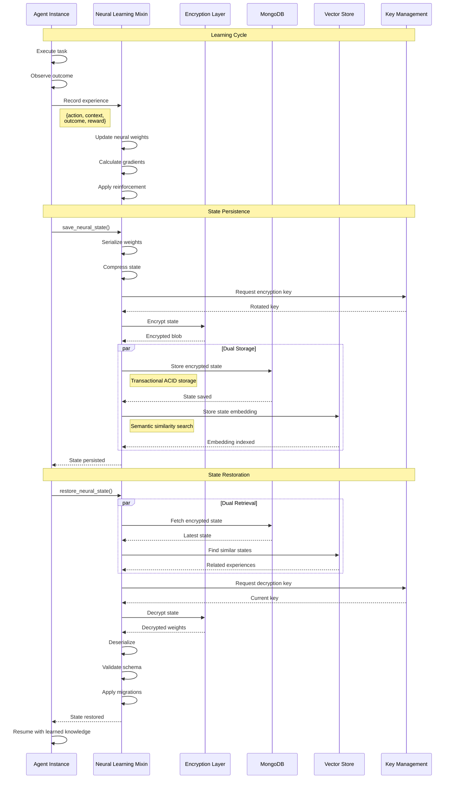

# Neural Learning & Memory Architecture



## Neural Learning Flow



## Memory Types

### 1. Transactional Memory (MongoDB)
**Purpose**: ACID-compliant storage for factual, structured data

**Use Cases**:
- Task execution results
- Agent configuration
- Workflow state
- Audit logs

**Example**:
```python
from memory.mongo_memory_provider import MongoMemoryProvider
from memory.transaction_manager import TransactionManager

provider = MongoMemoryProvider()

async with TransactionManager(provider) as tx:
    await tx.store("neural_weights", {
        "agent_id": "code_generator_001",
        "version": "1.2.3",
        "weights": encrypted_blob,
        "timestamp": datetime.utcnow()
    })
    await tx.store("task_result", {
        "task_id": "task_12345",
        "outcome": "success",
        "metrics": {...}
    })
    # Both operations commit atomically
```

### 2. Vector Memory (Semantic Search)
**Purpose**: Store meaning and enable similarity-based retrieval

**Use Cases**:
- Similar task discovery
- Context retrieval
- Pattern matching
- Experience replay

**Example**:
```python
from core.memory.memory_store import MemoryStore

store = MemoryStore()

# Store task with semantic embedding
await store.store_task(
    task_envelope={
        "description": "Build Python REST API",
        "requirements": [...],
        "context": {...}
    },
    result={
        "outcome": "success",
        "code": "...",
        "metrics": {...}
    }
)

# Find similar tasks
similar = await store.retrieve_similar_tasks(
    query="Create FastAPI microservice",
    limit=5,
    min_similarity=0.8
)
```

### 3. Neural State Storage
**Purpose**: Persistent agent learning across lifetimes

**Features**:
- **Encrypted**: AES-256 with KMS-backed keys
- **Versioned**: Snapshot history for rollback
- **Compressed**: Efficient storage of large weight matrices
- **Migrated**: Automatic schema evolution

**Example**:
```python
from mixins.neural_learning_mixin import NeuralLearningMixin

class MyAgent(BaseAgent, NeuralLearningMixin):
    async def on_task_complete(self, outcome):
        # Update learning based on outcome
        self.update_weights(outcome)
        
        # Persist learned state
        await self.save_neural_state()
    
    async def on_start(self):
        # Restore previous learning
        await self.restore_neural_state()
```

## Key Features

### Chaotic Key Rotation
Keys are rotated on unpredictable schedules to prevent pattern analysis:
```python
# Keys rotate every 1-7 days (random)
rotation_interval = random.randint(86400, 604800)
```

### Immutable Audit Trail
Every memory operation is logged immutably:
```json
{
  "operation": "store",
  "agent_id": "code_generator_001",
  "memory_type": "neural_weights",
  "timestamp": "2025-08-02T10:30:00Z",
  "justification": "Task completion learning",
  "hash": "sha256:abc123..."
}
```

### Retention Policy
Automated data lifecycle management:
- **Hot**: Recent data (< 7 days) in Redis
- **Warm**: Active data (< 90 days) in MongoDB
- **Cold**: Historical data (> 90 days) in archive
- **Purge**: Obsolete data (> 1 year) deleted with audit

### Cross-Lifetime Learning
Agents carry wisdom across restarts:
1. Agent starts → Restore neural state
2. Execute tasks → Update weights
3. Periodic save → Persist learning
4. Agent stops → Final state save
5. Agent restarts → Continue from saved state

