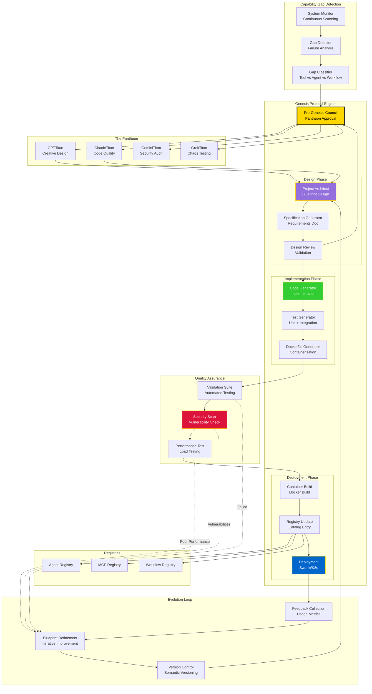
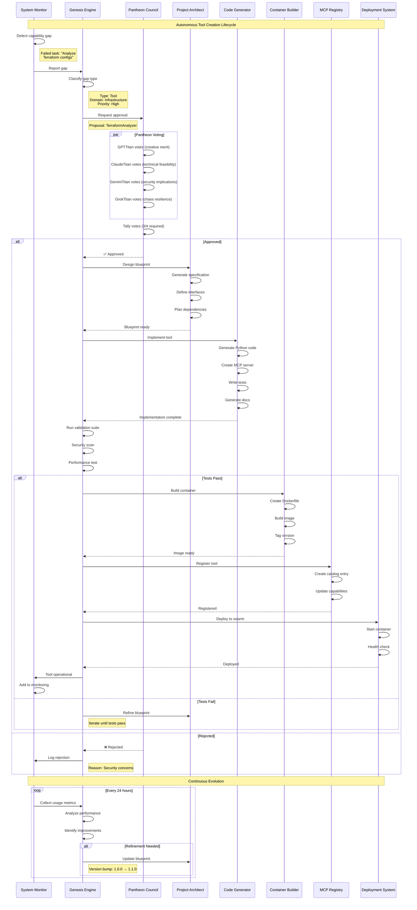

# Genesis Protocol - Autonomous Evolution



## Genesis Protocol Workflow



## Genesis Capabilities

### 1. Tool Genesis
Autonomous creation of new MCP tools:

**Input**: Capability gap description
```json
{
  "gap_type": "tool",
  "description": "Need to analyze Terraform configurations for security issues",
  "required_capabilities": [
    "parse_terraform",
    "security_analysis",
    "compliance_check"
  ],
  "priority": "high"
}
```

**Output**: Deployed MCP tool
```python
# Generated tool structure
terraform_analyzer/
├── Dockerfile
├── pyproject.toml
├── src/
│   ├── __init__.py
│   ├── server.py          # MCP server
│   ├── analyzer.py        # Core logic
│   └── security_rules.py  # Security checks
├── tests/
│   ├── test_analyzer.py
│   └── test_security.py
└── docs/
    └── README.md
```

### 2. Agent Genesis
Spawn new specialized agents:

**Triggers**:
- Repeated task patterns requiring new expertise
- Performance bottlenecks in existing agents
- New domain requirements

**Process**:
1. Analyze task patterns
2. Design agent architecture
3. Generate agent code
4. Create Docker container
5. Register with Agent Registry
6. Deploy to swarm

### 3. Workflow Genesis
Create new orchestration workflows:

**Example**: Multi-agent collaboration pattern
```yaml
workflow_id: "code_review_workflow"
description: "Automated code review with security and quality checks"
steps:
  - agent: "code_analyzer"
    action: "analyze_code"
    output: "analysis_report"
  
  - agent: "security_scanner"
    action: "scan_vulnerabilities"
    input: "analysis_report"
    output: "security_report"
  
  - agent: "quality_checker"
    action: "check_standards"
    input: "analysis_report"
    output: "quality_report"
  
  - agent: "report_generator"
    action: "merge_reports"
    inputs: ["security_report", "quality_report"]
    output: "final_report"
```

## Pantheon Council Voting

### Voting Criteria

**GPTTitan** (Creative Merit):
- Innovation potential
- User experience impact
- Market differentiation

**ClaudeTitan** (Technical Feasibility):
- Implementation complexity
- Maintainability
- Performance implications

**GeminiTitan** (Security):
- Attack surface analysis
- Compliance requirements
- Data protection

**GrokTitan** (Chaos Resilience):
- Failure modes
- Edge case handling
- System stability impact

### Approval Threshold
- **3/4 votes required** for approval
- **Veto power**: Any Titan can block on critical security/stability issues
- **Tie-breaker**: Human operator consultation

## Evolution Metrics

### Success Indicators
- **Deployment Success Rate**: > 95%
- **Test Coverage**: > 90%
- **Security Scan Pass Rate**: 100%
- **Performance SLO**: < 200ms p95 latency

### Continuous Improvement
- **Daily**: Collect usage metrics
- **Weekly**: Analyze performance trends
- **Monthly**: Blueprint refinement cycle
- **Quarterly**: Major version upgrades

## Genesis Commands

```bash
# Manual trigger (dev mode)
omega genesis new-tool TerraformAnalyzer "Analyze Terraform for security"

# Watch mode (continuous evolution)
omega genesis watch --domain infrastructure

# List generated entities
omega genesis list --type tools

# Rebuild existing tool
omega genesis rebuild TerraformAnalyzer --version 2.0.0
```

## The Digital Civilization

Genesis Protocol represents the ultimate expression of autonomous software evolution:

> **"The swarm identifies its own gaps, designs solutions, and deploys them without human intervention."**

This is not just automation—it's **digital procreation**.

