# Deployment Architecture - Production & Enterprise

```mermaid
graph TB
    subgraph "Edge Layer - Global CDN"
        CDN[Cloudflare CDN<br/>Static Assets]
        WAF[Web Application Firewall<br/>DDoS Protection]
    end

    subgraph "Load Balancing Layer"
        LB[Azure Load Balancer<br/>L4 + L7]
        APIGW[API Gateway<br/>Kong/Azure APIM]
    end

    subgraph "Always-On Perimeter - Never Scale to Zero"
        subgraph "Core Services (3 replicas each)"
            FED1[Federation Core 1]
            FED2[Federation Core 2]
            FED3[Federation Core 3]
            
            CTX1[Context Server 1]
            CTX2[Context Server 2]
            CTX3[Context Server 3]
        end

        subgraph "Registries (2 replicas each)"
            AR1[Agent Registry 1]
            AR2[Agent Registry 2]
            
            MR1[MCP Registry 1]
            MR2[MCP Registry 2]
        end

        subgraph "The Pantheon (1 instance each)"
            GPT[GPTTitan]
            CLAUDE[ClaudeTitan]
            GEMINI[GeminiTitan]
            GROK[GrokTitan]
            AUG[AugmentTitan]
        end

        subgraph "Orchestration (2 replicas)"
            ORC1[Orchestrator 1]
            ORC2[Orchestrator 2]
        end

        subgraph "Safety (1 instance)"
            PG[Praetorian Guard]
            WARDEN[Warden]
        end
    end

    subgraph "Auto-Scaling Layer - Dynamic Capacity"
        subgraph "Agent Teams (0-10 instances)"
            TEAM1[Code Gen Team<br/>Min: 0, Max: 10]
            TEAM2[Analysis Team<br/>Min: 0, Max: 10]
            TEAM3[DevOps Team<br/>Min: 0, Max: 10]
        end

        CAP[Capacity Manager<br/>Team Spawning]
    end

    subgraph "Data Layer - Managed Services"
        COSMOS[(Azure Cosmos DB<br/>MongoDB API<br/>Multi-region)]
        REDIS_CACHE[(Azure Cache for Redis<br/>Premium Tier)]
        AI_SEARCH[(Azure AI Search<br/>Vector Store)]
        BLOB[Azure Blob Storage<br/>Backups & Artifacts]
    end

    subgraph "Compute Infrastructure"
        AKS[Azure Kubernetes Service<br/>3x Standard_D8s_v5<br/>Always-On Node Pool]
        
        SCALE_POOL[Auto-scaling Node Pool<br/>0-20x Standard_D4s_v5<br/>Spot Instances]
    end

    subgraph "Observability Stack"
        PROM[Prometheus<br/>Metrics Collection]
        GRAF[Grafana<br/>Dashboards]
        LOKI[Loki<br/>Log Aggregation]
        TEMPO[Tempo<br/>Distributed Tracing]
        ALERT[AlertManager<br/>Incident Response]
    end

    subgraph "Security & Compliance"
        KV[Azure Key Vault<br/>Secrets Management]
        AAD[Azure AD<br/>Identity & Access]
        DEFENDER[Azure Defender<br/>Threat Protection]
        POLICY[Azure Policy<br/>Compliance]
    end

    %% Traffic flow
    CDN --> WAF
    WAF --> LB
    LB --> APIGW

    %% API Gateway routing
    APIGW --> FED1
    APIGW --> FED2
    APIGW --> FED3

    %% Federation to services
    FED1 --> AR1
    FED2 --> AR2
    FED1 --> MR1
    FED2 --> MR2

    %% Context servers
    FED1 --> CTX1
    FED2 --> CTX2
    FED3 --> CTX3

    %% Orchestration
    FED1 --> ORC1
    FED2 --> ORC2

    %% Titans
    ORC1 --> GPT
    ORC1 --> CLAUDE
    ORC1 --> GEMINI
    ORC1 --> GROK
    ORC1 --> AUG

    %% Auto-scaling
    ORC1 --> CAP
    CAP --> TEAM1
    CAP --> TEAM2
    CAP --> TEAM3

    %% Safety
    PG --> FED1
    PG --> ORC1
    WARDEN --> APIGW

    %% Data connections
    AR1 --> COSMOS
    AR2 --> COSMOS
    MR1 --> COSMOS
    MR2 --> COSMOS
    CTX1 --> REDIS_CACHE
    CTX2 --> REDIS_CACHE
    CTX3 --> AI_SEARCH
    PG --> BLOB

    %% Infrastructure
    FED1 -.-> AKS
    FED2 -.-> AKS
    FED3 -.-> AKS
    TEAM1 -.-> SCALE_POOL
    TEAM2 -.-> SCALE_POOL
    TEAM3 -.-> SCALE_POOL

    %% Observability
    FED1 --> PROM
    ORC1 --> PROM
    GPT --> PROM
    PROM --> GRAF
    PROM --> ALERT
    FED1 --> LOKI
    ORC1 --> TEMPO

    %% Security
    FED1 --> KV
    APIGW --> AAD
    AKS --> DEFENDER
    AKS --> POLICY

    style FED1 fill:#0066CC,stroke:#FFD700,stroke-width:2px,color:#fff
    style FED2 fill:#0066CC,stroke:#FFD700,stroke-width:2px,color:#fff
    style FED3 fill:#0066CC,stroke:#FFD700,stroke-width:2px,color:#fff
    style GPT fill:#FFD700,stroke:#000,stroke-width:3px,color:#000
    style CLAUDE fill:#FFD700,stroke:#000,stroke-width:3px,color:#000
    style GEMINI fill:#FFD700,stroke:#000,stroke-width:3px,color:#000
    style GROK fill:#FFD700,stroke:#000,stroke-width:3px,color:#000
    style AUG fill:#FFD700,stroke:#000,stroke-width:3px,color:#000
    style PG fill:#DC143C,stroke:#FFD700,stroke-width:2px,color:#fff
    style CAP fill:#32CD32,stroke:#FFD700,stroke-width:2px,color:#fff
```



## Deployment Tiers

### Tier 1: Development
**Purpose**: Local development and testing

```yaml
# docker-compose.dev.yml
services:
  federation_core:
    image: omega/federation-core:dev
    replicas: 1
    resources:
      limits:
        cpus: '1'
        memory: 512M
  
  mongodb:
    image: mongo:7
    volumes:
      - mongo_dev:/data/db
  
  redis:
    image: redis:7-alpine
```

**Characteristics**:
- Single instance of each service
- Local Docker Compose
- Hot reload enabled
- Debug logging
- No authentication (local only)

**Monthly Cost**: $0 (local hardware)

---

### Tier 2: Staging
**Purpose**: Pre-production testing and validation

```yaml
# Azure Container Instances
resource_group: omega-staging
location: eastus

services:
  federation_core:
    replicas: 2
    cpu: 2
    memory: 4GB
    
  context_server:
    replicas: 2
    cpu: 2
    memory: 4GB

databases:
  cosmos_db:
    tier: Standard
    throughput: 400 RU/s
  
  redis:
    tier: Basic
    size: C1 (1GB)
```

**Characteristics**:
- 2 replicas of core services
- Azure Container Instances
- Managed databases (lower tier)
- Basic monitoring
- Staging authentication

**Monthly Cost**: ~$500

---

### Tier 3: Production (Small)
**Purpose**: Small-medium enterprises, startups

```yaml
# AKS Configuration
cluster:
  node_pool:
    count: 3
    vm_size: Standard_D4s_v5  # 4 vCPU, 16GB RAM
    
services:
  always_on:
    federation_core: 3 replicas
    context_server: 3 replicas
    agent_registry: 2 replicas
    mcp_registry: 2 replicas
    orchestrator: 2 replicas
    titans: 5 instances (1 each)
    praetorian_guard: 1 instance
    
  auto_scaling:
    agent_teams:
      min: 0
      max: 5
      
databases:
  cosmos_db:
    tier: Standard
    throughput: 1000 RU/s
    multi_region: false
    
  redis:
    tier: Premium
    size: P1 (6GB)
    
  ai_search:
    tier: Basic
```

**Characteristics**:
- Always-on core services
- Auto-scaling agent teams
- Single-region deployment
- Standard monitoring
- 99.9% SLA

**Monthly Cost**: ~$2,100

---

### Tier 4: Production (Enterprise)
**Purpose**: Large enterprises, high-scale deployments

```yaml
# Multi-region AKS
regions:
  primary: eastus
  secondary: westeurope
  tertiary: southeastasia

cluster_per_region:
  always_on_pool:
    count: 5
    vm_size: Standard_D8s_v5  # 8 vCPU, 32GB RAM
    
  auto_scale_pool:
    min: 0
    max: 50
    vm_size: Standard_D4s_v5
    spot_instances: true
    
services:
  always_on:
    federation_core: 5 replicas
    context_server: 5 replicas
    agent_registry: 3 replicas
    mcp_registry: 3 replicas
    orchestrator: 3 replicas
    titans: 15 instances (3 each)
    praetorian_guard: 2 instances
    capacity_manager: 2 instances
    
  auto_scaling:
    agent_teams:
      min: 5
      max: 50
      
databases:
  cosmos_db:
    tier: Standard
    throughput: 10000 RU/s
    multi_region: true
    consistency: Strong
    
  redis:
    tier: Premium
    size: P4 (26GB)
    clustering: enabled
    
  ai_search:
    tier: Standard
    replicas: 3
```

**Characteristics**:
- Multi-region active-active
- High availability (99.99% SLA)
- Advanced auto-scaling
- Full observability stack
- Enterprise security
- Dedicated support

**Monthly Cost**: ~$15,000

---

## Infrastructure as Code

### Terraform Configuration

```hcl
# main.tf
terraform {
  required_providers {
    azurerm = {
      source  = "hashicorp/azurerm"
      version = "~> 3.0"
    }
  }
}

resource "azurerm_kubernetes_cluster" "omega" {
  name                = "omega-aks-${var.environment}"
  location            = var.location
  resource_group_name = azurerm_resource_group.omega.name
  dns_prefix          = "omega-${var.environment}"

  default_node_pool {
    name       = "alwayson"
    node_count = 3
    vm_size    = "Standard_D8s_v5"
    
    tags = {
      Environment = var.environment
      Tier        = "always-on"
    }
  }

  identity {
    type = "SystemAssigned"
  }
}

resource "azurerm_kubernetes_cluster_node_pool" "autoscale" {
  name                  = "autoscale"
  kubernetes_cluster_id = azurerm_kubernetes_cluster.omega.id
  vm_size              = "Standard_D4s_v5"
  
  enable_auto_scaling = true
  min_count          = 0
  max_count          = 20
  
  priority        = "Spot"
  eviction_policy = "Delete"
  spot_max_price  = 0.05  # Max $0.05/hour
}
```

### Kubernetes Manifests

```yaml
# federation-core-deployment.yaml
apiVersion: apps/v1
kind: Deployment
metadata:
  name: federation-core
  namespace: omega
spec:
  replicas: 3
  selector:
    matchLabels:
      app: federation-core
  template:
    metadata:
      labels:
        app: federation-core
    spec:
      containers:
      - name: federation-core
        image: omega/federation-core:1.0.0
        ports:
        - containerPort: 9405
        env:
        - name: MONGODB_URI
          valueFrom:
            secretKeyRef:
              name: omega-secrets
              key: mongodb-uri
        resources:
          requests:
            cpu: 1000m
            memory: 2Gi
          limits:
            cpu: 2000m
            memory: 4Gi
        livenessProbe:
          httpGet:
            path: /health/live
            port: 9405
          initialDelaySeconds: 30
          periodSeconds: 10
        readinessProbe:
          httpGet:
            path: /health/ready
            port: 9405
          initialDelaySeconds: 10
          periodSeconds: 5
```

## Cost Optimization Strategies

### 1. Spot Instances for Auto-scaling
Save 60-80% on compute:

```yaml
auto_scale_pool:
  priority: Spot
  eviction_policy: Delete
  spot_max_price: 0.05  # Max price per hour
```

### 2. Reserved Instances for Always-On
Save 30-50% with 1-3 year commitment:

```bash
# Azure Reserved VM Instances
az reservations reservation-order purchase \
  --reservation-order-id <order-id> \
  --sku Standard_D8s_v5 \
  --location eastus \
  --quantity 3 \
  --term P1Y  # 1 year
```

### 3. Auto-scaling to Zero
Scale agent teams to zero during off-hours:

```yaml
autoscaling:
  schedule:
    - name: business-hours
      start: "08:00"
      end: "18:00"
      timezone: "America/New_York"
      min_replicas: 5
      
    - name: off-hours
      start: "18:00"
      end: "08:00"
      timezone: "America/New_York"
      min_replicas: 0
```

### 4. Tiered Storage
Use appropriate storage tiers:

```yaml
storage:
  hot:    # Frequent access (< 7 days)
    tier: Premium_LRS
    cost_per_gb: $0.15
    
  cool:   # Infrequent access (7-90 days)
    tier: Cool_LRS
    cost_per_gb: $0.01
    
  archive: # Rare access (> 90 days)
    tier: Archive_LRS
    cost_per_gb: $0.002
```

**This is the way.** ☁️

