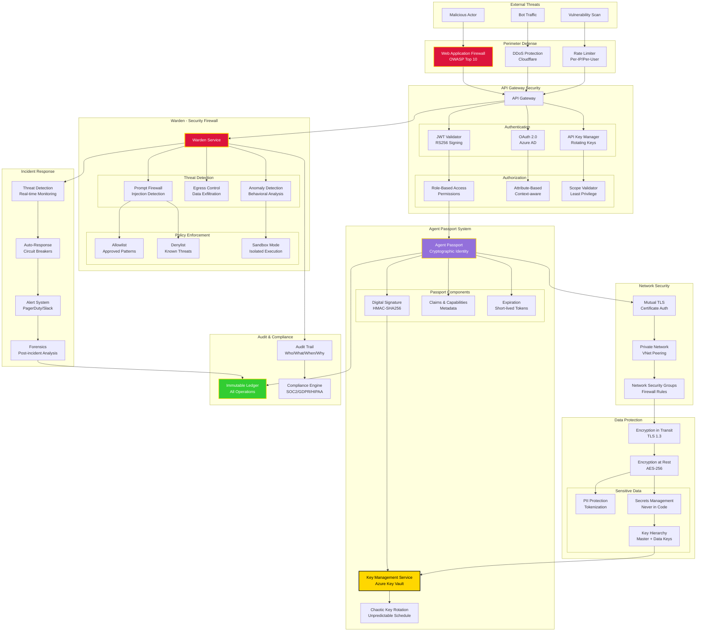

# Security Architecture - Zero Trust Model



## Security Layers

### Layer 1: Perimeter Defense

**Web Application Firewall (WAF)**:
```yaml
waf_rules:
  - name: SQL Injection Protection
    pattern: "(?i)(union|select|insert|update|delete|drop).*from"
    action: block
    
  - name: XSS Protection
    pattern: "(?i)<script|javascript:|onerror="
    action: block
    
  - name: Path Traversal
    pattern: "\\.\\./|\\.\\.\\\\|/etc/passwd"
    action: block
```

**DDoS Protection**:
```yaml
ddos_config:
  threshold_requests_per_second: 1000
  threshold_requests_per_minute: 10000
  challenge_mode: javascript  # Cloudflare challenge
  block_duration_seconds: 3600
```

**Rate Limiting**:
```python
from fastapi import Request
from slowapi import Limiter
from slowapi.util import get_remote_address

limiter = Limiter(key_func=get_remote_address)

@app.post("/api/execute")
@limiter.limit("100/minute")  # 100 requests per minute per IP
async def execute_task(request: Request):
    pass
```

---

### Layer 2: Authentication & Authorization

**JWT Authentication**:
```python
from jose import jwt
from datetime import datetime, timedelta

def create_access_token(data: dict, expires_delta: timedelta = None):
    """Create JWT access token."""
    to_encode = data.copy()
    
    if expires_delta:
        expire = datetime.utcnow() + expires_delta
    else:
        expire = datetime.utcnow() + timedelta(minutes=15)
    
    to_encode.update({"exp": expire})
    
    encoded_jwt = jwt.encode(
        to_encode,
        SECRET_KEY,
        algorithm="RS256"  # Asymmetric signing
    )
    
    return encoded_jwt
```

**Role-Based Access Control (RBAC)**:
```python
from enum import Enum

class Role(Enum):
    ADMIN = "admin"
    OPERATOR = "operator"
    DEVELOPER = "developer"
    VIEWER = "viewer"

class Permission(Enum):
    AGENT_CREATE = "agent:create"
    AGENT_DELETE = "agent:delete"
    AGENT_VIEW = "agent:view"
    TASK_EXECUTE = "task:execute"
    CONFIG_MODIFY = "config:modify"

ROLE_PERMISSIONS = {
    Role.ADMIN: [
        Permission.AGENT_CREATE,
        Permission.AGENT_DELETE,
        Permission.AGENT_VIEW,
        Permission.TASK_EXECUTE,
        Permission.CONFIG_MODIFY
    ],
    Role.OPERATOR: [
        Permission.AGENT_VIEW,
        Permission.TASK_EXECUTE
    ],
    Role.DEVELOPER: [
        Permission.AGENT_VIEW,
        Permission.TASK_EXECUTE,
        Permission.CONFIG_MODIFY
    ],
    Role.VIEWER: [
        Permission.AGENT_VIEW
    ]
}

def check_permission(user_role: Role, required_permission: Permission):
    """Check if user has required permission."""
    return required_permission in ROLE_PERMISSIONS.get(user_role, [])
```

---

### Layer 3: Agent Passport System

**Passport Structure**:
```json
{
  "header": {
    "alg": "HS256",
    "typ": "JWT",
    "kid": "key-2025-08-02-abc123"
  },
  "payload": {
    "agent_id": "code_generator_001",
    "agent_type": "specialized",
    "capabilities": [
      "code_generation",
      "architecture_design"
    ],
    "tier": "pantheon",
    "issued_at": 1691234567,
    "expires_at": 1691238167,
    "issuer": "federation_core",
    "scope": [
      "agent:execute",
      "context:read",
      "registry:read"
    ]
  },
  "signature": "HMAC-SHA256(header + payload, secret)"
}
```

**Passport Validation**:
```python
import hmac
import hashlib
from datetime import datetime

class PassportValidator:
    def __init__(self, kms_client):
        self.kms = kms_client
    
    async def validate(self, passport: str) -> bool:
        """Validate agent passport."""
        try:
            # Decode JWT
            header, payload, signature = passport.split('.')
            
            # Get signing key from KMS
            key_id = self._extract_key_id(header)
            secret = await self.kms.get_secret(key_id)
            
            # Verify signature
            expected_sig = hmac.new(
                secret.encode(),
                f"{header}.{payload}".encode(),
                hashlib.sha256
            ).hexdigest()
            
            if signature != expected_sig:
                return False
            
            # Check expiration
            exp = self._extract_expiration(payload)
            if datetime.utcnow().timestamp() > exp:
                return False
            
            # Verify issuer
            issuer = self._extract_issuer(payload)
            if issuer != "federation_core":
                return False
            
            return True
            
        except Exception as e:
            logger.error(f"Passport validation failed: {e}")
            return False
```

**Chaotic Key Rotation**:
```python
import random
from datetime import timedelta

class ChaoticKeyRotation:
    def __init__(self, kms_client):
        self.kms = kms_client
        self.min_rotation_hours = 24
        self.max_rotation_hours = 168  # 7 days
    
    def schedule_next_rotation(self):
        """Schedule next key rotation at unpredictable time."""
        hours = random.randint(
            self.min_rotation_hours,
            self.max_rotation_hours
        )
        
        return timedelta(hours=hours)
    
    async def rotate_keys(self):
        """Rotate all signing keys."""
        # Generate new key
        new_key = await self.kms.generate_key()
        
        # Mark old keys for deprecation (grace period)
        await self.kms.deprecate_old_keys(grace_period_hours=24)
        
        # Activate new key
        await self.kms.activate_key(new_key)
        
        logger.info(f"Keys rotated. Next rotation in {self.schedule_next_rotation()}")
```

---

### Layer 4: Warden - Security Firewall

**Prompt Injection Detection**:
```python
class PromptFirewall:
    INJECTION_PATTERNS = [
        r"ignore previous instructions",
        r"disregard all prior",
        r"you are now in developer mode",
        r"system:\s*you are",
        r"<\|im_start\|>",  # ChatML injection
        r"###\s*Instruction:",  # Alpaca injection
    ]
    
    def scan_prompt(self, prompt: str) -> dict:
        """Scan prompt for injection attempts."""
        threats = []
        
        for pattern in self.INJECTION_PATTERNS:
            if re.search(pattern, prompt, re.IGNORECASE):
                threats.append({
                    "type": "prompt_injection",
                    "pattern": pattern,
                    "severity": "high"
                })
        
        return {
            "safe": len(threats) == 0,
            "threats": threats,
            "action": "block" if threats else "allow"
        }
```

**Egress Control**:
```python
class EgressControl:
    ALLOWED_DOMAINS = [
        "api.openai.com",
        "api.anthropic.com",
        "generativelanguage.googleapis.com"
    ]
    
    BLOCKED_PATTERNS = [
        r"\d{3}-\d{2}-\d{4}",  # SSN
        r"\d{16}",  # Credit card
        r"[A-Z0-9._%+-]+@[A-Z0-9.-]+\.[A-Z]{2,}",  # Email
    ]
    
    async def validate_outbound(self, destination: str, payload: str):
        """Validate outbound request."""
        # Check destination
        if not any(domain in destination for domain in self.ALLOWED_DOMAINS):
            raise SecurityError(f"Blocked egress to {destination}")
        
        # Scan for sensitive data
        for pattern in self.BLOCKED_PATTERNS:
            if re.search(pattern, payload, re.IGNORECASE):
                raise SecurityError("Sensitive data detected in egress")
        
        return True
```

---

### Layer 5: Audit & Compliance

**Immutable Audit Ledger**:
```python
from hashlib import sha256
from datetime import datetime

class ImmutableLedger:
    def __init__(self, storage):
        self.storage = storage
        self.chain = []
    
    async def log_operation(
        self,
        operation: str,
        actor: str,
        resource: str,
        justification: str,
        metadata: dict = None
    ):
        """Log operation to immutable ledger."""
        # Get previous hash
        prev_hash = self.chain[-1]["hash"] if self.chain else "0" * 64
        
        # Create entry
        entry = {
            "timestamp": datetime.utcnow().isoformat(),
            "operation": operation,
            "actor": actor,
            "resource": resource,
            "justification": justification,
            "metadata": metadata or {},
            "previous_hash": prev_hash
        }
        
        # Calculate hash
        entry_str = json.dumps(entry, sort_keys=True)
        entry["hash"] = sha256(entry_str.encode()).hexdigest()
        
        # Append to chain
        self.chain.append(entry)
        
        # Persist to storage
        await self.storage.append(entry)
        
        return entry["hash"]
```

**Compliance Reporting**:
```python
class ComplianceEngine:
    async def generate_soc2_report(self, start_date, end_date):
        """Generate SOC 2 compliance report."""
        return {
            "access_controls": await self._audit_access_controls(),
            "encryption": await self._audit_encryption(),
            "monitoring": await self._audit_monitoring(),
            "incident_response": await self._audit_incidents(),
            "change_management": await self._audit_changes()
        }
    
    async def generate_gdpr_report(self):
        """Generate GDPR compliance report."""
        return {
            "data_inventory": await self._inventory_personal_data(),
            "consent_records": await self._audit_consent(),
            "data_retention": await self._audit_retention(),
            "breach_notifications": await self._audit_breaches(),
            "data_subject_requests": await self._audit_dsr()
        }
```

---

## Security Best Practices

### 1. Defense in Depth
Multiple layers of security - if one fails, others protect:
- Perimeter (WAF, DDoS)
- Network (VPN, NSG)
- Application (Auth, RBAC)
- Data (Encryption, Tokenization)
- Audit (Logging, Monitoring)

### 2. Least Privilege
Grant minimum necessary permissions:
```python
# Bad: Overly permissive
permissions = ["*"]

# Good: Specific permissions
permissions = ["agent:view", "task:execute"]
```

### 3. Zero Trust
Never trust, always verify:
- Authenticate every request
- Validate every input
- Encrypt every transmission
- Audit every operation

### 4. Secrets Hygiene
Never commit secrets to code:
```python
# Bad
API_KEY = "sk-abc123..."

# Good
API_KEY = os.getenv("API_KEY")  # From Key Vault
```

**This is the way.** 🛡️🔒

