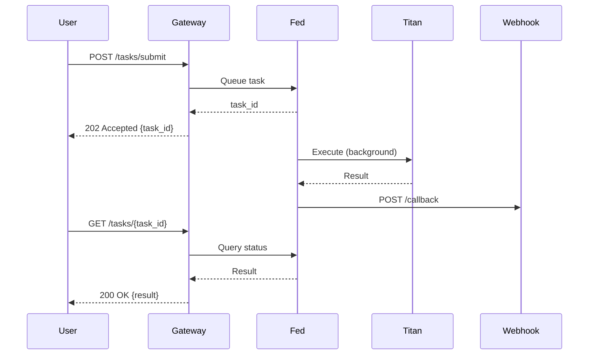
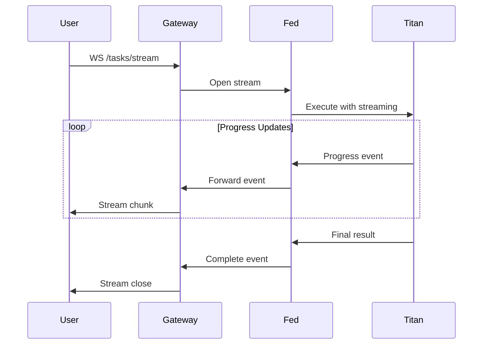
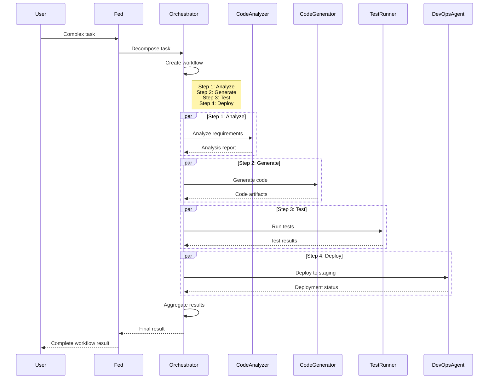

# End-to-End Data Flow - Task Execution Lifecycle

```mermaid
sequenceDiagram
    participant User as User/Client
    participant Gateway as API Gateway
    participant Warden as Warden (Security)
    participant Fed as Federation Core
    participant Oracle as Context Server
    participant Matcher as Capability Matcher
    participant Registry as Agent Registry
    participant Titan as Selected Titan
    participant Memory as Memory Store
    participant PG as Praetorian Guard

    Note over User,PG: Phase 1: Request Ingress & Security

    User->>Gateway: POST /tasks/execute
    Note right of User: {<br/>  task: "Build REST API",<br/>  requirements: [...],<br/>  context: {...}<br/>}

    Gateway->>Gateway: Rate limit check
    Gateway->>Gateway: Validate JWT token
    Gateway->>Gateway: Check RBAC permissions

    Gateway->>Warden: Security scan
    Warden->>Warden: Prompt injection check
    Warden->>Warden: Sensitive data scan
    Warden-->>Gateway: ✅ Safe to proceed

    Gateway->>Fed: Forward validated request
    Note right of Gateway: Signed with API Gateway cert

    Note over User,PG: Phase 2: Context Gathering (Oracle's Omniscience)

    Fed->>Oracle: GET /context/query
    Note right of Fed: {<br/>  task: "Build REST API",<br/>  depth: "detailed"<br/>}

    par Parallel Intelligence Gathering
        Oracle->>Memory: Query similar tasks
        Memory-->>Oracle: Historical outcomes
        
        Oracle->>Memory: Search code patterns
        Memory-->>Oracle: Repository insights
        
        Oracle->>Registry: Get agent performance
        Registry-->>Oracle: Success metrics
    end

    Oracle->>Oracle: Aggregate intelligence
    Oracle->>Oracle: Rank by relevance
    Oracle->>Oracle: Build context package

    Oracle-->>Fed: Enriched context
    Note left of Oracle: {<br/>  similar_tasks: [...],<br/>  best_practices: [...],<br/>  pitfalls: [...],<br/>  estimated_complexity: "medium"<br/>}

    Note over User,PG: Phase 3: Capability Matching & Agent Selection

    Fed->>Matcher: Find optimal agent
    Note right of Fed: {<br/>  task: {...},<br/>  context: {...},<br/>  requirements: [...]<br/>}

    Matcher->>Registry: Query agents by capability
    Note right of Matcher: capabilities=["code_generation"]

    Registry-->>Matcher: Candidate agents
    Note left of Registry: [<br/>  {id: "claude_titan", score: 0.95},<br/>  {id: "gpt_titan", score: 0.92},<br/>  {id: "code_gen_001", score: 0.88}<br/>]

    Matcher->>Matcher: Score candidates
    Note right of Matcher: Factors:<br/>- Capability match<br/>- Current load<br/>- Historical performance<br/>- Reputation score

    Matcher->>Registry: Get agent health
    Registry-->>Matcher: Health status

    Matcher->>Matcher: Select best agent
    Matcher-->>Fed: Selected: ClaudeTitan

    Note over User,PG: Phase 4: Task Envelope Creation

    Fed->>Fed: Create immutable task envelope
    Note right of Fed: {<br/>  task_id: "task_12345",<br/>  agent_id: "claude_titan",<br/>  task: {...},<br/>  context: {...},<br/>  timestamp: "2025-08-02T10:30:00Z",<br/>  signature: "sha256:abc123..."<br/>}

    Fed->>Fed: Sign envelope (HMAC-SHA256)
    Fed->>Memory: Store envelope
    Memory-->>Fed: Stored

    Note over User,PG: Phase 5: Agent Execution

    Fed->>Titan: POST /execute
    Note right of Fed: Task envelope + Agent passport

    Titan->>Titan: Validate passport
    Titan->>Titan: Verify envelope signature
    Titan->>Titan: Load neural state

    Titan->>Oracle: Request additional context
    Oracle-->>Titan: Domain-specific intel

    Titan->>Titan: Execute task
    Note right of Titan: Generate code,<br/>run tests,<br/>validate output

    Titan->>Titan: Update neural weights
    Titan->>Titan: Save learning state

    Titan-->>Fed: Task result
    Note left of Titan: {<br/>  task_id: "task_12345",<br/>  status: "success",<br/>  result: {...},<br/>  metrics: {<br/>    duration_ms: 4500,<br/>    tokens_used: 2340<br/>  },<br/>  signature: "sha256:def456..."<br/>}

    Note over User,PG: Phase 6: Result Processing & Storage

    Fed->>Fed: Validate result signature
    Fed->>Fed: Update task status

    Fed->>Memory: Store result
    Memory->>Memory: Transactional storage (MongoDB)
    Memory->>Memory: Vector embedding (semantic search)
    Memory-->>Fed: Stored

    Fed->>Registry: Update agent metrics
    Note right of Fed: {<br/>  success: true,<br/>  latency_ms: 4500,<br/>  quality_score: 0.95<br/>}

    Registry->>Registry: Update reputation score
    Registry-->>Fed: Metrics updated

    Note over User,PG: Phase 7: Health Monitoring & Learning

    Fed->>PG: Report task completion
    PG->>PG: Update agent health score
    PG->>PG: Check SLO compliance
    PG-->>Fed: Health status: HEALTHY

    Fed->>Oracle: Feedback for learning
    Oracle->>Oracle: Update context model
    Oracle->>Oracle: Refine recommendations

    Note over User,PG: Phase 8: Response Delivery

    Fed->>Warden: Egress scan
    Warden->>Warden: Check for sensitive data
    Warden->>Warden: Validate output safety
    Warden-->>Fed: ✅ Safe to return

    Fed-->>Gateway: Task result
    Gateway->>Gateway: Format response
    Gateway->>Gateway: Add response headers

    Gateway-->>User: 200 OK + Result
    Note left of Gateway: {<br/>  task_id: "task_12345",<br/>  status: "success",<br/>  result: {...},<br/>  metadata: {<br/>    agent: "claude_titan",<br/>    duration_ms: 4500,<br/>    quality_score: 0.95<br/>  }<br/>}

    Note over User,PG: Phase 9: Audit Trail

    Fed->>Memory: Log to immutable ledger
    Note right of Fed: {<br/>  operation: "task_execute",<br/>  actor: "user_123",<br/>  resource: "task_12345",<br/>  timestamp: "...",<br/>  justification: "User request",<br/>  hash: "sha256:..."<br/>}

    Memory->>Memory: Append to audit chain
    Memory-->>Fed: Logged
```



## Data Flow Patterns

### 1. Synchronous Request-Response
**Use Case**: Interactive tasks requiring immediate results

**Characteristics**:
- User waits for completion
- Timeout: 30 seconds
- Real-time feedback
- Direct response

**Example**:
```python
response = await client.execute_task({
    "task": "Analyze code for security issues",
    "code": "...",
    "timeout": 30
})
```

---

### 2. Asynchronous Task Queue
**Use Case**: Long-running tasks (> 30 seconds)

**Characteristics**:
- Immediate task ID returned
- Background processing
- Webhook/polling for status
- Result retrieval when complete

**Flow**:


---

### 3. Streaming Response
**Use Case**: Real-time progress updates

**Characteristics**:
- WebSocket connection
- Incremental results
- Progress indicators
- Cancellable

**Flow**:


---

### 4. Multi-Agent Collaboration
**Use Case**: Complex tasks requiring multiple agents

**Flow**:


---

## Data Transformations

### 1. Request Normalization
Convert various input formats to standard envelope:

```python
class RequestNormalizer:
    def normalize(self, raw_request: dict) -> TaskEnvelope:
        """Normalize request to standard format."""
        return TaskEnvelope(
            task_id=self._generate_id(),
            task_type=self._infer_type(raw_request),
            description=raw_request.get("task", ""),
            requirements=self._extract_requirements(raw_request),
            context=self._build_context(raw_request),
            priority=raw_request.get("priority", "normal"),
            timeout=raw_request.get("timeout", 30),
            metadata=self._extract_metadata(raw_request)
        )
```

### 2. Context Enrichment
Add intelligence to task envelope:

```python
class ContextEnricher:
    async def enrich(self, envelope: TaskEnvelope) -> EnrichedEnvelope:
        """Enrich task with contextual intelligence."""
        similar_tasks = await self.oracle.find_similar(envelope.description)
        best_practices = await self.oracle.get_best_practices(envelope.task_type)
        pitfalls = await self.oracle.get_common_pitfalls(envelope.task_type)
        
        return EnrichedEnvelope(
            **envelope.dict(),
            similar_tasks=similar_tasks,
            best_practices=best_practices,
            common_pitfalls=pitfalls,
            estimated_complexity=self._estimate_complexity(envelope),
            recommended_agent=self._recommend_agent(envelope)
        )
```

### 3. Result Formatting
Transform agent output to user-friendly format:

```python
class ResultFormatter:
    def format(self, raw_result: dict, format_type: str = "json"):
        """Format result for client consumption."""
        if format_type == "json":
            return self._format_json(raw_result)
        elif format_type == "markdown":
            return self._format_markdown(raw_result)
        elif format_type == "html":
            return self._format_html(raw_result)
        else:
            return raw_result
```

---

## Performance Optimizations

### 1. Caching Strategy
```python
# Hot path caching
@cache(ttl=300)  # 5 minutes
async def get_agent_capabilities(agent_id: str):
    """Cache agent capabilities."""
    return await registry.get_capabilities(agent_id)

# Context caching
@cache(ttl=3600)  # 1 hour
async def get_best_practices(domain: str):
    """Cache domain best practices."""
    return await oracle.query_best_practices(domain)
```

### 2. Parallel Processing
```python
# Gather intelligence in parallel
async def gather_context(task: Task):
    """Gather context from multiple sources in parallel."""
    results = await asyncio.gather(
        oracle.find_similar_tasks(task),
        oracle.get_code_patterns(task),
        oracle.get_environment_state(),
        oracle.get_agent_history(task),
        return_exceptions=True
    )
    return aggregate_results(results)
```

### 3. Connection Pooling
```python
# Reuse database connections
from motor.motor_asyncio import AsyncIOMotorClient

class ConnectionPool:
    def __init__(self):
        self.mongo = AsyncIOMotorClient(
            MONGODB_URI,
            maxPoolSize=50,
            minPoolSize=10
        )
        self.redis = aioredis.ConnectionPool.from_url(
            REDIS_URI,
            max_connections=100
        )
```

**This is the way.** 🌊

