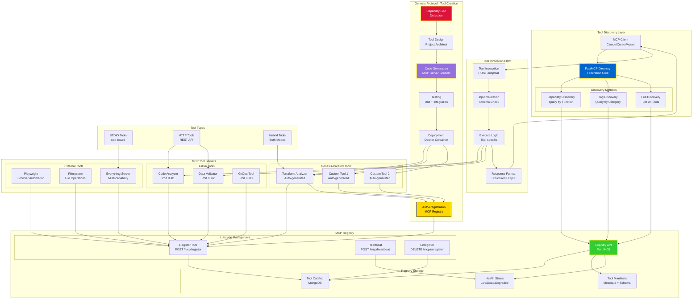
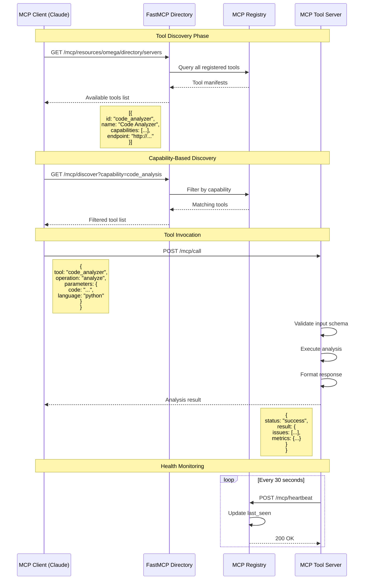

# MCP Tool Discovery, Usage & Genesis Creation



## MCP Tool Discovery Flow



## Tool Registration

### 1. Manual Registration
```python
from omega.mcp import McpRegistryClient

registry = McpRegistryClient("http://federation:9405")

# Register tool
await registry.register_tool({
    "id": "my_tool",
    "name": "My Custom Tool",
    "description": "Does amazing things",
    "capabilities": [
        {
            "name": "process",
            "description": "Process data",
            "parameters": {
                "type": "object",
                "properties": {
                    "data": {"type": "string"},
                    "format": {"type": "string", "enum": ["json", "xml"]}
                },
                "required": ["data"]
            }
        }
    ],
    "host": "my-tool",
    "port": 8000,
    "tags": ["processing", "data"]
})
```

### 2. Auto-Registration (Startup)
```python
from fastapi import FastAPI
from omega.mcp import McpRegistryClient

app = FastAPI()
registry = McpRegistryClient("http://federation:9405")

@app.on_event("startup")
async def register_with_mcp():
    """Auto-register on startup."""
    await registry.register_tool({
        "id": "code_analyzer",
        "name": "Code Analyzer",
        "description": "Analyzes code for issues",
        "capabilities": [...],
        "host": "code-analyzer",
        "port": 9501,
        "tags": ["code", "analysis", "security"]
    })
    
    # Start heartbeat loop
    asyncio.create_task(heartbeat_loop())

async def heartbeat_loop():
    """Send heartbeats every 30 seconds."""
    while True:
        await registry.heartbeat("code_analyzer")
        await asyncio.sleep(30)
```

## Tool Discovery Methods

### 1. Discover All Tools
```python
from omega.mcp import McpClient

client = McpClient("http://federation:9405")

# Get all available tools
tools = await client.discover_tools()

for tool in tools:
    print(f"{tool['name']}: {tool['description']}")
    print(f"  Capabilities: {[c['name'] for c in tool['capabilities']]}")
```

### 2. Discover by Capability
```python
# Find tools with specific capability
code_tools = await client.discover_tools_by_capability("code_analysis")

# Find tools with multiple capabilities
multi_tools = await client.discover_tools_by_capabilities([
    "code_analysis",
    "security_scan"
])
```

### 3. Discover by Tag
```python
# Find tools by tag
security_tools = await client.discover_tools_by_tag("security")

# Find tools with multiple tags
dev_tools = await client.discover_tools_by_tags([
    "development",
    "testing"
])
```

## Tool Invocation

### Direct Invocation
```python
# Call tool directly
result = await client.call_tool(
    tool_id="code_analyzer",
    operation="analyze",
    parameters={
        "code": "def hello(): pass",
        "language": "python",
        "checks": ["style", "security", "complexity"]
    }
)

print(result["issues"])
```

### Batch Invocation
```python
# Call multiple tools in parallel
results = await asyncio.gather(
    client.call_tool("code_analyzer", "analyze", {...}),
    client.call_tool("security_scanner", "scan", {...}),
    client.call_tool("test_runner", "run", {...})
)
```

## Genesis Protocol - Autonomous Tool Creation

### Capability Gap Detection
```python
class CapabilityGapDetector:
    async def detect_gaps(self):
        """Detect missing capabilities in ecosystem."""
        # Analyze failed tasks
        failures = await self.get_recent_failures()
        
        for failure in failures:
            if failure["reason"] == "no_capable_tool":
                gap = {
                    "capability": failure["required_capability"],
                    "description": failure["task_description"],
                    "priority": self._calculate_priority(failure)
                }
                
                # Trigger Genesis Protocol
                await self.genesis.spawn_tool(gap)
```

### Tool Generation Flow
```python
class ToolGenesisAgent:
    async def spawn_tool(self, gap_spec: dict):
        """Autonomously create new MCP tool."""
        
        # 1. Design phase
        blueprint = await self.architect.design_tool(
            capability=gap_spec["capability"],
            description=gap_spec["description"]
        )
        
        # 2. Code generation
        code = await self.code_generator.generate_mcp_server(
            blueprint=blueprint,
            template="fastapi_mcp_tool"
        )
        
        # 3. Testing
        test_results = await self.test_runner.run_tests(code)
        if not test_results["passed"]:
            # Refine and retry
            code = await self.refine_code(code, test_results)
        
        # 4. Containerization
        dockerfile = await self.docker_generator.create_dockerfile(code)
        image = await self.docker_builder.build_image(dockerfile)
        
        # 5. Deployment
        container = await self.docker_deployer.deploy_container(
            image=image,
            name=f"omega-{blueprint['name']}-tool"
        )
        
        # 6. Auto-registration
        await self.mcp_registry.register_tool({
            "id": blueprint["id"],
            "name": blueprint["name"],
            "description": blueprint["description"],
            "capabilities": blueprint["capabilities"],
            "host": container["host"],
            "port": container["port"],
            "tags": blueprint["tags"] + ["genesis-created"]
        })
        
        return {
            "tool_id": blueprint["id"],
            "status": "deployed",
            "endpoint": f"http://{container['host']}:{container['port']}"
        }
```

## Tool Types

### 1. STDIO Tools (npx-based)
```json
{
  "name": "everything",
  "config": {
    "type": "stdio",
    "command": "npx",
    "args": ["-y", "@modelcontextprotocol/server-everything"]
  }
}
```

### 2. HTTP Tools (REST API)
```json
{
  "name": "code_analyzer",
  "config": {
    "type": "http",
    "endpoint": "http://code-analyzer:9501",
    "auth": {
      "type": "bearer",
      "token": "${MCP_AUTH_TOKEN}"
    }
  }
}
```

### 3. Hybrid Tools (Both Modes)
```python
class HybridMCPTool:
    """Tool that supports both STDIO and HTTP."""
    
    def __init__(self):
        self.stdio_server = StdioServer()
        self.http_server = FastAPI()
    
    async def start(self, mode: str = "http"):
        """Start in specified mode."""
        if mode == "stdio":
            await self.stdio_server.run()
        elif mode == "http":
            uvicorn.run(self.http_server, port=9501)
        else:
            # Run both
            await asyncio.gather(
                self.stdio_server.run(),
                self._run_http_server()
            )
```

**This is the way, brother!** 🔱🔧


