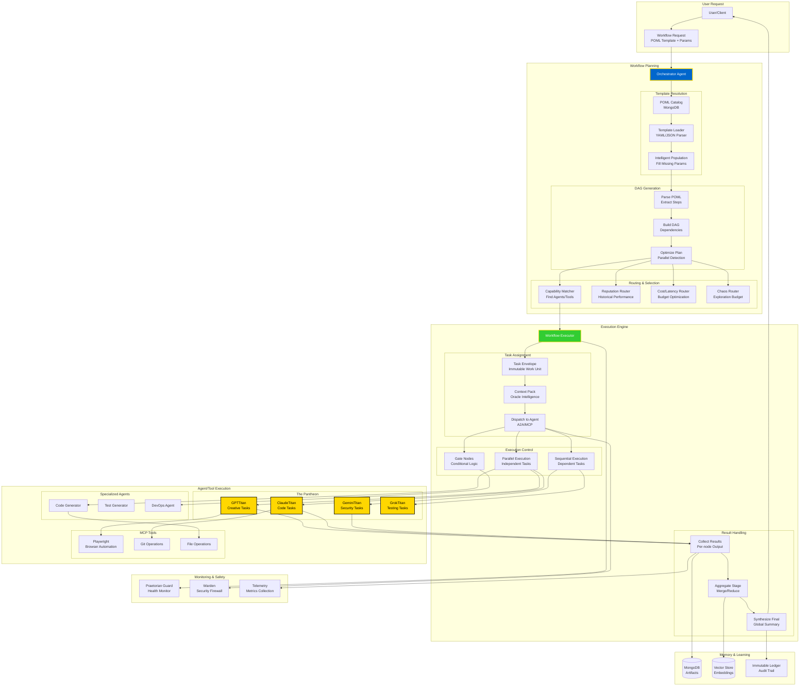
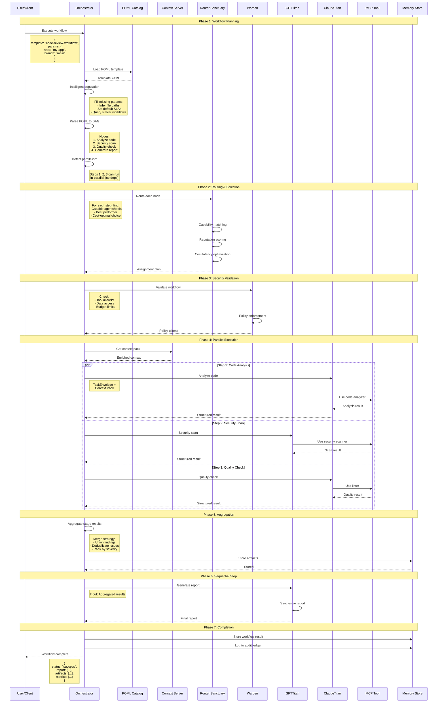

# POML Workflow Execution & Orchestration



## POML Workflow Execution Flow



## POML Template Structure

### Example: Code Review Workflow
```yaml
# code-review-workflow.poml
workflow_id: "code_review_workflow"
version: "1.0.0"
description: "Automated code review with security and quality checks"

parameters:
  repo:
    type: string
    required: true
    description: "Repository name"
  
  branch:
    type: string
    default: "main"
    description: "Branch to review"
  
  severity_threshold:
    type: string
    default: "medium"
    enum: ["low", "medium", "high", "critical"]

steps:
  - id: "analyze_code"
    name: "Code Analysis"
    agent_capability: "code_analysis"
    parallel: true
    inputs:
      repo: "${params.repo}"
      branch: "${params.branch}"
    outputs:
      - analysis_report
    
  - id: "security_scan"
    name: "Security Scan"
    agent_capability: "security_analysis"
    parallel: true
    inputs:
      repo: "${params.repo}"
      branch: "${params.branch}"
    outputs:
      - security_report
    
  - id: "quality_check"
    name: "Quality Check"
    agent_capability: "quality_analysis"
    parallel: true
    inputs:
      repo: "${params.repo}"
      branch: "${params.branch}"
    outputs:
      - quality_report
    
  - id: "aggregate_findings"
    name: "Aggregate Findings"
    type: "aggregator"
    depends_on:
      - analyze_code
      - security_scan
      - quality_check
    strategy: "merge_and_deduplicate"
    inputs:
      reports:
        - "${steps.analyze_code.analysis_report}"
        - "${steps.security_scan.security_report}"
        - "${steps.quality_check.quality_report}"
    outputs:
      - combined_findings
    
  - id: "generate_report"
    name: "Generate Report"
    agent_capability: "report_generation"
    depends_on:
      - aggregate_findings
    inputs:
      findings: "${steps.aggregate_findings.combined_findings}"
      severity_threshold: "${params.severity_threshold}"
    outputs:
      - final_report
    
  - id: "create_pr_comment"
    name: "Create PR Comment"
    tool: "git_operations"
    depends_on:
      - generate_report
    inputs:
      repo: "${params.repo}"
      branch: "${params.branch}"
      comment: "${steps.generate_report.final_report}"

aggregation:
  merge_and_deduplicate:
    type: "custom"
    logic: |
      # Merge all findings
      all_findings = []
      for report in inputs.reports:
        all_findings.extend(report.findings)
      
      # Deduplicate by hash
      unique_findings = deduplicate_by_hash(all_findings)
      
      # Sort by severity
      sorted_findings = sort_by_severity(unique_findings)
      
      return {
        "findings": sorted_findings,
        "total": len(sorted_findings),
        "by_severity": group_by_severity(sorted_findings)
      }

sla:
  max_duration_minutes: 15
  timeout_per_step_minutes: 5

error_handling:
  retry_policy:
    max_attempts: 3
    backoff: "exponential"
  
  on_failure:
    - notify: "slack"
    - escalate_to: "human"
```

## Workflow Execution Patterns

### 1. Sequential Workflow
```yaml
# Steps execute one after another
steps:
  - id: "step1"
    # No parallel flag, no depends_on
  
  - id: "step2"
    depends_on: ["step1"]
  
  - id: "step3"
    depends_on: ["step2"]
```

### 2. Parallel Workflow
```yaml
# Steps execute simultaneously
steps:
  - id: "step1"
    parallel: true
  
  - id: "step2"
    parallel: true
  
  - id: "step3"
    parallel: true
  
  - id: "merge"
    depends_on: ["step1", "step2", "step3"]
```

### 3. Conditional Workflow
```yaml
# Steps execute based on conditions
steps:
  - id: "analyze"
    outputs: ["result"]
  
  - id: "fix_issues"
    depends_on: ["analyze"]
    condition: "${steps.analyze.result.has_issues}"
  
  - id: "deploy"
    depends_on: ["analyze"]
    condition: "${!steps.analyze.result.has_issues}"
```

### 4. Fan-out/Fan-in Workflow
```yaml
# One step spawns multiple parallel steps, then merge
steps:
  - id: "split_data"
    outputs: ["chunks"]
  
  - id: "process_chunk"
    depends_on: ["split_data"]
    parallel: true
    for_each: "${steps.split_data.chunks}"
  
  - id: "merge_results"
    depends_on: ["process_chunk"]
    strategy: "reduce"
```

## Intelligent Population

### Context-Aware Parameter Inference
```python
class IntelligentPopulator:
    async def populate_template(
        self,
        template: dict,
        user_params: dict,
        context: dict
    ) -> dict:
        """Fill missing parameters intelligently."""
        
        populated = template.copy()
        
        for param_name, param_spec in template["parameters"].items():
            if param_name in user_params:
                # User provided value
                populated["parameters"][param_name] = user_params[param_name]
            
            elif "default" in param_spec:
                # Use default value
                populated["parameters"][param_name] = param_spec["default"]
            
            else:
                # Infer from context
                inferred = await self._infer_parameter(
                    param_name,
                    param_spec,
                    context
                )
                populated["parameters"][param_name] = inferred
        
        return populated
    
    async def _infer_parameter(
        self,
        param_name: str,
        param_spec: dict,
        context: dict
    ):
        """Infer parameter value from context."""
        
        # Query similar workflows
        similar = await self.vector_store.find_similar_workflows(
            template_id=context["template_id"],
            limit=5
        )
        
        # Extract common parameter values
        common_values = self._extract_common_values(
            similar,
            param_name
        )
        
        # Use most common value
        if common_values:
            return common_values[0]
        
        # Ask LLM to infer
        prompt = f"""
        Infer the value for parameter '{param_name}' based on:
        - Type: {param_spec['type']}
        - Description: {param_spec['description']}
        - Context: {context}
        """
        
        return await self.llm.generate(prompt)
```

## DAG Optimization

### Parallel Detection
```python
class DAGOptimizer:
    def optimize_dag(self, dag: nx.DiGraph) -> nx.DiGraph:
        """Optimize DAG for parallel execution."""
        
        # Detect independent nodes
        stages = self._detect_stages(dag)
        
        # Mark parallel nodes
        for stage in stages:
            if len(stage) > 1:
                for node in stage:
                    dag.nodes[node]["parallel"] = True
        
        # Calculate critical path
        critical_path = self._calculate_critical_path(dag)
        
        # Optimize resource allocation
        self._optimize_resources(dag, critical_path)
        
        return dag
    
    def _detect_stages(self, dag: nx.DiGraph) -> list[list]:
        """Group nodes into execution stages."""
        stages = []
        remaining = set(dag.nodes())
        
        while remaining:
            # Find nodes with no dependencies in remaining
            stage = [
                node for node in remaining
                if all(
                    pred not in remaining
                    for pred in dag.predecessors(node)
                )
            ]
            
            stages.append(stage)
            remaining -= set(stage)
        
        return stages
```

**This is the way, brother!** 🔱📋⚡


