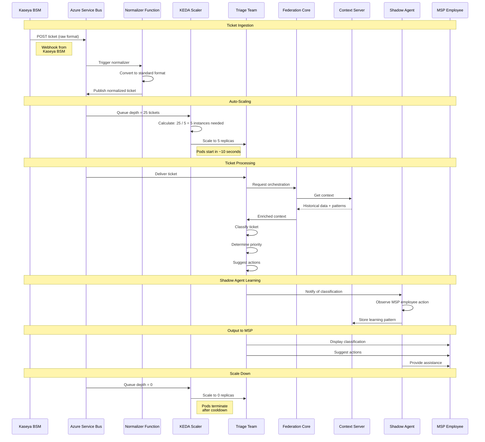

# Azure Deployment Strategy - Enterprise MSP Architecture

```mermaid
graph TB
    subgraph "Azure Cloud Perimeter"
        subgraph "Always-On Tier - Never Scale to Zero"
            subgraph "AKS Perimeter Node Pool"
                FED1[Federation Core<br/>Replica 1]
                FED2[Federation Core<br/>Replica 2]
                FED3[Federation Core<br/>Replica 3]
                
                CTX1[Context Server<br/>Replica 1]
                CTX2[Context Server<br/>Replica 2]
                CTX3[Context Server<br/>Replica 3]
                
                AR1[Agent Registry<br/>Replica 1]
                AR2[Agent Registry<br/>Replica 2]
                
                MR1[MCP Registry<br/>Replica 1]
                MR2[MCP Registry<br/>Replica 2]
            end

            subgraph "The Pantheon - Titan Instances"
                GPT[GPTTitan<br/>1 instance]
                CLAUDE[ClaudeTitan<br/>1 instance]
                GEMINI[GeminiTitan<br/>1 instance]
                GROK[GrokTitan<br/>1 instance]
                AUG[AugmentTitan<br/>1 instance]
            end

            subgraph "Core Orchestration"
                ORC1[Orchestrator<br/>Replica 1]
                ORC2[Orchestrator<br/>Replica 2]
                CAP[Capacity Manager<br/>1 instance]
            end
        end

        subgraph "Dynamic Tier - Scale 0-n Based on Demand"
            subgraph "AKS Dynamic Node Pool - KEDA Autoscaling"
                TRIAGE[Ticket Triage Team<br/>0-10 instances]
                CLASSIFY[Classification Team<br/>0-5 instances]
                SHADOW[Shadow Agent Team<br/>0-100 instances]
                ANALYTICS[Analytics Team<br/>0-3 instances]
            end
        end

        subgraph "Data & Messaging Layer"
            subgraph "Azure Service Bus Premium"
                SB_RAW[Topic: ticket-raw<br/>Multi-platform ingestion]
                SB_NORM[Topic: ticket-normalized<br/>Standardized format]
                SB_TRIAGE[Queue: ticket-triage<br/>KEDA trigger]
            end

            subgraph "Azure Cosmos DB - MongoDB API"
                COSMOS_AGENT[Agent Registry DB]
                COSMOS_MCP[MCP Registry DB]
                COSMOS_STATE[State Store DB]
                COSMOS_TICKETS[Ticket Data DB]
            end

            subgraph "Azure Cache for Redis Premium"
                REDIS_SESSION[Session State<br/>Short-term memory]
                REDIS_CACHE[Hot Cache<br/>Frequent queries]
            end

            subgraph "Azure AI Search"
                AI_SEARCH[Vector Store<br/>Semantic search<br/>Long-term memory]
            end

            subgraph "Azure Blob Storage"
                BLOB_HOT[Hot Tier<br/>Recent tickets]
                BLOB_COOL[Cool Tier<br/>Archived tickets]
                BLOB_AUDIT[Audit Logs<br/>Immutable]
            end
        end

        subgraph "Observability & Governance"
            MONITOR[Azure Monitor<br/>Metrics & Alerts]
            INSIGHTS[Application Insights<br/>APM & Tracing]
            LOG_ANALYTICS[Log Analytics<br/>Centralized Logging]
            OTEL[OpenTelemetry Collector<br/>Unified Telemetry]
            KV[Azure Key Vault<br/>Secrets & Certs]
            PRIVATE_LINK[Azure Private Link<br/>Network Isolation]
        end

        subgraph "Ingestion Layer"
            KASEYA[Kaseya BSM<br/>Webhook]
            SALESFORCE[Salesforce<br/>API]
            ZENDESK[Zendesk<br/>Webhook]
            SERVICENOW[ServiceNow<br/>API]
            
            NORMALIZER[Azure Function<br/>Ticket Normalizer]
        end
    end

    subgraph "External MSP Systems"
        MSP_DASH[MSP Employee<br/>Dashboard]
        MSP_AUTO[Auto-Action<br/>Queue]
    end

    %% Ingestion flow
    KASEYA --> SB_RAW
    SALESFORCE --> SB_RAW
    ZENDESK --> SB_RAW
    SERVICENOW --> SB_RAW
    
    SB_RAW --> NORMALIZER
    NORMALIZER --> SB_NORM
    SB_NORM --> SB_TRIAGE

    %% KEDA scaling
    SB_TRIAGE -.->|Triggers scaling| TRIAGE
    SB_TRIAGE -.->|Triggers scaling| CLASSIFY

    %% Federation connections
    TRIAGE --> FED1
    CLASSIFY --> FED2
    SHADOW --> FED3

    %% Orchestration
    FED1 --> ORC1
    FED2 --> ORC2
    ORC1 --> CAP

    %% Capacity management
    CAP -.->|Spawns teams| TRIAGE
    CAP -.->|Spawns teams| CLASSIFY
    CAP -.->|Spawns teams| SHADOW

    %% Registry connections
    FED1 --> AR1
    FED2 --> AR2
    FED1 --> MR1
    FED2 --> MR2

    %% Context server
    FED1 --> CTX1
    FED2 --> CTX2
    FED3 --> CTX3

    %% Titan orchestration
    ORC1 --> GPT
    ORC1 --> CLAUDE
    ORC1 --> GEMINI
    ORC1 --> GROK
    ORC1 --> AUG

    %% Data layer connections
    AR1 --> COSMOS_AGENT
    AR2 --> COSMOS_AGENT
    MR1 --> COSMOS_MCP
    MR2 --> COSMOS_MCP
    TRIAGE --> COSMOS_TICKETS
    
    CTX1 --> REDIS_SESSION
    CTX2 --> REDIS_CACHE
    CTX3 --> AI_SEARCH
    
    TRIAGE --> BLOB_HOT
    CLASSIFY --> BLOB_HOT
    SHADOW --> BLOB_COOL

    %% Observability
    FED1 --> OTEL
    ORC1 --> OTEL
    TRIAGE --> OTEL
    OTEL --> MONITOR
    OTEL --> INSIGHTS
    OTEL --> LOG_ANALYTICS

    %% Security
    FED1 --> KV
    ORC1 --> KV
    TRIAGE --> KV
    
    FED1 --> PRIVATE_LINK
    COSMOS_AGENT --> PRIVATE_LINK

    %% Output to MSP
    SHADOW --> MSP_DASH
    TRIAGE --> MSP_AUTO

    style FED1 fill:#0066CC,stroke:#FFD700,stroke-width:2px,color:#fff
    style FED2 fill:#0066CC,stroke:#FFD700,stroke-width:2px,color:#fff
    style FED3 fill:#0066CC,stroke:#FFD700,stroke-width:2px,color:#fff
    style GPT fill:#FFD700,stroke:#000,stroke-width:3px,color:#000
    style CLAUDE fill:#FFD700,stroke:#000,stroke-width:3px,color:#000
    style GEMINI fill:#FFD700,stroke:#000,stroke-width:3px,color:#000
    style GROK fill:#FFD700,stroke:#000,stroke-width:3px,color:#000
    style AUG fill:#FFD700,stroke:#000,stroke-width:3px,color:#000
    style TRIAGE fill:#32CD32,stroke:#FFD700,stroke-width:2px,color:#fff
    style CAP fill:#9370DB,stroke:#FFD700,stroke-width:2px,color:#fff
```



## Azure Deployment Strategy Overview

### Hybrid Always-On/Scale-to-Zero Pattern

OMEGA's Azure deployment implements a **cost-optimized, performance-first** architecture:

1. **Always-On Perimeter** (Never scales to zero)
   - Core services: Federation, Context, Registries
   - The Pantheon: 5 Titan agents
   - Orchestration: Orchestrator + Capacity Manager
   - **Cost**: ~$2,100/month

2. **Dynamic Agent Teams** (Scale 0-n based on demand)
   - Ticket Triage Team (0-10 instances)
   - Classification Team (0-5 instances)
   - Shadow Agents (0-100 instances, one per employee)
   - Analytics Team (0-3 instances)
   - **Cost**: Variable, ~$600-$2,000/month based on load

3. **Managed Azure Services**
   - Cosmos DB (MongoDB API)
   - Azure Cache for Redis (Premium)
   - Azure AI Search (Vector store)
   - Azure Service Bus (Premium)
   - Azure Blob Storage (Hot/Cool tiers)
   - **Cost**: ~$1,500/month

**Total Monthly Cost**: ~$4,200-$5,600 (production-ready, enterprise-grade)

---

## Deployment Options Comparison

### Option 1: AKS (Recommended) ✅

**Architecture**:
```yaml
# Always-On Node Pool
node_pool: perimeter-pool
  vm_size: Standard_D8s_v5
  min_nodes: 3
  max_nodes: 10
  labels: tier=always-on

# Dynamic Node Pool
node_pool: dynamic-pool
  vm_size: Standard_D4s_v5
  min_nodes: 0
  max_nodes: 50
  labels: tier=dynamic
  autoscaler: KEDA
```

**Pros**:
- ✅ Full orchestration control
- ✅ Native Kubernetes ecosystem
- ✅ Advanced networking (CNI, Network Policies)
- ✅ Cost-effective for mixed workloads
- ✅ OMEGA's K8s patterns transfer directly

**Cons**:
- ⚠️ Higher operational complexity
- ⚠️ Requires K8s expertise

**Monthly Cost**: ~$2,100 (compute only)

---

### Option 2: Azure Container Apps

**Architecture**:
```yaml
# Always-On Apps
federation_core:
  min_replicas: 3
  max_replicas: 10
  
context_server:
  min_replicas: 3
  max_replicas: 10

# Scale-to-Zero Apps
ticket_triage_team:
  min_replicas: 0
  max_replicas: 10
```

**Pros**:
- ✅ Serverless, fully managed
- ✅ Built-in scale-to-zero
- ✅ Simpler operations
- ✅ Integrated KEDA, Dapr

**Cons**:
- ⚠️ Less networking control
- ⚠️ Always-on still incurs costs
- ⚠️ Limited customization vs AKS

**Monthly Cost**: ~$1,800 (compute only)

---

### Option 3: Hybrid (AKS + Azure Functions)

**Architecture**:
- AKS for always-on perimeter
- Azure Functions for event-driven tasks

**Pros**:
- ✅ Best of both worlds
- ✅ Cost-optimized

**Cons**:
- ⚠️ Two orchestration platforms
- ⚠️ Increased complexity

---

## KEDA Autoscaling Configuration

### Ticket Triage Team Scaler
```yaml
apiVersion: keda.sh/v1alpha1
kind: ScaledObject
metadata:
  name: ticket-triage-scaler
  namespace: omega-dynamic
spec:
  scaleTargetRef:
    name: ticket-triage-team
  minReplicaCount: 0
  maxReplicaCount: 10
  triggers:
  - type: azure-servicebus
    metadata:
      queueName: ticket-triage-queue
      namespace: omega-servicebus
      messageCount: "5"  # Scale up when >5 messages per instance
      connectionFromEnv: AZURE_SERVICEBUS_CONNECTION
  
  cooldownPeriod: 300  # 5 minutes
  pollingInterval: 30  # Check every 30 seconds
```

### Shadow Agent Team Scaler
```yaml
apiVersion: keda.sh/v1alpha1
kind: ScaledObject
metadata:
  name: shadow-agent-scaler
  namespace: omega-dynamic
spec:
  scaleTargetRef:
    name: shadow-agent-team
  minReplicaCount: 0
  maxReplicaCount: 100  # One per active employee
  triggers:
  - type: azure-servicebus
    metadata:
      topicName: employee-activity
      subscriptionName: shadow-agent-sub
      messageCount: "1"  # One shadow agent per active employee
```

---

## Kaseya MSP Ticket Triage Flow



---

## Cost Breakdown

### Always-On Tier (Monthly)
| Component | Instances | VM Size | Cost |
|-----------|-----------|---------|------|
| Federation Core | 3 | D8s_v5 | $300 |
| Context Server | 3 | D8s_v5 | $300 |
| Agent Registry | 2 | D4s_v5 | $150 |
| MCP Registry | 2 | D4s_v5 | $150 |
| Orchestrator | 2 | D4s_v5 | $150 |
| GPTTitan | 1 | D8s_v5 | $100 |
| ClaudeTitan | 1 | D8s_v5 | $100 |
| GeminiTitan | 1 | D8s_v5 | $100 |
| GrokTitan | 1 | D8s_v5 | $100 |
| AugmentTitan | 1 | D8s_v5 | $100 |
| Capacity Manager | 1 | D4s_v5 | $75 |
| **Subtotal** | | | **~$1,625** |

### Dynamic Tier (Monthly, Average Load)
| Component | Avg Instances | VM Size | Cost |
|-----------|---------------|---------|------|
| Triage Team | 5 | D4s_v5 | $375 |
| Classification Team | 2 | D4s_v5 | $150 |
| Shadow Agents | 10 | D2s_v5 | $250 |
| Analytics Team | 1 | D4s_v5 | $75 |
| **Subtotal** | | | **~$850** |

### Managed Services (Monthly)
| Service | Tier | Cost |
|---------|------|------|
| Cosmos DB | Standard, 1000 RU/s | $600 |
| Azure Cache for Redis | Premium P1 (6GB) | $250 |
| Azure AI Search | Basic | $75 |
| Azure Service Bus | Premium | $700 |
| Azure Blob Storage | 1TB Hot + 5TB Cool | $100 |
| Azure Monitor | Standard | $200 |
| **Subtotal** | | **~$1,925** |

### **Total Monthly Cost**: ~$4,400

---

## Privacy & Compliance

### Generic Data Capture
- **No PII stored**: Only ticket metadata, patterns, classifications
- **Tenant isolation**: Separate namespaces per MSP customer
- **GDPR compliance**: Right to erasure, data portability
- **Audit trail**: Immutable logs in Azure Blob (Cool tier)

### Security Measures
- **Azure Private Link**: Network isolation for data services
- **Azure Key Vault**: Secrets and certificate management
- **mTLS**: All inter-service communication encrypted
- **RBAC**: Role-based access control per tenant

**This is the way, brother!** ☁️🔱


