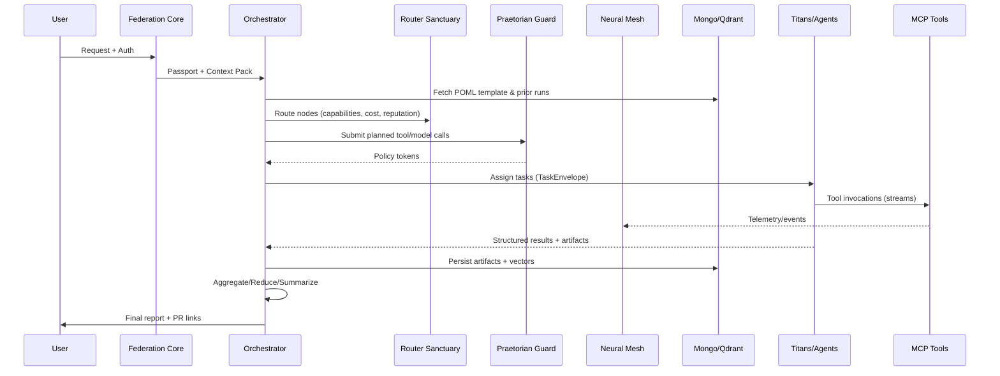

# OMEGA End‑to‑End Flow (POML Workflow Scenario)

**Context:** This document explains how a user request flows through the O.M.E.G.A. platform when executing a **POML** (Process/Plan Orchestration Markup Language) workflow template. It highlights the roles of the **four Titans** (GPT‑Titan, Claude‑Titan, Gemini‑Titan, Grok‑Titan), the **Orchestrator**, federation/routing, intelligent workflow population, security (Praetorian Guard), dynamic agent/tool selection via MCP, gap detection (Genesis Protocol), neural mesh collaboration, orchestration mechanics (ordering, aggregation, summarization), deadlock resolution, caching, and memory providers (MongoDB + Qdrant).

---

## 0) Core Actors & Primitives

- **Federation Core**: The sovereign ingress/egress and coordination plane; exposes APIs/websocket for user and system traffic. Maintains service registry and capability graph.
- **Orchestrator (DualModeAgent)**: Central planner/executor that speaks **A2A** and **MCP**; performs workflow planning, task decomposition, agent/tool assignment, ordering, aggregation/summarization, and overall control flow.
- **Router Sanctuary** (Routing Law): Certifies routing strategies (CapabilityRouter, ReputationRouter, Cost/LatencyRouter, ChaosRouter). The Orchestrator delegates selection of agents/tools/models here.
- **Titans (4)**: Model‑specialist macro‑agents (GPT‑Titan, Claude‑Titan, Gemini‑Titan, Grok‑Titan) registered with the Federation. Each may sub‑spawn specialists; all expose MCP tools and A2A endpoints.
- **Specialist Agents**: Focused executors (e.g., Prompt Optimizer, Researcher, Workflow Planner, Evaluator, Toolsmith) that can act as tools and/or conversational peers.
- **MCP Tool Network**: Externalized capabilities (Filesystem, Git, Playwright, Cloud SDKs, Lint/Build/Test suites, Vector Ops, etc.). Discoverable via Registry; invocable directly by agents.
- **Memory Providers**:
  - **MongoDB**: immutable audit ledger + structured memory (tasks, artifacts, configs, plans, events).
  - **Qdrant**: vector store for semantic recall (context packs, prior runs, codebase embeddings, domain corpora).
- **Praetorian Guard**: Policy/guardrail service enforcing security, safety, compliance (RBAC/ABAC, PII rules, tool safelists, rate caps, chaos budgets).
- **Neural Mesh**: Collaboration fabric enabling cross‑agent message passing, shared blackboards, event streams, and consensus primitives.
- **PlanAuditor** (Planning Law): Validates DAG plans, doctrinal constraints, and safety before execution; monitors for drift during runtime.
- **Genesis Protocol**: Gap detection & capability creation flow (spawn new tool/agent/template, or escalate to human). Includes Router certification and memory registration.

---

## 1) Ingress & Intent

1. **User Request** arrives via Federation Core (HTTP/WebSocket). Example: *“Run ‘Data‑Quality‑Audit’ using POML template v2 across latest customer CSVs; provide findings and auto‑fix PR.”*
2. **AuthN/Z**: Federation verifies identity/tenant and issues a short‑lived **Agent Passport** (capability‑scoped JWT/JWS with RBAC/ABAC claims, tool allowlist, rate & cost budgets, chaos budget, data domains).
3. **Context Service** primes the request using Mongo+Qdrant: retrieves prior runs, domain glossaries, code embeddings, and known constraints; attaches a **Context Pack**.

---

## 2) Template Resolution (POML)

1. Orchestrator locates the **POML workflow template** from the Catalog (MongoDB) and optional vector‑linked guidance from Qdrant.
2. **Intelligent Population**: Missing parameters are inferred from the request and context (e.g., dataset paths, repo branch, SLAs, acceptance criteria, severity thresholds). The Orchestrator asks Titans/agents to fill gaps using:
   - **Schema‑aware prompting** (strict POML fields)
   - **Capability queries** via Router Sanctuary (what tools/models can satisfy each step?)
   - **Semantic recall** from Qdrant (similar past workflows) to suggest step defaults.
3. **Plan Synthesis**: The POML is transformed into an executable **DAG** with typed nodes (AgentTask, ToolCall, ModelEval, Gate, Merge, Audit).

---

## 3) Routing & Model/Tool Selection

1. For each DAG node, the Orchestrator consults **Router Sanctuary**:
   - **CapabilityRouter**: maps task requirements to candidate agents/tools/models.
   - **ReputationRouter**: weighs historical success/quality per cluster/task type.
   - **Cost/LatencyRouter**: optimizes for budget/SLA.
   - **ChaosRouter** (if enabled): allocates exploration budget for controlled variation.
2. **Selection Output** includes: primary assignee, backup/fallbacks, toolchain sequence, retry policy, and observability hooks.

---

## 4) Security & Guardrails

- **Praetorian Guard** intercepts planned tool calls and A2A messages:
  - Validates passport claims and tool safelist; sanitizes prompts/inputs; enforces data scoping.
  - Applies **Doctrinal Rules** (e.g., no direct prod writes unless gated; redaction rules; rate and spend limits).
  - Instruments all calls with a **Policy Token** retained in Mongo’s audit log.

---

## 5) Execution Loop (DAG Orchestration)

### 5.1 Ordering & Concurrency
- The Orchestrator executes the DAG in **topological order**, releasing ready nodes when dependencies resolve.
- Nodes are grouped into **Stages**; within a stage, tasks with no conflicts run **in parallel**.
- **Resource Locks** (e.g., repo branch, dataset) are respected to avoid race conditions.

### 5.2 Task Assignment Mechanics
- For each node:
  1. **Assignment**: send a structured TaskEnvelope (ID, inputs, acceptance criteria, budget, observability channel) to the chosen agent/Titan with the **Context Pack**.
  2. **Execution**: the assignee invokes MCP tools as needed (e.g., Playwright, Filesystem, GitOps, Linters, Data Validators). Tool calls are streamed to the Mesh with trace IDs.
  3. **Intermediates**: artifacts and logs are persisted: binary/text to **Mongo (artifacts collection)**; embeddings to **Qdrant** for later semantic access.
  4. **Evaluation**: optional **Evaluator nodes** score outputs (style, test pass, policy compliance). Failures loop to **Auto‑Repair** steps.

### 5.3 Response Handling (Aggregation & Summarization)
- **Per‑node**: the assignee emits a **Structured Result** (status, metrics, artifacts, deltas). The Orchestrator validates schema and stores it.
- **Stage‑level Aggregation**: the Orchestrator combines sibling outputs via reducer strategies defined in POML (e.g., *merge_findings*, *union_artifacts*, *vote*, *RAG‑summarize*). Conflicts are flagged with provenance.
- **Global Synthesis**: at DAG completion, the Orchestrator asks a **Synthesis Titan** (selected by Router Sanctuary) to produce:
  - Executive Summary (objectives → outcomes)
  - Technical Appendix (artifacts, logs, PR links)
  - Decisions & Rationale (with citations/provenance)
  - Next‑Step Recommendations

### 5.4 Ordering Guarantees
- **Causal ordering** via per‑task dependency edges and Mesh event sequence numbers.
- **Idempotency keys** for tool calls and commits.
- **Exactly‑once semantics** at orchestration layer using dedupe tokens; retries are safe.

---

## 6) Collaboration via the Neural Mesh

- The Mesh provides **topics/streams** (e.g., plan/updates, tool‑invocations, metrics, guardrail alerts).
- Agents/Titans subscribe to relevant streams and publish:
  - Discoveries (e.g., schema changes)
  - Requests for help (co‑pilot pattern)
  - Partial artifacts (blackboard pattern)
- **Consensus Primitives** allow small swarms (e.g., 4 Titans) to run **deliberation rounds**: propose → critique → refine → vote. Results are committed with a quorum threshold.

---

## 7) Gap Detection & Genesis Protocol

- During planning or execution, if a step lacks a capable assignee or tool, the **Genesis Protocol** triggers:
  1. **Diagnosis**: classify the capability gap (tool missing, adapter absent, schema unknown).
  2. **Synthesis**: spawn a **Toolsmith** or **Agent‑Builder** workflow (POML variant) to scaffold a new MCP tool/agent or adapter.
  3. **Certification**: route the new component through **Router Sanctuary** tests.
  4. **Registration**: publish to Federation Registry with metadata; generate embeddings to Qdrant; write design + tests to Mongo.
  5. **Resume**: rewire the original plan with the new capability and continue.
- If Genesis cannot satisfy safely within budget/SLA, escalate to **Human‑in‑the‑Loop** with a decision packet.

---

## 8) Deadlock Detection & Resolution

- **Symptoms**: cycle wait on resources, repeated policy blocks, or stalled evaluators.
- **Detection**: Orchestrator monitors progress KPIs, dependency graph health, and Mesh heartbeat.
- **Resolution Strategies**:
  - **Edge Rewiring**: relax non‑critical dependencies per Doctrinal guardrails.
  - **Assignee Swap**: re‑route to a different Titan/agent/tool (via Router Sanctuary).
  - **Shard/Clone**: split workload if partitionable.
  - **Stalemate Protocol**: trigger Council vote (time‑boxed) or fallback to conservative path.

---

## 9) Caching & Performance

- **Plan Cache**: canonicalized POML → DAG expansion cached keyed by template version and parameters.
- **Tool Result Cache**: deterministic tool calls (e.g., static analysis) memoized with content hashes.
- **Context Cache**: recent embeddings and retrieved chunks pinned in Qdrant with TTL.
- **Model Hint Cache**: router hints (which Titan excels on which subtask) updated after each run.

---

## 10) Memory & Persistence (MongoDB + Qdrant)

- **MongoDB** (structured):
  - `runs`, `tasks`, `artifacts`, `events`, `policies`, `plans`, `capabilities`, `audit_trail`.
  - Append‑only **Immutable Ledger** for doctrinal audit; cross‑linked by trace IDs.
- **Qdrant** (vector):
  - `corpora` (project docs, code, prior outputs)
  - `context_packs` (bundled embeddings per request)
  - `capability_vectors` (tools/agents metadata for semantic routing)
- **Round‑trip**: Every artifact stored in Mongo has an optional vector shadow in Qdrant to enable semantic traceability and retrieval in future runs.

---

## 11) Observability & Compliance

- **Traces/Metrics/Logs** streamed to the Mesh; summarized per run.
- **Policy Evidence**: Praetorian Guard stores rule matches and redactions with pointers.
- **Repro Pack**: Orchestrator can export a self‑contained bundle (POML, plan, inputs, versions, outputs) for audits or replays.

---

## 12) Completion & Delivery

1. **Artifact Assembly**: merged findings, reports, dashboards, and **auto‑fix PR** are collated.
2. **Synthesis**: final narrative produced by selected Titan with citations to artifacts/events.
3. **Publishing**: outputs delivered via Federation egress (API, webhook, UI) with links to PR and dashboards. Mongo/Qdrant entries are tagged with version + retention.

---

## 13) Error Handling & Recovery

- **Saga‑style** compensations for multi‑step operations (e.g., revert repo changes, delete temp buckets).
- **Resumability**: run state is persisted; Orchestrator can restart from the last committed DAG frontier.
- **Hot Reload**: config/services discovered via Settings Service; Router Sanctuary updates are applied without restarts under a controlled feature‑flag gate.

---

## 14) Orchestrator: Deep‑Dive on Task Ordering & Response Aggregation

### 14.1 Ordering Algorithm
1. **DAG Topology** with priority weights from POML (e.g., critical‑path boost).
2. **Readiness Queue**: tasks whose dependencies met and guardrails cleared.
3. **Batching**: tasks grouped by resource locality (repo, dataset) to minimize context churn.
4. **Concurrency Windows**: per‑class limits (e.g., max parallel tool calls per domain) and global budget guards.

### 14.2 Assignment Strategy
- **Primary/backup assignees** with dynamic **reassignment** on SLO breach.
- **Exploration vs Exploitation**: small randomness via ChaosRouter when budget allows to learn better mappings.
- **Affinity Hints**: reuse assignees that already hold relevant context to reduce spin‑up.

### 14.3 Aggregation Toolkit
- **Reducers**: `merge_json`, `score_and_rank`, `vote_majority`, `weighted_consensus`, `diff_and_patch`.
- **Policy‑Aware Merge**: guardrail validation after merge; auto‑repair on violation.
- **Provenance Graph**: every merged element carries source edges for explainability.

### 14.4 Summarization Patterns
- **Pyramid Summarization**: per‑task → per‑stage → global executive summary.
- **Role‑diverse Deliberation**: have multiple Titans critique/condense from different angles (precision, fluency, safety, novelty).
- **RAG‑Grounded**: cite artifacts and event traces; embed into final report for future retrieval.

---

## 15) Example Sequence (Condensed)

---

## 16) Extensibility

- **New Titans/Agents/Tools** register via Genesis → Sanctuary certification → Federation catalog → Qdrant vectors.
- **New POML Templates**: added to Catalog; auto‑indexed; validated by PlanAuditor.
- **Policy Evolution**: Praetorian Guard rules are hot‑reloaded, versioned, and audit‑logged.

---

## 17) Definitions (Glossary)

- **POML**: Declarative workflow template rendered to an executable DAG with typed nodes and reducers.
- **Agent Passport**: Scoped credential describing allowed tools, data domains, budgets, and governance flags.
- **Context Pack**: Curated bundle of retrieved knowledge (Mongo docs + Qdrant embeddings) tailored to a request.
- **Neural Mesh**: Evented collaboration substrate (topics, blackboards, consensus) for multi‑agent work.
- **Genesis Protocol**: Capability‑gap loop that scaffolds and certifies new tools/agents.
- **Router Sanctuary**: Routing certification and strategy suite; enforces the Routing Law.
- **PlanAuditor**: DAG validator enforcing doctrinal constraints and monitoring drift.

---

### TL;DR
A user request is authenticated and contextualized, a POML template is populated into a DAG, Router Sanctuary selects the best Titans/agents/tools under Praetorian Guard oversight, the Orchestrator executes tasks in ordered, parallel stages over the Neural Mesh, aggregates and summarizes results, detects and resolves gaps and deadlocks (invoking Genesis as needed), and persists everything to Mongo/Qdrant for audit and future acceleration.

