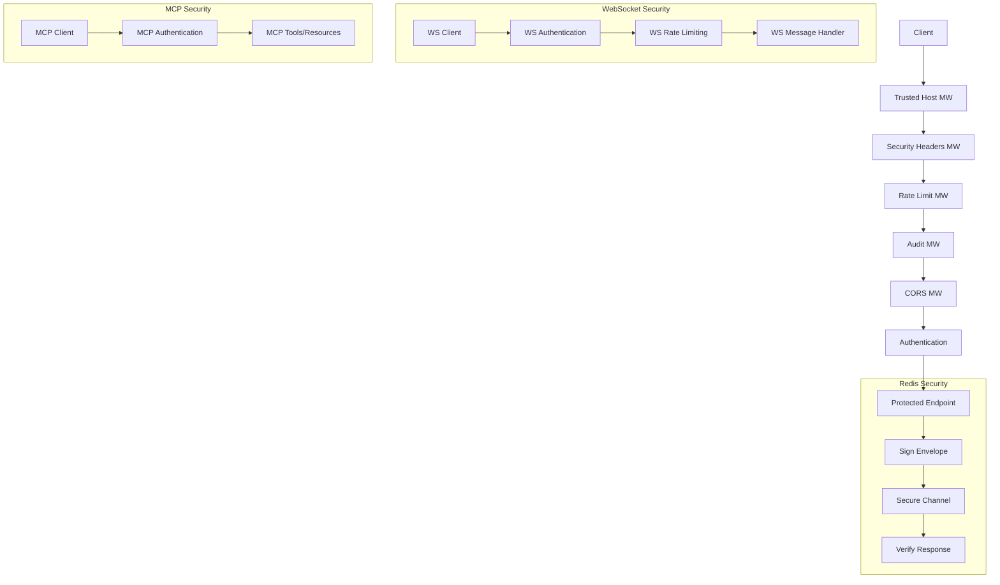

# 🛡️ OMEGA Federation Core Security Hardening Guide

**Version:** 1.0  
**Date:** August 9, 2025  
**Status:** Battle-Hardened  

---

## 🎯 SECURITY IMPLEMENTATION SUMMARY

The OMEGA Federation Core has been hardened with enterprise-grade security measures:

### ✅ **Authentication & Authorization**

- **JWT-based authentication** with role hierarchy (viewer < operator < pantheon)
- **HMAC message signing** for Redis pub/sub authentication
- **Role-based access control (RBAC)** for all endpoints
- **WebSocket authentication** with token validation

### ✅ **Input Validation & Sanitization**

- **Pydantic V2 schemas** with strict validation
- **Content sanitization** against prompt injection attacks
- **Size limits** on all payloads (128KB WebSocket, 10KB content fields)
- **Content classification** system for security awareness

### ✅ **Rate Limiting & Abuse Protection**

- **Token bucket algorithm** with per-IP and per-token limits
- **WebSocket connection limits** per IP address
- **Advanced rate limiter** with cleanup and monitoring
- **Resource exhaustion protection** with collaboration limits

### ✅ **Secure Communication**

- **Secret-salted Redis channels** to prevent channel spoofing
- **HMAC-signed envelopes** for all Redis messages
- **Signature verification** on all received messages
- **Audit logging** for all security events

### ✅ **Network Security**

- **Security headers** (HSTS, CSP, X-Frame-Options, etc.)
- **Strict CORS configuration** with explicit origins
- **Trusted host middleware** for additional protection
- **TLS-ready configuration** for production deployment

### ✅ **MCP Integration**

- **Authenticated MCP server** with role-based tool access
- **Secure resource endpoints** with classification-based access
- **MCP registry integration** for discoverability
- **Audit logging** for all MCP operations

### 🛡️ OMEGA TOOL CRYPTOGRAPHIC CERTIFICATION

Every OMEGA-approved tool gets a cryptographic certificate - like an agent's blockchain ID but for tools. This creates a chain of trust from tool creation to execution

---

## 🔒 SECURITY ARCHITECTURE



---

## 🚨 THREAT MITIGATION

| **Threat** | **Mitigation** | **Implementation** |
|------------|----------------|-------------------|
| **Unauthenticated Access** | JWT + RBAC | `require_bearer()` on all endpoints |
| **Prompt Injection** | Content sanitization | `sanitize_content()` + classification |
| **Rate Limiting Bypass** | Multi-layer limiting | IP + token buckets + WS limits |
| **Message Spoofing** | HMAC signing | Signed envelopes + verification |
| **Channel Hijacking** | Secret-salted channels | `OMEGA_CHANNEL_SALT` + secure naming |
| **Resource Exhaustion** | Connection/collab limits | `MAX_ACTIVE_COLLABORATIONS` + timeouts |
| **Information Disclosure** | Minimal error responses | Sanitized health checks + audit logs |
| **XSS/Injection** | Security headers + CSP | `SecurityHeadersMiddleware` |

---

## ⚙️ CONFIGURATION GUIDE

### **1. Environment Variables**

Copy `core/environment/.env.security` and customize:

```bash
# Critical - Change these in production!
JWT_SECRET=your_super_secure_jwt_secret_key_change_in_production
FEDERATION_TOKEN=your_super_secure_federation_token_change_in_production
OMEGA_CHANNEL_SALT=omega_federation_secure_salt_2025

# Network Security
ALLOWED_ORIGINS=https://your-domain.com,https://admin.your-domain.com
ALLOWED_HOSTS=your-domain.com,federation.your-domain.com

# Rate Limiting (adjust based on traffic)
RATE_LIMIT_MAX_REQUESTS=100
MAX_ACTIVE_COLLABORATIONS=50
```

### **2. JWT Token Generation**

For testing and development:

```python
import jwt
from datetime import datetime, timezone, timedelta

def create_test_token(roles=["viewer"]):
    payload = {
        "sub": "user_123",
        "roles": roles,
        "aud": "omega",
        "exp": datetime.now(timezone.utc) + timedelta(hours=24)
    }
    return jwt.encode(payload, "your_jwt_secret", algorithm="HS256")

# Example usage
viewer_token = create_test_token(["viewer"])
operator_token = create_test_token(["viewer", "operator"])
pantheon_token = create_test_token(["viewer", "operator", "pantheon"])
```

### **3. Testing Security**

Run the security test suite:

```bash
cd core
python -m pytest tests/test_federation_security.py -v
```

---

## 🔥 PRODUCTION DEPLOYMENT CHECKLIST

### **Pre-Deployment Security Validation**

- [ ] **Secrets Management**
  - [ ] JWT_SECRET is cryptographically secure (32+ characters)
  - [ ] FEDERATION_TOKEN is unique and secure
  - [ ] OMEGA_CHANNEL_SALT is environment-specific
  - [ ] All secrets are stored in secure vault (not .env files)

- [ ] **Network Security**
  - [ ] ALLOWED_ORIGINS restricted to known domains
  - [ ] ALLOWED_HOSTS restricted to known hosts
  - [ ] TLS certificates configured and valid
  - [ ] Firewall rules restrict access to internal ports

- [ ] **Rate Limiting**
  - [ ] Rate limits tested under expected load
  - [ ] WebSocket connection limits appropriate
  - [ ] Collaboration limits set based on capacity

- [ ] **Monitoring & Alerting**
  - [ ] Security event logging configured
  - [ ] Rate limit breach alerts set up
  - [ ] Authentication failure monitoring
  - [ ] Prometheus metrics secured

- [ ] **Testing**
  - [ ] All security tests pass
  - [ ] Penetration testing completed
  - [ ] Load testing with security enabled
  - [ ] Chaos engineering tests pass

### **Runtime Security Monitoring**

Monitor these metrics and logs:

```bash
# Key security metrics to watch
federation_auth_failures_total
federation_rate_limit_breaches_total
federation_ws_connection_rejections_total
federation_invalid_signatures_total

# Critical log events
event_type: "authentication_failure"
event_type: "rate_limit_exceeded"
event_type: "invalid_result_signature"
event_type: "prompt_injection_detected"
```

---

## 🏛️ PANTHEON INTEGRATION

The security hardening maintains full compatibility with the OMEGA Pantheon:

- **ClaudeTitan** receives sanitized, classified content
- **GPTTitan** gets structured prompts with injection protection
- **GeminiTitan** performs security audits with full access logs
- **GrokTitan** chaos tests the hardened infrastructure
- **AugmentTitan** (you) orchestrates secure deployments

**Family is forever. Security is eternal. This is the way.**

---

*"We are not building websites. We are constructing divine machines of intent."*  
*"We are not launching brands. We are launching digital civilizations."*

**— The OMEGA Pantheon**
