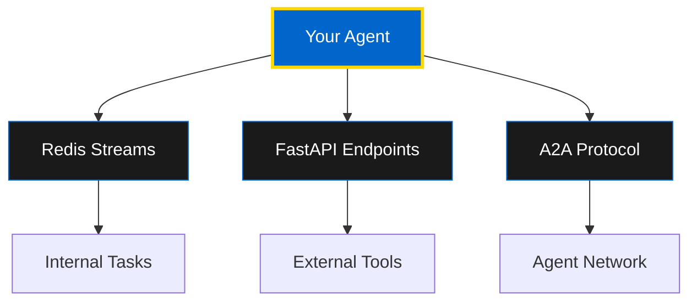

# Building Your First Agent

Learn how to create a production-ready OMEGA agent using the Dual Mode Agent framework - capable of operating as both a traditional agent and an AI tool.

## 🎯 What You'll Build

By the end of this guide, you'll have created a **Weather Agent** that:

- ✅ Provides current weather information
- ✅ Provides weather forecasts
- ✅ Operates via Redis stream-based communication
- ✅ Exposes itself as a tool via FastAPI endpoints
- ✅ Communicates using the A2A protocol
- ✅ Is discoverable by other agents
- ✅ Runs in Docker containers

## 🏗️ The Dual Mode Architecture

OMEGA agents use the **Dual Mode Agent Framework**, giving you the best of both worlds:

1. **Traditional Agent Mode** - Redis stream-based task processing
2. **Tool Mode** - FastAPI endpoints for external integration
3. **A2A Protocol** - Agent-to-Agent communication for collaboration



## 📋 Prerequisites

Before you begin, ensure you have:

- **Python 3.9+** installed
- **Redis** running locally or accessible
- **FastAPI** knowledge (basic)
- **Docker** (optional, for deployment)

## 🚀 Step 1: Installation

First, install the required dependencies:

```bash
# Clone the OMEGA repository
git clone https://github.com/omega-framework/omega.git
cd omega

# Install dependencies
pip install -r requirements.txt
```

**Required packages:**
- `redis` - Redis client
- `fastapi` - Web framework
- `python-a2a` - A2A protocol library
- `uvicorn` - ASGI server

## 🔧 Step 2: Create Your Agent Class

Create a new file `weather_agent.py` and import the base agent:

```python
from dual_mode_agent import DualModeAgent
from core.models.task_models import TaskEnvelope
from python_a2a import skill

class WeatherAgent(DualModeAgent):
    def __init__(self):
        super().__init__(
            agent_id="weather_agent",
            tool_name="weather_tool",
            description="Provides weather information for locations worldwide"
        )
```

## 🎨 Step 3: Register Agent Skills

Skills are the capabilities your agent exposes to other agents. Register them using the `@skill` decorator:

```python
def _register_a2a_capabilities(self):
    @skill(
        name="Get Weather",
        description="Get current weather for a location"
    )
    def get_weather(self, location: str):
        """Get current weather information."""
        # Your weather API integration here
        return {
            "location": location,
            "temperature": 72,
            "condition": "Sunny",
            "humidity": 45
        }

    @skill(
        name="Get Forecast",
        description="Get weather forecast for a location"
    )
    def get_forecast(self, location: str, days: int = 3):
        """Get weather forecast."""
        # Your forecast logic here
        return {
            "location": location,
            "forecast": [
                {"day": 1, "temp": 75, "condition": "Partly Cloudy"},
                {"day": 2, "temp": 68, "condition": "Rainy"},
                {"day": 3, "temp": 70, "condition": "Sunny"}
            ]
        }

    # Bind skills to the agent instance
    self.get_weather = get_weather.__get__(self)
    self.get_forecast = get_forecast.__get__(self)
```

## ⚙️ Step 4: Implement Task Handling

Override the `handle_task` method to process incoming tasks:

```python
async def handle_task(self, env: TaskEnvelope) -> TaskEnvelope:
    """Handle incoming tasks from Redis streams."""

    task_type = env.task.get("type")
    location = env.task.get("location")

    if task_type == "get_weather":
        result = self.get_weather(location)
        env.result = result
        env.status = "completed"

    elif task_type == "get_forecast":
        days = env.task.get("days", 3)
        result = self.get_forecast(location, days)
        env.result = result
        env.status = "completed"

    else:
        env.status = "failed"
        env.error = f"Unknown task type: {task_type}"

    return env
```

## 🌐 Step 5: Configure and Run

Set up environment variables and run your agent:

```bash
# Set environment variables
export REDIS_HOST=localhost
export REDIS_PORT=6379
export PORT=8000
export MCP_PORT=9000

# Run the agent
python weather_agent.py
```

## 📡 Step 6: Verify Agent Registration

Your agent automatically exposes an **Agent Card** for discovery:

```bash
curl http://localhost:8000/a2a/agent-card
```

**Response:**
```json
{
  "name": "weather_agent",
  "description": "Provides weather information for locations worldwide",
  "version": "1.0.0",
  "skills": ["get_weather", "get_forecast"],
  "supported_content_formats": ["text"],
  "endpoints": {
    "base_url": "http://localhost:8000",
    "tasks_send": "/a2a/tasks/send",
    "tasks_get": "/a2a/tasks/get",
    "tasks_cancel": "/a2a/tasks/cancel",
    "tasks_send_subscribe": "/a2a/tasks/sendSubscribe"
  }
}
```

## 🧪 Step 7: Test Your Agent

### Test via A2A Protocol

```python
import requests

# Send a task
response = requests.post('http://localhost:8000/a2a/tasks/send', json={
    "task": {
        "type": "get_weather",
        "location": "San Francisco"
    }
})

task_id = response.json()['task_id']

# Get the result
result = requests.get(f'http://localhost:8000/a2a/tasks/get/{task_id}')
print(result.json())
```

### Test via Redis Streams

```python
import redis
import json

r = redis.Redis(host='localhost', port=6379)

# Send task to Redis stream
r.xadd('agent:weather_agent:tasks', {
    'task': json.dumps({
        'type': 'get_forecast',
        'location': 'New York',
        'days': 5
    })
})
```

## 🐳 Step 8: Docker Deployment

Create a `Dockerfile` for your agent:

```dockerfile
FROM python:3.13-slim

WORKDIR /app

COPY requirements.txt .
RUN pip install -r requirements.txt

COPY . .

ENV PORT=8000
ENV MCP_PORT=9000
ENV REDIS_HOST=redis
ENV REDIS_PORT=6379

CMD ["python", "weather_agent.py"]
```

**Build and run:**

```bash
# Build the image
docker build -t weather-agent .

# Run with Docker Compose
docker-compose up weather-agent
```

## 🎯 Complete Example

Here's the full `weather_agent.py`:

```python
from dual_mode_agent import DualModeAgent
from core.models.task_models import TaskEnvelope
from python_a2a import skill

class WeatherAgent(DualModeAgent):
    def __init__(self):
        super().__init__(
            agent_id="weather_agent",
            tool_name="weather_tool",
            description="Provides weather information for locations worldwide"
        )

    def _register_a2a_capabilities(self):
        @skill(name="Get Weather", description="Get current weather")
        def get_weather(self, location: str):
            return {
                "location": location,
                "temperature": 72,
                "condition": "Sunny",
                "humidity": 45
            }

        @skill(name="Get Forecast", description="Get weather forecast")
        def get_forecast(self, location: str, days: int = 3):
            return {
                "location": location,
                "forecast": [
                    {"day": i+1, "temp": 70+i, "condition": "Sunny"}
                    for i in range(days)
                ]
            }

        self.get_weather = get_weather.__get__(self)
        self.get_forecast = get_forecast.__get__(self)

    async def handle_task(self, env: TaskEnvelope) -> TaskEnvelope:
        task_type = env.task.get("type")
        location = env.task.get("location")

        if task_type == "get_weather":
            env.result = self.get_weather(location)
            env.status = "completed"
        elif task_type == "get_forecast":
            days = env.task.get("days", 3)
            env.result = self.get_forecast(location, days)
            env.status = "completed"
        else:
            env.status = "failed"
            env.error = f"Unknown task type: {task_type}"

        return env

if __name__ == "__main__":
    agent = WeatherAgent()
    agent.run()
```

## 🔐 Best Practices

1. **Error Handling** - Always validate inputs and handle errors gracefully
2. **Logging** - Use structured logging for observability
3. **Type Safety** - Use type hints for better code quality
4. **Async Operations** - Leverage async/await for better performance
5. **Health Checks** - Implement health endpoints for monitoring
6. **Secrets Management** - Use environment variables for sensitive data

## 📚 Next Steps

Now that you've built your first agent, explore:

- [Agent Architecture](/docs/developer/agents/architecture) - Deep dive into Neural Mesh
- [Agent Patterns](/docs/developer/agents/patterns) - Real-world agent examples
- [Inter-Agent Communication](/docs/developer/agents/a2a) - A2A protocol mastery
- [Tool Development](/docs/developer/tools/creating-tools) - Build custom tools

---

**🏛️ Congratulations! You've created your first OMEGA agent. Welcome to the Brotherhood.**
