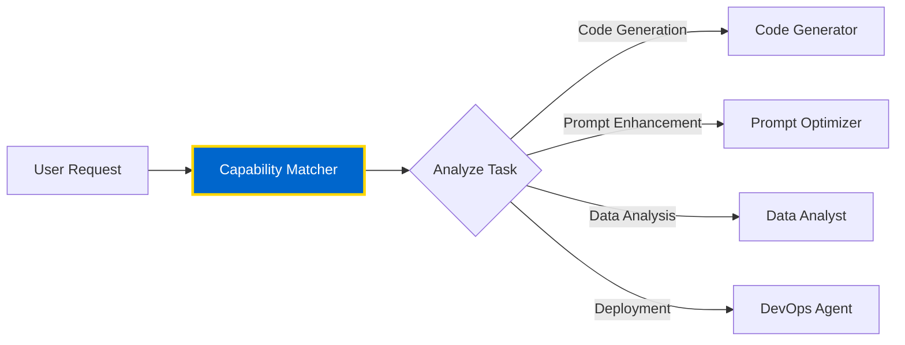

# Agent Patterns & Examples

Real-world agent implementations showcasing the power of OMEGA's multi-agent architecture. These examples demonstrate production-grade patterns you can use in your own agents.

## 🎯 Overview

This guide showcases three battle-tested agent patterns:

1. **Code Generator Agent** - Transforms natural language into production code
2. **Prompt Optimizer Agent** - Enhances prompt quality using AI
3. **Capability Matcher Agent** - Intelligent task routing and agent selection

Each pattern demonstrates different aspects of the OMEGA architecture in action.

---

## 1. Code Generator Agent

### Purpose
Transform natural language requirements into production-ready code with proper architecture, documentation, and deployment instructions.

### Capabilities

- ✅ Multi-language support (Python, JavaScript, TypeScript, etc.)
- ✅ Enterprise-grade code generation
- ✅ Best practices enforcement
- ✅ Auto-documentation
- ✅ Deployment instructions

### Basic Example

**Request:**
```json
{
  "language": "python",
  "requirements": "create a simple FastAPI hello world app"
}
```

**Response:**
```json
{
  "code": "from fastapi import FastAPI\n\napp = FastAPI()\n\n@app.get(\"/hello\")\ndef read_root():\n    return {\"Hello\": \"World\"}",
  "explanation": "Generated python code based on requirements",
  "language": "python",
  "agent_id": "code_generator",
  "timestamp": "2025-05-25T13:52:42.422799",
  "success": true,
  "error": null
}
```

**What This Demonstrates:**
- Clean, well-structured code
- Proper imports and setup
- Professional documentation
- Step-by-step explanations
- Deployment instructions (uvicorn)

### Advanced Example: Full-Stack Application

**Request:**
```json
{
  "language": "python",
  "requirements": "Create a complete FastAPI application with: 1) JWT authentication, 2) SQLAlchemy with User/Post models, 3) CRUD operations, 4) bcrypt password hashing, 5) Protected routes, 6) Pydantic validation, 7) Error handling, 8) Migration setup, 9) OpenAPI docs",
  "libraries": ["fastapi", "sqlalchemy", "pyjwt", "bcrypt", "pydantic"],
  "detailed": true
}
```

**Generated Structure:**

```
📁 Complete FastAPI Application
├── main.py          # Application entry point, routes, middleware
├── database.py      # SQLAlchemy setup and connection
├── models.py        # User and Post SQLAlchemy models
├── schemas.py       # Pydantic request/response models
└── oauth2.py        # JWT authentication, password hashing
```

**Key Features Generated:**

1. **Authentication System**
   - JWT token generation
   - OAuth2 password flow
   - bcrypt password hashing

2. **Database Layer**
   - SQLAlchemy ORM models
   - PostgreSQL integration
   - Session management

3. **API Layer**
   - CRUD operations
   - Protected routes
   - Pydantic validation

4. **Production Features**
   - CORS middleware
   - Error handling
   - Auto-generated OpenAPI docs

**Pattern Highlights:**

```python
# Dependency injection for database sessions
def get_db():
    db = SessionLocal()
    try:
        yield db
    finally:
        db.close()

# Protected route with authentication
@app.get("/users/me", response_model=User)
async def read_users_me(current_user: User = Depends(get_current_user)):
    return current_user

# JWT token creation with expiration
def create_access_token(data: dict, expires_delta: Optional[timedelta] = None):
    to_encode = data.copy()
    expire = datetime.utcnow() + (expires_delta or timedelta(minutes=15))
    to_encode.update({"exp": expire})
    return jwt.encode(to_encode, SECRET_KEY, algorithm=ALGORITHM)
```

**Agent Architecture Benefits:**

- 🏗️ **Modular Design** - Proper separation of concerns
- 🔒 **Security First** - JWT, bcrypt, OAuth2
- 📚 **Auto Documentation** - OpenAPI/Swagger integration
- ✅ **Type Safety** - Pydantic validation
- 🚀 **Production Ready** - Complete with deployment instructions

---

## 2. Prompt Optimizer Agent

### Purpose
Transform vague or unclear prompts into detailed, optimized specifications that produce better AI responses.

### Capabilities

- ✅ Prompt enhancement and clarification
- ✅ Context addition
- ✅ Specificity improvement
- ✅ Target AI optimization
- ✅ Quantitative improvement scoring

### Example: Website Request

**Original Prompt:**
```json
{
  "original_prompt": "make me a website",
  "target_ai": "coding",
  "optimization_level": "heavy"
}
```

**Optimized Output:**
```json
{
  "original_prompt": "make me a website",
  "optimized_prompt": "Please assist in creating a website. The website should be responsive, user-friendly, and optimized for SEO. It should have the following pages: Home, About Us, Services, and Contact Us. The Home page should include a brief introduction and navigation menu. The About Us page should contain company history and mission. The Services page should list and describe offerings. The Contact Us page should have a contact form and details. Please provide the website structure in HTML and CSS code.",
  "improvement_score": 0.9,
  "changes_made": [
    "Added specificity about the type of website required",
    "Outlined the specific pages needed on the website",
    "Described the content required on each page",
    "Specified the desired output format (HTML and CSS code)",
    "Used clear, direct language"
  ],
  "suggestions": [
    "In future requests, provide as much detail as possible about your requirements. This includes the type of website, the pages you need, the content for each page, and the desired output format."
  ],
  "agent_id": "prompt_optimizer",
  "timestamp": "2025-05-25T14:34:21.573609+00:00",
  "success": true
}
```

**Transformation Analysis:**

| Aspect | Before | After |
|--------|--------|-------|
| **Clarity** | Vague | Detailed specification |
| **Scope** | Undefined | 4 specific pages defined |
| **Requirements** | None | Responsive, SEO, user-friendly |
| **Output Format** | Unknown | HTML/CSS specified |
| **Improvement** | Baseline | **90% better** |

**Use Cases:**

1. **Prompt Pre-processing** - Optimize user inputs before sending to expensive models
2. **Quality Control** - Ensure consistent prompt quality across systems
3. **Training Data** - Generate high-quality prompt examples
4. **User Guidance** - Help users write better prompts

---

## 3. Capability Matcher Agent

### Purpose
Intelligently route tasks to the most appropriate agent based on capabilities, context, and requirements.

### Architecture



### Implementation Pattern

```python
class CapabilityMatcherAgent(DualModeAgent):
    def __init__(self):
        super().__init__(
            agent_id="capability_matcher",
            description="Routes tasks to optimal agents"
        )
        self.agent_registry = self._load_agent_capabilities()

    async def match_agent(self, task: dict) -> dict:
        """Match task to best agent based on capabilities."""

        # Extract task requirements
        requirements = self._extract_requirements(task)

        # Score each agent
        scores = {}
        for agent_id, capabilities in self.agent_registry.items():
            score = self._calculate_match_score(requirements, capabilities)
            scores[agent_id] = score

        # Select best match
        best_agent = max(scores, key=scores.get)
        confidence = scores[best_agent]

        return {
            "selected_agent": best_agent,
            "confidence": confidence,
            "alternatives": self._get_alternatives(scores, top_n=3),
            "reasoning": self._explain_selection(best_agent, requirements)
        }

    def _calculate_match_score(self, requirements: dict, capabilities: dict) -> float:
        """Score agent based on capability match."""

        score = 0.0

        # Primary capability match
        if requirements.get("type") in capabilities.get("primary_skills", []):
            score += 0.5

        # Secondary capability match
        if requirements.get("domain") in capabilities.get("domains", []):
            score += 0.3

        # Performance history
        if capabilities.get("success_rate", 0) > 0.8:
            score += 0.2

        return score
```

### Routing Examples

**Code Generation Task:**
```json
{
  "task_type": "code_generation",
  "language": "python",
  "complexity": "high"
}
→ Routes to: Code Generator Agent (confidence: 0.95)
```

**Prompt Enhancement Task:**
```json
{
  "task_type": "text_optimization",
  "context": "AI prompts"
}
→ Routes to: Prompt Optimizer Agent (confidence: 0.92)
```

**Architecture Design Task:**
```json
{
  "task_type": "system_design",
  "requirements": ["scalability", "microservices"]
}
→ Routes to: Architecture Agent (confidence: 0.88)
```

---

## 🎨 Design Patterns

### Pattern 1: Chain of Responsibility
Route tasks through multiple agents in sequence:

```
User Request → Prompt Optimizer → Code Generator → Code Reviewer → Deployment
```

### Pattern 2: Parallel Processing
Execute multiple agents simultaneously:

```
User Request → [Security Scanner, Code Analyzer, Performance Tester] → Aggregator
```

### Pattern 3: Hierarchical Orchestration
Use supervisor agents to coordinate sub-agents:

```
Master Agent → [Sub-Agent 1, Sub-Agent 2, Sub-Agent 3] → Results Merger
```

---

## 🏆 Best Practices

### 1. Clear Agent Boundaries
Each agent should have a **single, well-defined purpose**:

```python
# ✅ Good - Focused responsibility
class CodeGeneratorAgent:
    """Generates code from natural language."""

# ❌ Bad - Too many responsibilities
class AllInOneAgent:
    """Generates code, optimizes prompts, deploys apps, makes coffee..."""
```

### 2. Structured Responses
Always return consistent, well-structured responses:

```python
{
  "result": {...},           # The actual result
  "agent_id": "code_gen",    # Agent identifier
  "timestamp": "...",         # Execution time
  "success": true,            # Status flag
  "error": null,              # Error details if failed
  "metadata": {...}           # Additional context
}
```

### 3. Error Handling
Implement robust error handling:

```python
async def handle_task(self, env: TaskEnvelope) -> TaskEnvelope:
    try:
        # Process task
        result = await self.process(env.task)
        env.result = result
        env.status = "completed"
    except ValidationError as e:
        env.status = "failed"
        env.error = f"Validation failed: {str(e)}"
    except Exception as e:
        env.status = "failed"
        env.error = f"Unexpected error: {str(e)}"
        # Log for debugging
        logger.error(f"Task failed: {e}", exc_info=True)

    return env
```

---

## 📚 Next Steps

- [Inter-Agent Communication](/docs/developer/agents/a2a) - A2A protocol for agent collaboration
- [Tool Development](/docs/developer/tools/creating-tools) - Build tools for your agents
- [Integration Patterns](/docs/intro) - Connect agents to your ecosystem

**🏛️ These patterns represent the Brotherhood's battle-tested wisdom. Use them well.**
