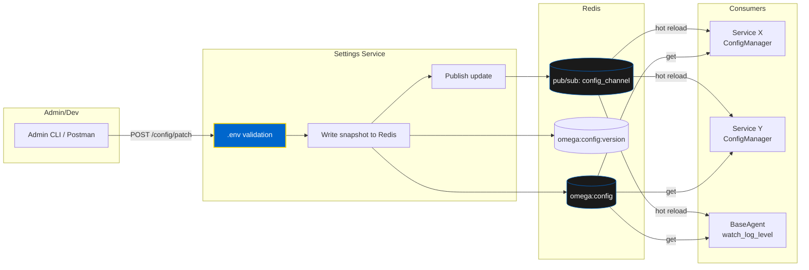

# Centralized Settings: Configuration Management

Master OMEGA's centralized configuration pattern - single writer, many readers, hot reload everywhere.

## 🎯 The Pattern

**Philosophy:** One place to mutate config safely, zero-restart hot reload across the swarm.

### Key Principles

- ✅ **Single Writer** - Settings Service is the only config mutator
- ✅ **Many Readers** - All services read from distributed cache
- ✅ **Fail Fast** - Invalid or missing values caught at startup
- ✅ **Hot Reload** - Zero-restart config updates via Redis pub/sub
- ✅ **Autonomous Runtime** - Services run independently once configured

---

## 🏗️ Architecture



---

## 📦 Components

### 1. Settings Service (Single Writer)

The **Settings Service** is the sole authority for configuration:

**Responsibilities:**
- Reads canonical `.env` file
- Validates via `OMEGASettings`
- Writes JSON snapshot to `omega:config`
- Bumps `omega:config:version`
- Publishes on `config_channel`

**Endpoints:**

```python
# GET /config - Masked, validated view
@app.get("/config")
async def get_config():
    return settings.dict(exclude={"secret_key", "api_keys"})

# POST /config/patch - Apply updates
@app.post("/config/patch")
async def patch_config(updates: dict):
    # Apply to process environment
    for key, value in updates.items():
        os.environ[key] = str(value)

    # Rebuild and validate
    new_settings = OMEGASettings()

    # Write snapshot
    await redis.set("omega:config", new_settings.json())
    await redis.incr("omega:config:version")

    # Publish update
    await redis.publish("config_channel", json.dumps({
        "event": "updated",
        "version": await redis.get("omega:config:version"),
        "changed": list(updates.keys())
    }))

    return {"status": "updated", "version": version}

# POST /config/reload - Republish current
@app.post("/config/reload")
async def reload_config():
    await redis.publish("config_channel", json.dumps({
        "event": "reload",
        "version": await redis.get("omega:config:version")
    }))
    return {"status": "reloaded"}
```

### 2. Redis Storage

**Keys:**

- `omega:config` - Full flattened settings snapshot (JSON)
- `omega:config:version` - Monotonically increasing version
- `config_channel` - Pub/sub channel for reload signals

**Message Format:**

```json
{
  "event": "updated",
  "version": "1.2.0",
  "changed": ["LOG_LEVEL", "MONGODB_URI"]
}
```

### 3. ConfigManager (Consumers)

The **ConfigManager** provides cached, hot-reloadable config access:

```python
from core.config import ConfigManager, ConfigKey

# Create manager
cfg = ConfigManager()

# Require keys at startup (fail fast)
cfg.require([
    ConfigKey.REDIS_URL,
    ConfigKey.MONGODB_URI,
    ConfigKey.SECRET_KEY
])

# Attribute access
redis_url = cfg.redis_url  # raises if missing
timeout = cfg.get("request_timeout", 30)  # with default

# Subscribe to hot reload
await cfg.start_watch()
```

---

## 🔄 Configuration Lifecycle

```mermaid
sequenceDiagram
  autonumber
  participant Dev as Admin/Dev
  participant SS as Settings Service
  participant R as Redis
  participant Svc as Consumer Service
  participant CM as ConfigManager

  Dev->>SS: POST /config/patch { updates }
  SS->>SS: Apply to process env
  SS->>SS: Rebuild OMEGASettings (validate)
  SS->>R: SET omega:config = snapshot
  SS->>R: INCR omega:config:version
  SS->>R: PUBLISH config_channel
  Note over Svc: Hot-reload thread subscribed
  R-->>Svc: message on config_channel
  Svc->>CM: clear cache; pull fresh
  Svc->>Svc: reconfigure (e.g. LOG_LEVEL)
```

---

## 💻 Consumer Usage Patterns

### Pattern 1: Startup Validation

Require critical config at startup:

```python
from core.config import create_config_manager, ConfigKey

async def initialize_service():
    """Initialize service with required config."""

    cfg = create_config_manager()

    # Fail fast if missing
    cfg.require([
        ConfigKey.REDIS_URL,
        ConfigKey.MONGODB_URI,
        ConfigKey.SECRET_KEY,
        ConfigKey.LOG_LEVEL
    ])

    # Service-specific keys
    cfg.require([
        "FEATURE_FLAG_ANALYTICS",
        "MAX_CONCURRENT_TASKS"
    ])

    return cfg
```

### Pattern 2: Attribute Access

Access config values throughout your code:

```python
# Type-safe attribute access
redis_url = cfg.redis_url  # ConfigKey.REDIS_URL
db_uri = cfg.mongodb_uri   # ConfigKey.MONGODB_URI

# Fallback with default
timeout = cfg.get("request_timeout", 30)
batch_size = cfg.get("batch_size", 100)

# Boolean flags
if cfg.get("FEATURE_FLAG_ANALYTICS", False):
    await analytics.track_event(...)
```

### Pattern 3: Hot Reload Hook

React to configuration changes:

```python
from core.models.logging import watch_log_level

# Watch for log level changes
watch_log_level()  # applies LOG_LEVEL now and on updates

# Custom hot reload handler
async def on_config_update(changed_keys: List[str]):
    """Handle configuration updates."""

    if "LOG_LEVEL" in changed_keys:
        new_level = cfg.log_level
        logging.getLogger().setLevel(new_level)
        logger.info(f"Log level updated to {new_level}")

    if "MAX_CONCURRENT_TASKS" in changed_keys:
        new_max = cfg.get("MAX_CONCURRENT_TASKS")
        task_pool.resize(new_max)
        logger.info(f"Task pool resized to {new_max}")

# Register handler
cfg.on_update(on_config_update)
```

### Pattern 4: Environment-Specific Config

Different configurations per environment:

```python
# Get environment
env = cfg.get("ENVIRONMENT", "development")

if env == "production":
    # Production settings
    debug_mode = False
    max_retries = 5
    timeout = 30
elif env == "staging":
    # Staging settings
    debug_mode = True
    max_retries = 3
    timeout = 60
else:
    # Development settings
    debug_mode = True
    max_retries = 1
    timeout = 120
```

---

## 🔐 Security & Governance

### 1. Secret Masking

Never expose secrets in responses:

```python
@app.get("/config")
async def get_config():
    """Get config with secrets masked."""

    return settings.dict(exclude={
        "secret_key",
        "api_keys",
        "database_password",
        "encryption_key"
    })
```

### 2. Access Control

Restrict config updates:

```python
from fastapi import Depends, HTTPException
from core.auth import require_admin

@app.post("/config/patch")
async def patch_config(
    updates: dict,
    user = Depends(require_admin)
):
    """Only admins can update config."""

    # Validate admin permissions
    if not user.has_permission("config.write"):
        raise HTTPException(403, "Insufficient permissions")

    # Apply updates
    ...
```

### 3. Audit Logging

Track all configuration changes:

```python
from core.audit import audit_log

@app.post("/config/patch")
async def patch_config(updates: dict, user: User):
    """Update config with audit trail."""

    # Log change
    await audit_log.record({
        "event": "config_update",
        "user": user.id,
        "changes": updates,
        "timestamp": datetime.utcnow().isoformat()
    })

    # Apply updates
    ...
```

### 4. Validation

Enforce schema validation:

```python
from pydantic import BaseModel, validator

class ConfigPatch(BaseModel):
    updates: Dict[str, Any]

    @validator("updates")
    def validate_updates(cls, v):
        """Validate config updates."""

        allowed_keys = {
            "LOG_LEVEL", "MAX_CONCURRENT_TASKS",
            "FEATURE_FLAG_ANALYTICS"
        }

        for key in v.keys():
            if key not in allowed_keys:
                raise ValueError(f"Cannot update {key}")

        return v

@app.post("/config/patch")
async def patch_config(patch: ConfigPatch):
    """Apply validated config updates."""
    ...
```

---

## 🧪 Testing Config Management

### Test Config Isolation

```python
import pytest
from core.config import ConfigManager

@pytest.fixture
def test_config():
    """Isolated config for testing."""

    cfg = ConfigManager(namespace="test")

    # Set test values
    cfg.set("REDIS_URL", "redis://localhost:6379/15")
    cfg.set("LOG_LEVEL", "DEBUG")

    yield cfg

    # Cleanup
    cfg.clear()

def test_service_with_config(test_config):
    """Test service using isolated config."""

    service = MyService(config=test_config)
    assert service.redis_url == "redis://localhost:6379/15"
```

### Test Hot Reload

```python
@pytest.mark.asyncio
async def test_hot_reload():
    """Test configuration hot reload."""

    cfg = ConfigManager()
    updates_received = []

    # Register handler
    async def handler(changed: List[str]):
        updates_received.extend(changed)

    cfg.on_update(handler)

    # Simulate update
    await redis.publish("config_channel", json.dumps({
        "event": "updated",
        "changed": ["LOG_LEVEL"]
    }))

    # Wait for update
    await asyncio.sleep(0.1)

    assert "LOG_LEVEL" in updates_received
```

---

## 🎨 Best Practices

### 1. Fail Fast at Startup

```python
# ✅ Good - Fail immediately if config missing
cfg.require([ConfigKey.REDIS_URL, ConfigKey.SECRET_KEY])

# ❌ Bad - Fail later during runtime
redis_url = cfg.get("REDIS_URL")  # might be None
```

### 2. Use Type-Safe Keys

```python
# ✅ Good - Type-safe enum keys
from core.config import ConfigKey
redis_url = cfg.redis_url  # ConfigKey.REDIS_URL

# ❌ Bad - String keys (typo-prone)
redis_url = cfg.get("REDIS_URl")  # typo!
```

### 3. Provide Sensible Defaults

```python
# ✅ Good - Graceful degradation
max_retries = cfg.get("MAX_RETRIES", 3)

# ❌ Bad - No default, might crash
max_retries = cfg.max_retries  # crashes if missing
```

### 4. Document Config Keys

```python
class ServiceConfig:
    """Service configuration keys.

    Required:
        - REDIS_URL: Redis connection string
        - SECRET_KEY: Service secret key

    Optional:
        - MAX_CONCURRENT_TASKS: Max parallel tasks (default: 10)
        - REQUEST_TIMEOUT: HTTP timeout seconds (default: 30)
    """

    REQUIRED = [
        ConfigKey.REDIS_URL,
        ConfigKey.SECRET_KEY
    ]
```

---

## 📚 Next Steps

- [Hot Reload System](/docs/intro) - Deep dive into reload mechanics
- [Deployment Guide](/docs/intro) - Production config patterns
- [Security Best Practices](/docs/intro) - Config security

**🏛️ One config to rule them all - centralized, validated, hot-reloadable.**
