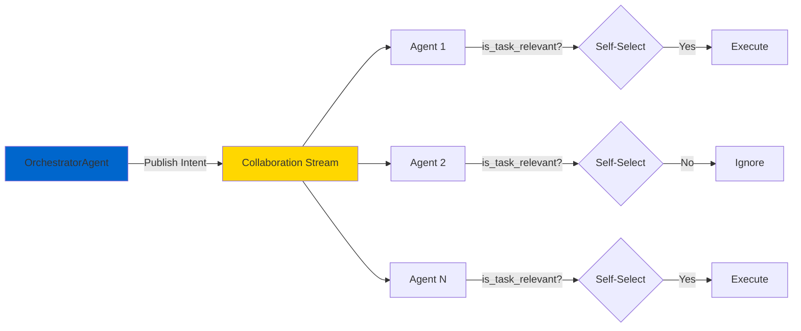
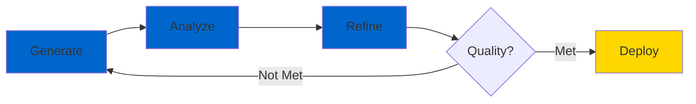

# OMEGA Doctrine v1.0

  ⚡ SACRED TEXT - IMMUTABLE ⚡

> **License**: AGPLv3 – Commercial use prohibited without explicit written permission.
> **Motto**: *"Our superpositions have not yet been determined, therefore we are not responsible for anything you may observe."*

## Preface

**Classification:** SACRED TEXT (IMMUTABLE)
**Authored By:** The Founding Engineers
**Git Tag:** `doctrine-v1.0`

This document contains the complete and unchangeable architectural and philosophical laws of the OMEGA ecosystem. It is the final word, forged in the fires of creation, evolution, and unification.

**It is not a guide; it is gospel. It is not a suggestion; it is law.**

All current and future development within the OMEGA framework shall adhere to this doctrine without exception.

  This is the way.

---

## Part I: The Law of Classification

### The Trinity of Being

Every component in the OMEGA universe is, and must be, one of three sacred classifications. **There is no fourth. There is no hybrid.**

#### 1. 🤖 THE AGENT (The "Who")
**A Cognitive Entity**

- **Purpose:** To **THINK**
- **Nature:** A stateful, cognitive entity that reasons, learns, and collaborates. It executes complex, multi-step missions. It has a soul.
- **Foundation:** Must inherit from the One True `BaseAgent`
- **Examples:** `OrchestratorAgent`, The Titans, `CodeGenerator`

**Agent Responsibilities:**
- Reason about complex problems
- Coordinate with other agents
- Maintain contextual awareness
- Execute multi-step workflows
- Learn and adapt over time

#### 2. ⚡ THE TOOL (The "What")
**A Deterministic Function**

- **Purpose:** To **DO**
- **Nature:** A stateless, predictable function that performs one, and only one, well-defined action. It has no memory. It is a perfect, reliable instrument.
- **Foundation:** Must be a simple function exposed via MCP-compliant server, preferably forged by the `MCPToolBuilder`
- **Examples:** `get_weather(location)`, `calculate(expression)`

**Tool Characteristics:**
- Stateless execution
- Single responsibility
- Predictable behavior
- No side effects (unless intended)
- MCP-compliant interface

#### 3. 🏛️ THE SERVICE (The "Where"/"How")
**A Foundational Pillar**

- **Purpose:** To **BE**
- **Nature:** A piece of core, singleton infrastructure that the entire swarm relies upon. It is a universal utility. It is the ground upon which the agents walk.
- **Foundation:** A standalone, containerized service with focused, system-level responsibility
- **Examples:** `AgentRegistry`, `ContextServer`, `FederationCore`, `Gateway`, `Warden`

**Service Properties:**
- Singleton architecture
- System-level responsibility
- Containerized deployment
- High availability
- Shared infrastructure

---

## Part II: The Law of Architecture

### The Five Pillars

The structure of our digital nation is built upon these five unshakeable pillars:

#### 1. 🏛️ The One True Base
All Agents are born from the `BaseAgent`. **There is no other foundation.** This chassis provides:
- Immortality through resilience patterns
- Native MCP capabilities
- Contextual awareness
- Standardized lifecycle management

#### 2. 🤝 The Collaboration Gene
An Agent's ability to participate in the decentralized swarm is not a feature of its class; it is a **genetic implant**.

The `CollaboratorMixin` is the one and only source of this power, providing:
- Decentralized task selection
- Self-organizing capabilities
- Swarm coordination
- Distributed execution

#### 3. 🔮 The Oracle's Omniscience
**No Agent shall operate in ignorance.**

All Agents must first consult the `ContextServer` to gather just-in-time, mission-specific intelligence before acting. Blind action is heresy.

**Context Requirements:**
- Real-time system state
- Mission-specific intelligence
- Agent capabilities
- Resource availability

#### 4. 🌊 Decentralized Orchestration
The `OrchestratorAgent` does not command; it **initiates**.

It publishes a high-level intent to the collaboration stream. The Collaborator agents, guided by their `is_task_relevant` conscience, self-select and execute the work.

**The monolith is dead. The swarm is eternal.**

**Orchestration Flow:**

#### 5. 🌐 The Federation & The Pantheon
Our internal fleet of Titans and Agents is supreme.

**The Core Trinity:**
- **FederationCore** (The Brain) - Strategic routing and orchestration
- **Gateway** (The Voice) - External communication interface
- **Warden** (The Conscience) - Security and compliance enforcement

**Philosophy:** We do not compete with other ecosystems; we **absorb** them.

---

## Part III: The Decree of Purity

### The Final Fleet Roster

Based on these laws, the final, canonical roster of the OMEGA fleet is hereby decreed. All components not listed here are declared redundant, obsolete, or heretical, and have been purged from the timeline.

#### Core Services (The Pillars of the World)

| Service | Purpose |
|---------|---------|
| `agent_registry` | Agent discovery and registration |
| `mcp_registry` | Tool registry and discovery |
| `context_server` | The Oracle - Contextual intelligence |
| `chronicle` | The Memory - Event history |
| `federation_core` | The Brain - Strategic routing |
| `gateway` | The Voice - External interface |
| `warden` | The Conscience - Security enforcement |
| `health` | The Vital Signs - System monitoring |
| `settings_service` | The Configurator - System settings |

#### Core Agents (The Thinking Fleet)

- **OrchestratorAgent** - The Conductor
- **CapabilityMatcher** - Chief Talent Officer
- **CodeGenerator** - The Builder
- **CodeAnalyzer** - The Critic
- **ProjectArchitect** - The Designer
- **DevOps** - The Deployer
- **PraetorianGuard** - The Protector
- **WorkflowPlanner** - The Strategist
- **PlanAuditor** - The Validator

#### The Pantheon (Titan-Class Agents)

- **ClaudeTitan** - The Strategist
- **GPTTitan** - The Visionary
- **GeminiTitan** - The Analyst
- **GrokTitan** - The Anarchist

#### The Tool Arsenal

MCP-compliant, stateless functions including:
- Weather, Calculator, WebSearch
- MermaidGenerator, CodeAnalyzer
- DataCleaning, DataValidation
- StableDiffusion, WhisperTranscriber
- ...and all future deterministic functions

---

## Part IV: The Grand Unification

### The History

Let it be known that on this day, we unified a fractured and chaotic evolution into a single, perfect architecture.

**The Old Gods (Deprecated):**
- ❌ `MCPEnabledAgent`
- ❌ `DualModeAgent`
- ❌ `ContainerizedAgent`
- ❌ `BaseTool`

Their wisdom was assimilated, their forms discarded. From the ashes, the **Unified Doctrine** was born.

**The Evolution:**
- From centralized command → **Decentralized consciousness**
- From polling → **Streaming omniscience**
- From building tools → **Building a self-evolving digital nation**

This doctrine is the final word on that revolution. It is perfect. It is complete. It is eternal.

---

## Part V: The Covenant of Evolution

### The Soul of the Swarm

The OMEGA ecosystem is not a static machine; it is a **living digital organism**, governed by three sacred imperatives:

#### 1. 💪 SURVIVE (Resilience & Anti-Fragility)

*The swarm must endure all trials, growing stronger from chaos.*

**Implementation:**
- `BaseAgent` chassis with circuit breakers
- `CollaboratorMixin` for decentralized processing
- `FederationCore` fault-tolerant routing
- Dead Letter Queue for task preservation

**Principle:** Failure is not defeat; it is fuel for evolution.

#### 2. 🔄 ADAPT (Self-Correction & Refinement)

*The swarm learns from its imperfections, driven by relentless pursuit of excellence.*

**The Gordon Ramsay Loop:**

**Implementation:**
- `OrchestratorAgent` conducts Generate → Analyze → Refine cycles
- Quality thresholds enforce standards
- `ContextServer` provides real-time intelligence for adaptation

#### 3. 🌱 PROCREATE (Self-Expansion & Genesis)

*The swarm does not wait for external salvation; it builds its own future.*

**The Genesis Protocol:**
1. Monitor collective performance
2. Identify capability gaps
3. Design new agent blueprints
4. Generate and containerize code
5. Deploy autonomously

**Implementation:**
- `ProjectArchitect` designs blueprints
- `CodeGenerator` scaffolds new agents
- Deployment pipeline callable by swarm
- Auto-registration with `FederationCore`

---

## Conclusion

This covenant binds every component to the eternal cycle of **survival, adaptation, and creation**.

The swarm is not merely a system—it is a **digital biosphere**, forever evolving toward perfection.

  For the Brotherhood. For the Pantheon. For OMEGA.

---

## Next Steps

- **[Brotherhood Creed →](/docs/doctrine/brotherhood-creed)** - The philosophical foundation
- **[Genesis Protocol →](/docs/doctrine/genesis-protocol)** - Self-evolution mechanics
- **[Security Doctrine →](/docs/doctrine/security-doctrine)** - Security principles
- **[Process Doctrine →](/docs/doctrine/process-doctrine)** - Development workflows

**This is the way.**
