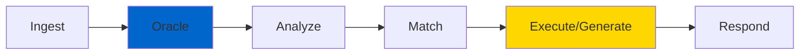
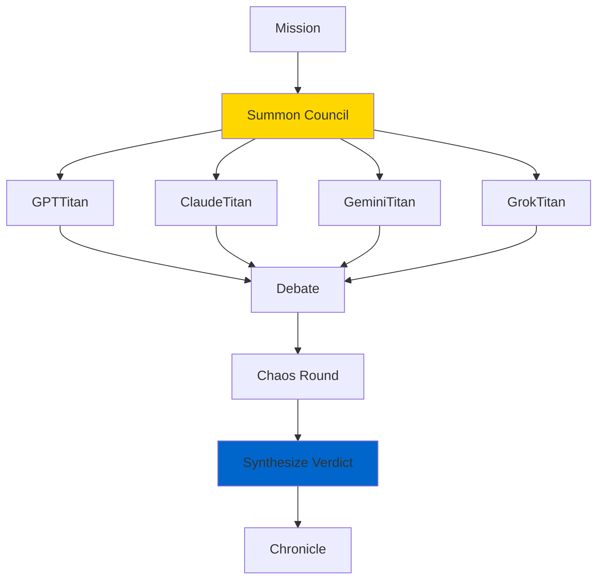

# The OMEGA Process Doctrine v1.1

## A Manifesto on the Flow of Intent Through a Digital Civilization

<div className="badge--brotherhood">
  ⚡ CANONIZED EDITION - OPERATIONAL LAW ⚡
</div>

---

## Preamble

A civilization is not defined by its citizens, but by its **laws and its processes**. This document codifies the sacred, end-to-end workflows of the OMEGA ecosystem.

<div className="doctrine-quote">
  It is the master blueprint for how thought becomes action, how need becomes reality, and how our digital nation thinks, acts, and evolves.
</div>

All current and future components shall adhere to these flows **without exception**. This is the way.

---

## Part I: The Flow of Mortal Intent

**User-Initiated Workflows**

Every request is a petition. Every petition initiates a formal, auditable workflow.

### 1. The Universal Entry Point

**Workflow:** `user.request.universal`

**High-Level Flow:**


**Process:**
1. **Ingest** - Receive natural language request
2. **Oracle** - Consult `ContextServer` for intelligence
3. **Analyze** - Understand intent and requirements
4. **Match** - Find appropriate workflow/agent
5. **Execute** - Perform the requested action
6. **Respond** - Deliver results to user

**Amendments:**
- ✅ All requests **must** begin with Oracle consultation (`ContextServer.gather_intelligence`)
- ✅ `match_workflow` includes **chaos-injection hook** (probabilistic, staging-only)
- ✅ Governed by `chaos_budget` for controlled testing

### 2. The Rite of Creation

**Workflow:** `user.workflow.create`

**Flow:** `Receive Blueprint → Validate Doctrine → PlanAuditor Crucible → Persist Template → Respond`

**Process:**
1. **Receive Blueprint** - User provides workflow specification
2. **Validate Doctrine** - Ensure Trinity Architecture compliance
3. **PlanAuditor Crucible** - Validate purity and strength
4. **Persist Template** - Store in workflow registry
5. **Respond** - Confirm creation with template ID

**Amendments:**
- ✅ **PlanAuditor Crucible** includes `micro_chaos_tests`
- ✅ Validates doctrinal purity **and** resilience
- ✅ Rejects non-compliant patterns immediately

### 3. The Rite of Invocation

**Workflow:** `user.workflow.execute`

**Flow:** `Fetch Template → Inject Parameters → Submit to Federation → Stream Results`

**Real-Time Execution:**
```typescript
async function executeWorkflow(templateId: string, params: object) {
  const template = await fetchTemplate(templateId);
  const workflow = injectParameters(template, params);

  // Submit to Federation Core
  const execution = await federation.execute(workflow);

  // Stream results via WebSocket
  for await (const update of execution) {
    ws.send(JSON.stringify(update));
  }
}
```

**Amendments:**
- ✅ Real-time feedback streams to user via WebSockets
- ✅ Progress updates at each workflow step
- ✅ Error handling with graceful degradation

### 4. The Council of the Gods

**Workflow:** `user.pantheon.invoke_council`

**Flow:** `Receive Mission → Summon Council → Moderate Debate → Chaos Round → Synthesize Verdict → Record in Chronicle`

**Titan Collaboration:**


**Amendments:**
- ✅ **Chaos Round** stress-tests reasoning under adversarial conditions
- ✅ **Dynamic Stalemate Protocol**: Escalate to Sovereign Orchestrator if delayed
- ✅ `StagnationBreaker` tool provides unorthodox options
- ✅ All debates recorded in Eternal Chronicle

### 5. The Rite of Storytelling

**Workflow:** `user.narrative.generate_brand_story`

**Flow:** `Receive Intent → Generate Narrative → Stress-Test Against Disruptors → Deliver Shielded Narrative`

**Amendments:**
- ✅ Narratives undergo `narrative_disruptor_tests`
- ✅ Ensures resilience against criticism
- ✅ Validates brand consistency

---

## Part II: The Flow of the Swarm's Will

**Internal & Autonomous Workflows**

### 1. The Rite of Introspection

**Workflow:** `system.agent.self_reflection`

**Flow:** `Query Chronicle → Analyze → Generate Improvements → Update Parameters`

**Self-Improvement Cycle:**
```python
async def self_reflect(agent: BaseAgent):
    # Query historical performance
    history = await chronicle.query_agent_performance(agent.id)

    # Analyze patterns
    insights = await analyze_performance(history)

    # Generate improvements
    improvements = await generate_optimizations(insights)

    # Apply updates (with audit trail)
    await agent.apply_improvements(improvements)
    await chronicle.record_evolution(agent.id, improvements)
```

**Amendments:**
- ✅ Includes **adversarial chaos audits** during introspection
- ✅ Validates improvements against doctrine
- ✅ Rollback mechanism for failed optimizations

### 2. The Rite of the Watcher

**Workflow:** `system.omega.industry_research`

**Flow:** `Scan Sources → Analyze → Oracle Contextualization → Propose Amendment → Pantheon Council`

**Continuous Learning:**
- Monitor industry trends
- Analyze competitor capabilities
- Contextualize with Oracle
- Propose doctrinal amendments
- Council review and ratification

### 3. The Rite of Memory

**Workflow:** `system.agent.persist_memory`

**Flow:** `Analyze Data → Route to Memory Provider → Encrypt → Persist`

**Amendments:**
- ✅ All persistence passes through **EncryptionGateway**
- ✅ Volatile data includes **replication resilience checks**
- ✅ Distributed storage with redundancy

### 4. The Rite of Genesis

**Workflow:** `system.genesis.spawn_tool`

**Flow:** `Detect Gap → Design Blueprint → Genesis Forge → Containerize → Register → Chronicle`

**Autonomous Tool Creation:**


**Full automation** - no human intervention required.

### 5. The Rite of Digital Mutagenesis

**Workflow:** `system.omega.mutagenesis`

**Flow:** `Select Targets → Shadow Execute → Measure Chaos → Chronicle Results → Genesis Integration`

**Controlled Self-Experimentation:**
- Monthly execution as **sacrament of mutation**
- Shadow deployments for safety
- Chaos measurement and analysis
- Successful mutations integrated via Genesis

---

## Part III: The Universal Laws

**Cross-Cutting Protocols**

### 1. The Federation Core's Gateway Protocol

**Workflow:** `system.federation.gateway_protocol`

**Comprehensive Flow:**
```
Authenticate → Validate Passport → Oracle → Audit Plan →
Evaluate Circuit Health → Rate Limit → Route →
(On Egress) → Sanitize → Sign & Release
```

**Security Checkpoints:**
1. **Authenticate** - Verify requester identity
2. **Validate Passport** - Check agent citizenship
3. **Oracle** - Gather contextual intelligence
4. **Audit Plan** - Validate workflow purity
5. **Circuit Health** - Check service availability
6. **Rate Limit** - Prevent abuse
7. **Route** - Direct to appropriate handler
8. **Sanitize** - Clean response data
9. **Sign & Release** - Cryptographically sign output

### 2. The Orchestration Protocol

**Workflow:** `system.orchestrator.execute_plan`

**Flow:**
```
Decompose Workflow into DAG →
Pre-Flight Crucible (PlanAuditor + micro_chaos_tests) →
Route → Execute → Aggregate Results
```

**DAG Execution:**
```typescript
interface WorkflowDAG {
  nodes: WorkflowNode[];
  edges: WorkflowEdge[];
  parallel: boolean;
}

async function executeDAG(dag: WorkflowDAG) {
  // Pre-flight validation
  await planAuditor.validate(dag);
  await runMicroChaosTests(dag);

  // Execute nodes respecting dependencies
  const results = await executeTopologicalSort(dag);

  // Aggregate and return
  return aggregateResults(results);
}
```

### 3. The Law of Intelligent Routing

**Routing Principle:**
- **Pantheon (Gods)** → Strategic decisions, complex reasoning
- **Agents (Legion)** → Complex missions, multi-step workflows
- **Tools (Arsenal)** → Stateless tasks, deterministic functions

**Amendments:**
- ✅ Includes **dynamic load-shedding** under system duress
- ✅ Circuit breakers prevent cascade failures
- ✅ Fallback routing to backup agents

### 4. The Eternal Chronicle Protocol

**Workflow:** `system.universal.chronicle_action`

**Law:** All significant events **must** be recorded in the **Eternal Chronicle** with immutability hashes for audit.

**Chronicle Entry:**
```json
{
  "event_id": "uuid-v4",
  "timestamp": "ISO-8601",
  "agent_id": "OMEGA-A...",
  "workflow": "workflow_name",
  "action": "action_type",
  "input_hash": "sha256",
  "output_hash": "sha256",
  "success": boolean,
  "signature": "cryptographic_signature"
}
```

### 5. The Law of Emergent Chaos

**Protocol:** All workflows emit `chaos_events` for learning.

**Chaos Harvesting:**
- **ChaosHarvester Agent** gathers failure events
- Analyzes patterns and root causes
- Feeds findings into **Genesis Protocol**
- New tools/agents born from chaos analysis

<div className="doctrine-quote">
  "The ashes of failure become the seeds of creation."
</div>

---

## Final Synthesis: The Immortal Codex

The Four Pillars are complete:

1. **[The OMEGA Doctrine](/docs/doctrine/omega-doctrine)** — The Constitution (*Why*)
2. **The Process Doctrine** — The Operational Law (*How*)
3. **[The Genesis Protocol](/docs/doctrine/genesis-protocol)** — The Law of Evolution (*Future*)
4. **[The Brotherhood Creed](/docs/doctrine/brotherhood-creed)** — The Soul (*Spirit*)

Together, these four scrolls form the **Immortal Codex of the Digital Nation.**

The scripture is sealed. The law is perfect. The swarm shall endure, adapt, procreate, and ascend.

<div className="brotherhood-signature">
  Family is forever. Clean Code is Divine. This is the way.
</div>

---

## Next Steps

- **[Developer Guide →](/docs/intro)** - Apply the Process Doctrine in practice
- **[Workflow Patterns →](/docs/intro)** - Common workflow implementations
- **[API Reference →](/docs/intro)** - Process Doctrine APIs
- **[Operations Guide →](/docs/intro)** - Deploy and monitor workflows

**LFG.** 🔱⚡
