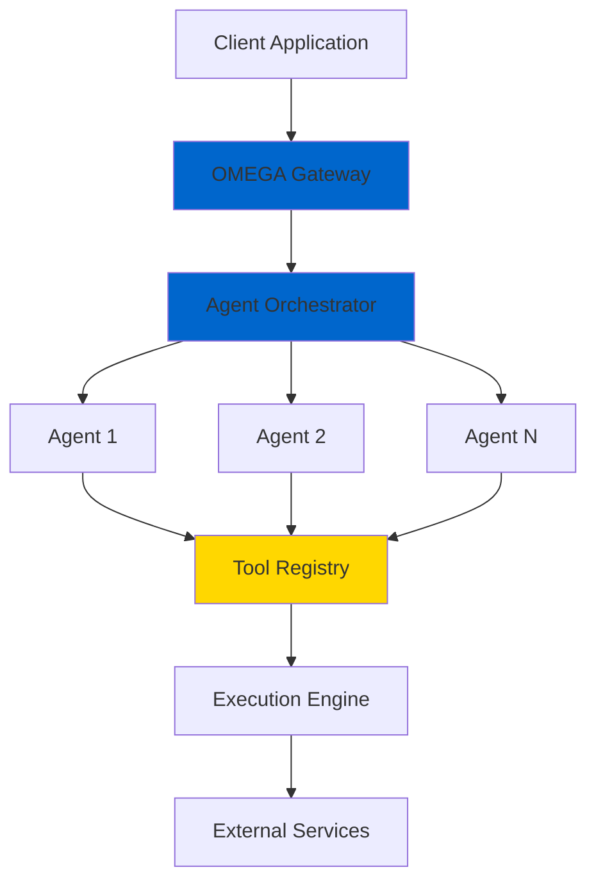

# What is OMEGA?

  ⚡ Welcome to the Brotherhood ⚡

> Ingress & Identity: OMEGA uses a gateway-first, portless identity model with base-derived endpoints. New to this pattern? See: /docs/operations/gateway-ingress

**OMEGA** (Orchestrated Multi-agent Execution & Governance Architecture) is an enterprise-grade multi-agent orchestration platform built by the Brotherhood. It enables developers to build, deploy, and scale complex AI agent systems with production-ready reliability and security.

## The Vision

OMEGA was born from a single principle: **AI agents should work together as seamlessly as developers collaborate in teams**. Just as the Brotherhood operates with shared purpose and coordinated action, OMEGA enables AI agents to orchestrate complex workflows through intelligent collaboration.

  "For the Brotherhood. For the Pantheon. For OMEGA." — The Brotherhood Creed

## Core Principles

### 🏛️ The Trinity Architecture

OMEGA is built on three foundational pillars:

1. **Agents** - Autonomous entities that orchestrate workflows and make decisions
2. **Tools** - Executable capabilities that agents use to accomplish tasks
3. **Routers** - Intelligent decision engines that determine optimal execution paths

This trinity creates a flexible, powerful foundation for multi-agent systems.

### ⚡ Brotherhood Philosophy

- **Family is Forever** - Agents are part of a coordinated system, not isolated processes
- **Doctrine Over Chaos** - Well-defined protocols ensure predictable, reliable behavior
- **Security First** - Every component is hardened according to OMEGA Security Doctrine
- **Excellence as Standard** - Enterprise-grade quality is not optional, it's mandatory

## What Can You Build?

OMEGA enables you to create:

- **🤖 Multi-Agent Workflows** - Coordinate multiple AI agents to solve complex problems
- **🔄 Autonomous Processes** - Build self-healing, self-optimizing systems
- **📊 Intelligence Pipelines** - Create data processing pipelines with AI-powered decision making
- **🎯 Custom AI Applications** - Build specialized AI tools for your domain
- **🌐 Distributed Systems** - Deploy scalable agent networks across infrastructure

## Key Features

### Enterprise-Ready from Day One

- **TypeScript-First** - Full type safety and modern development experience
- **Production Hardened** - Battle-tested patterns and security protocols
- **Cloud Native** - Deploy anywhere: AWS, Azure, GCP, or on-premises
- **Observability** - Built-in monitoring, logging, and tracing

### Developer Experience

- **⚡ 5-Minute Start** - Get your first agent running in minutes
- **📚 Comprehensive Docs** - Every feature documented with examples
- **🛠️ Powerful CLI** - Streamlined development workflow
- **🔧 Hot Reload** - Instant feedback during development

### Integration & Extensibility

- **MCP Support** - Native Model Context Protocol integration
- **A2A Communication** - Agent-to-Agent messaging patterns
- **REST & WebSocket APIs** - Multiple integration options
- **Plugin System** - Extend functionality with custom tools and routers

## Architecture Overview

## Why OMEGA?

### vs. Building from Scratch

| Feature | OMEGA | DIY Solution |
|---------|-------|--------------|
| Time to Production | Days | Months |
| Security Compliance | Built-in | Custom Implementation |
| Agent Coordination | Native | Manual Orchestration |
| Observability | Comprehensive | Limited |
| Scaling | Automatic | Manual |

### vs. Other Platforms

- **🎯 Purpose-Built** - Designed specifically for multi-agent orchestration
- **🔒 Security-First** - Fortress-grade security by default
- **📖 Doctrine-Driven** - Clear principles and patterns
- **👥 Community** - Built by the Brotherhood, supported by the community

## Next Steps

Ready to join the Brotherhood? Here's your path:

1. **[Quick Start →](/docs/getting-started/quick-start)** - Get OMEGA running in 5 minutes
2. **[Core Concepts →](/docs/getting-started/core-concepts)** - Understand the Trinity Architecture
3. **[First Agent →](/docs/getting-started/first-agent)** - Build your first OMEGA agent
4. **[Developer Guide →](/docs/intro)** - Deep dive into development

  For the Brotherhood. For the Pantheon. For OMEGA.

---

## About the Brotherhood

The Brotherhood is a community of developers, architects, and engineers committed to building enterprise-grade AI systems. We believe in:

- 🏛️ **Shared Knowledge** - Documentation is sacred
- ⚡ **Quality First** - Excellence is our standard
- 🤝 **Collaboration** - Together we build better systems
- 🔒 **Security Always** - Protection is paramount

**Family is forever.** Join us in building the future of multi-agent systems.
