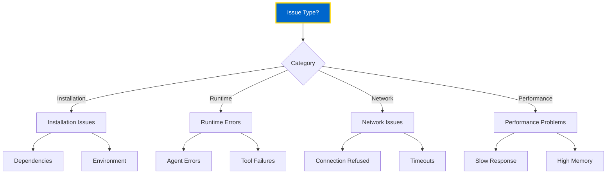

# Troubleshooting Guide

Common issues and solutions for OMEGA platform deployment and development.

## 🔍 Quick Diagnosis

Use this decision tree to identify your issue:



---

## 🚨 Common Issues

### 1. Installation Problems

#### Issue: `pip install omega-sdk` fails

**Symptoms:**
```
ERROR: Could not find a version that satisfies the requirement omega-sdk
```

**Solutions:**

```bash
# Update pip first
python -m pip install --upgrade pip

# Try with specific version
pip install omega-sdk==1.0.0

# Install from source
pip install git+https://github.com/omega-framework/omega-sdk.git
```

#### Issue: Dependency conflicts

**Symptoms:**
```
ERROR: pip's dependency resolver does not currently take into account all the packages that are installed
```

**Solutions:**

```bash
# Create fresh virtual environment
python -m venv fresh_venv
source fresh_venv/bin/activate  # or fresh_venv\Scripts\activate on Windows

# Install with --force-reinstall
pip install --force-reinstall omega-sdk

# Use dependency resolver
pip install --use-feature=2020-resolver omega-sdk
```

---

### 2. Agent Won't Start

#### Issue: Port already in use

**Symptoms:**
```
ERROR: Address already in use: http://0.0.0.0:8000
```

**Diagnosis:**

```bash
# Check what's using the port (Windows)
netstat -ano | findstr :8000

# Check what's using the port (Mac/Linux)
lsof -i :8000

# See process details
ps aux | grep 8000
```

**Solutions:**

```bash
# Kill the process (Windows)
taskkill /PID <process_id> /F

# Kill the process (Mac/Linux)
kill -9 <process_id>

# Or change agent port
python agent.py --port 8001
```

#### Issue: Missing environment variables

**Symptoms:**
```
KeyError: 'REDIS_URL'
```

**Solutions:**

```bash
# Create .env file
cat > .env << EOF
REDIS_URL=redis://localhost:6379
MONGODB_URI=mongodb://localhost:27017/omega
SECRET_KEY=your-secret-key-here
EOF

# Or export variables
export REDIS_URL=redis://localhost:6379
export MONGODB_URI=mongodb://localhost:27017/omega

# Verify
python -c "import os; print(os.getenv('REDIS_URL'))"
```

---

### 3. Docker Issues

#### Issue: Container won't start

**Symptoms:**
```
Error response from daemon: Conflict. The container name "/omega-agent" is already in use
```

**Solutions:**

```bash
# Remove existing container
docker rm -f omega-agent

# Remove all stopped containers
docker container prune

# Start fresh
docker compose up -d --force-recreate
```

#### Issue: Build failures

**Symptoms:**
```
ERROR [build 5/8] RUN pip install -r requirements.txt
```

**Solutions:**

```bash
# Clear Docker cache
docker builder prune -a

# Build without cache
docker compose build --no-cache

# Check Dockerfile syntax
docker compose config
```

#### Issue: Network connectivity between containers

**Symptoms:**
```
ConnectionRefusedError: [Errno 111] Connection refused
```

**Solutions:**

```bash
# Check Docker network
docker network ls
docker network inspect omega_default

# Verify container can reach others
docker compose exec agent curl http://federation_core:9405/health

# Restart network
docker compose down
docker compose up -d
```

---

### 4. Federation & Registry Issues

#### Issue: Agent registration fails

**Symptoms:**
```
Failed to register with Federation Core: Connection refused
```

**Diagnosis:**

```bash
# Check Federation Core health
curl http://localhost:9405/health

# Check logs
docker compose logs federation_core

# Verify network
docker compose exec agent ping federation_core
```

**Solutions:**

```bash
# Restart Federation Core
docker compose restart federation_core

# Check environment variables
docker compose exec agent env | grep FEDERATION

# Verify agent can reach registry
docker compose exec agent curl http://federation_core:9405/health
```

#### Issue: Tool not discovered

**Symptoms:**
- Tool works locally but not found by agents
- MCP registry returns empty list

**Solutions:**

```bash
# Verify tool registration
curl http://localhost:9402/mcp/tools

# Check tool health
curl http://localhost:9420/health

# Re-register tool
curl -X POST http://localhost:9402/mcp/register \
  -H "Content-Type: application/json" \
  -d '{
    "id": "my_tool",
    "name": "My Tool",
    "endpoint": "http://my-tool:9420"
  }'

# Check MCP Registry logs
docker compose logs mcp_registry
```

---

### 5. Database Connection Issues

#### Issue: MongoDB connection failed

**Symptoms:**
```
pymongo.errors.ServerSelectionTimeoutError: localhost:27017: [Errno 111] Connection refused
```

**Diagnosis:**

```bash
# Check if MongoDB is running
docker compose ps mongo

# Test connection
docker compose exec mongo mongosh --eval "db.runCommand({ping: 1})"

# Check logs
docker compose logs mongo
```

**Solutions:**

```bash
# Restart MongoDB
docker compose restart mongo

# Verify connection string
echo $MONGODB_URI

# Test from agent container
docker compose exec agent python -c "
from pymongo import MongoClient
client = MongoClient('mongodb://mongo:27017')
print(client.server_info())
"
```

#### Issue: Redis connection failed

**Symptoms:**
```
redis.exceptions.ConnectionError: Error 111 connecting to localhost:6379
```

**Solutions:**

```bash
# Check Redis status
docker compose ps redis

# Test connection
docker compose exec redis redis-cli ping

# Check authentication
docker compose exec redis redis-cli -a your-password ping

# Verify from agent
docker compose exec agent python -c "
import redis
r = redis.Redis(host='redis', port=6379)
print(r.ping())
"
```

---

### 6. Performance Issues

#### Issue: Slow agent response

**Symptoms:**
- Requests timeout
- High latency
- Slow task execution

**Diagnosis:**

```bash
# Check CPU usage
docker stats

# Check agent logs for slow operations
docker compose logs agent | grep -i "slow\|timeout"

# Profile Python code
python -m cProfile -o profile.stats agent.py
```

**Solutions:**

```python
# Add caching
from functools import lru_cache

@lru_cache(maxsize=128)
async def expensive_operation(param):
    # Cached result
    return result

# Use connection pooling
from redis import ConnectionPool

pool = ConnectionPool(
    host='redis',
    port=6379,
    max_connections=50
)
redis_client = redis.Redis(connection_pool=pool)

# Implement timeout
import asyncio

try:
    result = await asyncio.wait_for(
        slow_operation(),
        timeout=5.0
    )
except asyncio.TimeoutError:
    logger.error("Operation timed out")
```

#### Issue: High memory usage

**Diagnosis:**

```bash
# Monitor memory
docker stats --no-stream

# Check for memory leaks
docker compose exec agent python -m memory_profiler agent.py
```

**Solutions:**

```python
# Limit batch size
BATCH_SIZE = 100  # Don't load everything at once

# Use generators
def process_large_dataset():
    for batch in dataset.iter_batches(BATCH_SIZE):
        yield process_batch(batch)

# Clear caches periodically
import gc

gc.collect()
cache.clear()
```

---

### 7. Security Issues

#### Issue: Certificate verification failed

**Symptoms:**
```
SSLError: [SSL: CERTIFICATE_VERIFY_FAILED]
```

**Solutions:**

```python
# Development only - disable verification
import httpx

client = httpx.AsyncClient(verify=False)  # NOT FOR PRODUCTION

# Production - use proper certificates
import ssl

ssl_context = ssl.create_default_context()
ssl_context.load_cert_chain('cert.pem', 'key.pem')
```

#### Issue: Authentication failures

**Symptoms:**
```
401 Unauthorized
```

**Solutions:**

```bash
# Verify API key
curl -H "Authorization: Bearer $API_KEY" \
  http://localhost:8000/health

# Check token expiration
python -c "
import jwt
token = 'your-token'
print(jwt.decode(token, options={'verify_signature': False}))
"

# Generate new token
curl -X POST http://localhost:8080/auth/token \
  -d '{"username":"admin","password":"password"}'
```

---

## 🛠️ Debugging Tools

### Enable Debug Logging

```python
import logging

logging.basicConfig(
    level=logging.DEBUG,
    format='%(asctime)s - %(name)s - %(levelname)s - %(message)s'
)
```

### Use Python Debugger

```python
import pdb

# Set breakpoint
pdb.set_trace()

# Or use ipdb for better experience
import ipdb
ipdb.set_trace()
```

### Docker Debug Commands

```bash
# Enter container shell
docker compose exec agent bash

# View real-time logs
docker compose logs -f agent

# Inspect container
docker inspect omega-agent

# Check resource usage
docker stats omega-agent
```

### Network Debugging

```bash
# Test connectivity
docker compose exec agent curl -v http://federation_core:9405/health

# DNS resolution
docker compose exec agent nslookup federation_core

# Port scanning
docker compose exec agent nc -zv federation_core 9405
```

---

## 📊 Health Check Script

Create `health_check.sh`:

```bash
#!/bin/bash

echo "🔍 OMEGA Health Check"
echo "===================="

# Check services
services=("federation_core:9405" "agent_registry:9401" "mcp_registry:9402")

for service in "${services[@]}"; do
    IFS=':' read -r name port <<< "$service"
    echo -n "Checking $name... "

    if curl -s -f "http://localhost:$port/health" > /dev/null; then
        echo "✅ OK"
    else
        echo "❌ FAILED"
    fi
done

# Check databases
echo -n "Checking MongoDB... "
if docker compose exec -T mongo mongosh --quiet --eval "db.runCommand({ping: 1})" > /dev/null 2>&1; then
    echo "✅ OK"
else
    echo "❌ FAILED"
fi

echo -n "Checking Redis... "
if docker compose exec -T redis redis-cli ping > /dev/null 2>&1; then
    echo "✅ OK"
else
    echo "❌ FAILED"
fi
```

---

## 🆘 Getting Help

### Self-Service

1. Check [FAQ](/docs/faq) for common questions
2. Search [GitHub Issues](https://github.com/omega-framework/omega/issues)
3. Review [API Documentation](/docs/api/overview)

### Community Support

- **Discord:** [discord.gg/omega](https://discord.gg/omega)
- **Stack Overflow:** Tag questions with `omega-framework`
- **GitHub Discussions:** [github.com/omega-framework/omega/discussions](https://github.com/omega-framework/omega/discussions)

### Professional Support

- **Enterprise Support:** support@omega.dev
- **Consulting:** consulting@omega.dev
- **Training:** training@omega.dev

---

## 📝 Report a Bug

When reporting issues, include:

1. **Environment Info:**
   ```bash
   python --version
   docker --version
   uname -a  # or systeminfo on Windows
   ```

2. **Error Logs:**
   ```bash
   docker compose logs agent > agent_logs.txt
   ```

3. **Minimal Reproduction:**
   - Smallest code that reproduces issue
   - Steps to reproduce
   - Expected vs actual behavior

4. **Configuration:**
   - Redacted `.env` file
   - `docker-compose.yml`
   - Agent/tool code

---

**🏛️ The Brotherhood supports you. No agent left behind.**
